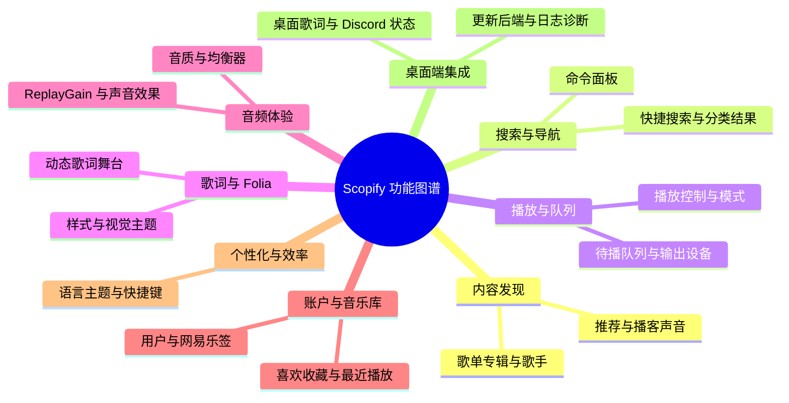

<div align="center">


<h2> Scopify </h2>
<p> 一个仿 Spotify UI 的音乐播放器 </p>

[后端 API](https://vdoonnridu.apifox.cn/) | [发行版](https://github.com/MT-SUPER-POWER/Scopify/releases) | [版本日志](https://github.com/MT-SUPER-POWER/Scopify/blob/master/docs/CHANGELOG.md) | [开发文档]()

[](https://github.com/MT-SUPER-POWER/Scopify/stargazers)
[](https://github.com/MT-SUPER-POWER/Scopify/releases)
[](https://nodejs.org/)
[](https://deepwiki.com/MT-SUPER-POWER/Scopify)
[](https://github.com/mt-super-power/scopify/blob/master/license)

</div>

## 简介

这是一个基于 Next.js + Electron 配合网易云 node.js API 的一个客户端音乐播放器，是我初学 Electron 的第一个作品。

- 本项目主要技术链为 [Next.js](https://nextjs.org/) + [TypeScript](https://www.typescriptlang.org/) + [ShadCN UI](https://ui.shadcn.com/) + [Electron](https://www.electronjs.org/zh/docs/latest/) + [Nodejs](https://nodejs.org/zh-cn/) + [Turborepo](https://turbo.build/)
- Node.js 版本要求：>= 24，包管理器：bun >= 1.3.11，pnpm >= 10.0.0
- 支持网页端与客户端，由于设备有限，目前仅保证 Windows 系统的适配，App 开发中

## 技术栈总览

1. Next.js + React: 前端框架
2. Electron: 桌面应用框架
3. Tailwind CSS: CSS 框架
4. shadnCN UI: UI 组件库
5. Docker: 部署部分
6. Axios + TanStack Query: 后端通讯统一管理部分
7. Zustand: 前端状态管理
8. Eslint + Prettier + Husky: 代码格式化约束 + Git 提交规范
9. Framer-Motion: 动画框架
10. TanStack-Virtual: 虚拟列表
11. WebGL: 歌词舞台可视化

### 代码结构

仓库使用 Bun Workspaces + Turborepo 管理 Web、Electron 和共享契约：

```text
repo/
├── frontend/
│   ├── apps/
│   │   ├── web/                 # Next.js Web 与 Electron Renderer 源码
│   │   ├── desktop/             # Electron 主进程、预加载与打包配置
│   │   └── mobile/              # Flutter 预留入口（submodule）
│   └── packages/
│       └── desktop-contract/    # Web 与 Electron 之间的类型化契约
└── backend/
    └── api-enhanced/            # NetEase API 后端（submodule）
```

新建或修改代码前，请先阅读：

- **[AGENTS.md](./AGENTS.md)** — 项目结构规范
- **[docs/structure.md](./docs/structure.md)** — 面向贡献者的结构说明与迁移进度

### 重要的三方库

> 特别感谢以下项目的开源：

1. [Folia](https://github.com/chthollyphile/folia-major/tree/main)
2. [Netease Cloud Music API Enhanced](https://github.com/neteasecloudmusicapienhanced/api-enhanced)

### 参考文档

1. [Folia Source Snapshot](https://github.com/chthollyphile/folia-major/tree/main)
2. [Electron Doc](https://www.electronjs.org/zh/docs/latest/api/app)
3. [Netease Cloud Music API Doc](https://docs-neteasecloudmusicapi.focalors.ltd/#/)
4. [Electron Builder Help Doc - Not Official](https://github.com/QDMarkMan/CodeBlog/blob/master/Electron/electron-builder%E6%89%93%E5%8C%85%E8%AF%A6%E8%A7%A3.md)

## 部署方法

Scopify 现在把桌面客户端、Web 前端和后端分开管理。Web 和桌面客户端需要能访问一个独立运行的 NetEase API 后端。

### 后端的运行

> 请确保你后端的实际运行
> 当然你也可以看这个文档[部署文档](repo/frontend/apps/docs/content/docs/(framework)/deployment.mdx)来部署你的专有后端作为项目后端运行。

```bash
git submodule update --init --recursive   # 初次克隆时需要
bun run dev:backend                       # 运行后端
```

### 前端与桌面客户端的运行

```bash
bun install
bun run dev:web          # 仅 Next.js Web
bun run dev:desktop      # 仅 Electron（开发时使用 Web dev server），确保你的 dev:web 已运行
bun run dev              # Web + Electron
bun run dev:full         # Web + Electron + backend

# 其他网页
bun run dev:docs         # 仅 docs（文档网站），确保你的 dev:web 已运行
```

## 功能

Scopify 的能力围绕八类使用场景展开。完整说明和更多截图见 [产品能力文档](repo/frontend/apps/docs/content/docs/(framework)/features.mdx)。

| 分类 | 主要能力 |
| --- | --- |
| 内容发现 | 每日与个性化推荐、歌单、专辑、歌手、播客声音和评论 |
| 搜索与导航 | 快捷搜索、常驻搜索栏、分类结果页和命令面板 |
| 播放与队列 | 播放控制、进度与音量、播放模式、输出设备和待播队列 |
| 歌词与 Folia | 动态歌词舞台、歌词来源与匹配、时间轴校准、样式和视觉主题 |
| 音频体验 | 多档音质、十段均衡器、ReplayGain 和声音效果 |
| 账户与音乐库 | 喜欢、收藏、最近播放、自建歌单、用户资料和网易乐签 |
| 个性化与效率 | 语言、主题、快捷键、命令面板和应用运行设置 |
| 桌面端集成 | 桌面歌词、Discord 状态、客户端更新、本地后端和日志诊断 |



<details>
<summary>内容发现</summary>


</details>

<details>
<summary>歌词与 Folia</summary>


</details>

<details>
<summary>音频体验</summary>


</details>

<details>
<summary>账户与音乐库</summary>


</details>

<details>
<summary>个性化与效率</summary>


</details>


## 版本号规则

> 版本号的发布规则 `x.y.z`

- `x`: 重大更新，可能包含不兼容的 API 修改
- `y`: 次要更新，添加了新功能，但保持向后兼容
- `z`: 修复 bug 和小的改进，不添加新功能

## 开源许可

本项目基于 [GNU Affero General Public License v3.0 (AGPL-3.0)](https://www.gnu.org/licenses/agpl-3.0.html) 许可开源。

- **修改与分发：** 任何修改或分发都必须同样基于 **AGPL-3.0**，并提供完整源代码。
- **派生作品：** 必须同样采用 **AGPL-3.0**，并在适当位置保留本项目的许可与版权信息。
- **署名：** 必须保留原作者及版权信息。可为二次开发添加你自己的署名，但不得移除或篡改原始信息。
- **商业用途：** 如用于售卖或其他盈利用途，必须提供源代码及原项目链接。由于本项目涉及第三方服务，商业使用可能存在法律风险。
- **免责：** 本软件按「现状」提供，不附带任何形式的担保，详见 AGPL-3.0。
