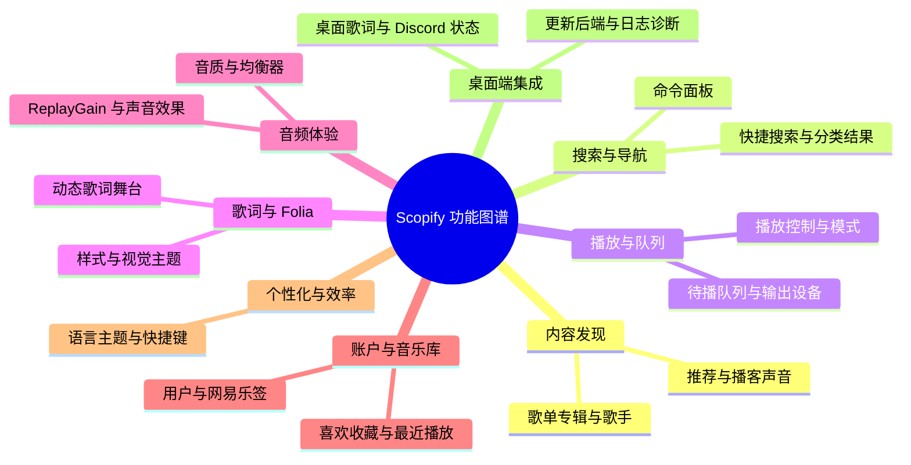
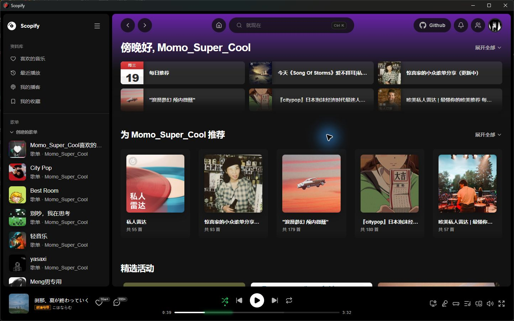
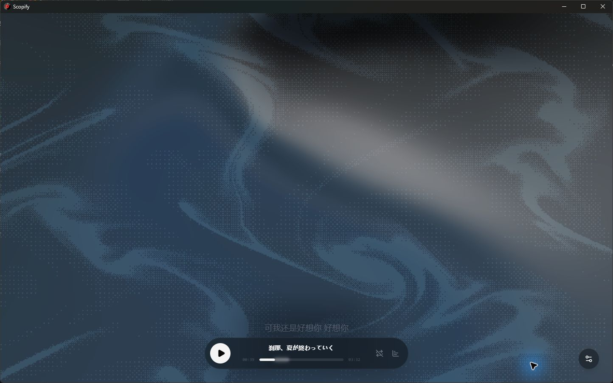
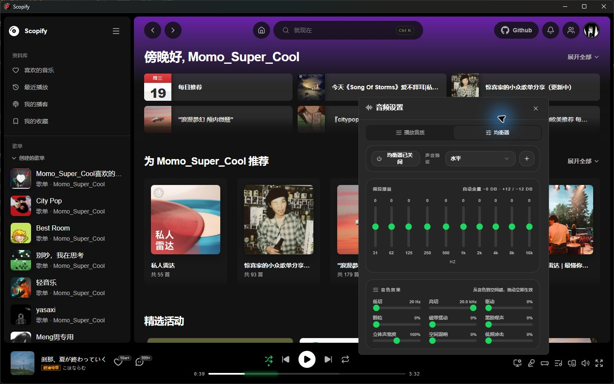
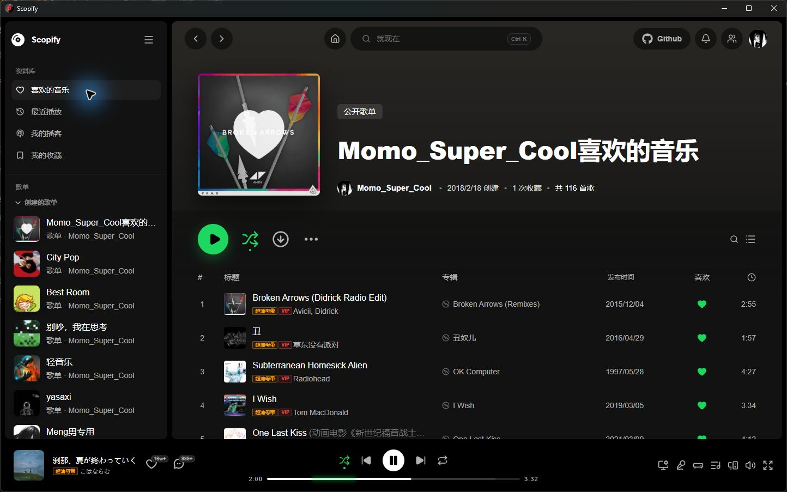
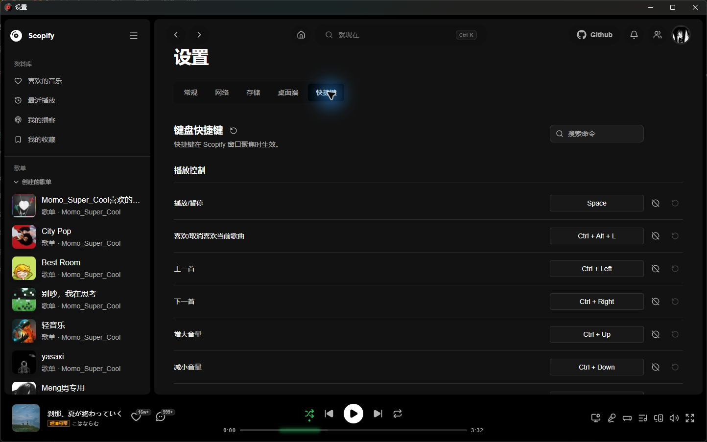

<div align="center">


<h2> Scopify </h2>
<p> 一个仿 Spotify UI 的音乐播放器 </p>

[后端 API](https://vdoonnridu.apifox.cn/) | [发行版](https://github.com/MT-SUPER-POWER/Scopify/releases) | [版本日志](https://github.com/MT-SUPER-POWER/Scopify/blob/master/docs/CHANGELOG.md) | [开发文档]()

[](https://github.com/MT-SUPER-POWER/Scopify/stargazers)
[](https://github.com/MT-SUPER-POWER/Scopify/releases)
[](https://github.com/mt-super-power/scopify/blob/master/license)
[](https://github.com/MT-SUPER-POWER/Scopify/issues)
[](https://nodejs.org/)
[](https://deepwiki.com/MT-SUPER-POWER/Scopify)

</div>

## 简介

这是一个基于 Next.js + Electron 配合网易云 node.js API 的一个客户端音乐播放器，是我初学 Electron 的第一个作品。

- 本项目主要技术链为 [Next.js](https://nextjs.org/) + [TypeScript](https://www.typescriptlang.org/) + [ShadCN UI](https://ui.shadcn.com/) + [Electron](https://www.electronjs.org/zh/docs/latest/) + [Nodejs](https://nodejs.org/zh-cn/) + [Turborepo](https://turbo.build/)
- Node.js 版本要求：>= 24，包管理器：bun >= 1.3.11，pnpm >= 10.0.0
- 支持网页端与客户端，由于设备有限，目前仅保证 Windows 系统的适配，App 开发中

## 技术栈总览

1. Next.js + React: 前端框架
2. Electron: 桌面应用框架
3. Tailwind CSS: CSS 框架
4. shadnCN UI: UI 组件库
5. Docker: 部署部分
6. Axios + TanStack Query: 后端通讯统一管理部分
7. Zustand: 前端状态管理
8. Eslint + Prettier + Husky: 代码格式化约束 + Git 提交规范
9. Framer-Motion: 动画框架
10. TanStack-Virtual: 虚拟列表
11. WebGL: 歌词舞台可视化

### 代码结构

仓库使用 Bun Workspaces + Turborepo 管理 Web、Electron 和共享契约：

```text
repo/
├── frontend/
│   ├── apps/
│   │   ├── web/                 # Next.js Web 与 Electron Renderer 源码
│   │   ├── desktop/             # Electron 主进程、预加载与打包配置
│   │   └── mobile/              # Flutter 预留入口（submodule）
│   └── packages/
│       └── desktop-contract/    # Web 与 Electron 之间的类型化契约
└── backend/
    └── api-enhanced/            # NetEase API 后端（submodule）
```

新建或修改代码前，请先阅读：

- **[AGENTS.md](./AGENTS.md)** — 项目结构规范
- **[docs/structure.md](./docs/structure.md)** — 面向贡献者的结构说明与迁移进度

### 重要的三方库

> 特别感谢以下项目的开源：

1. [Folia](https://github.com/chthollyphile/folia-major/tree/main) — complete Playback Stage and desktop-lyric presentation source snapshot (AGPL-3.0)
2. [Netease Cloud Music API Enhanced](https://github.com/neteasecloudmusicapienhanced/api-enhanced)

### 参考文档

1. [Folia Source Snapshot](https://github.com/chthollyphile/folia-major/tree/main)
2. [Electron Doc](https://www.electronjs.org/zh/docs/latest/api/app)
3. [Netease Cloud Music API Doc](https://docs-neteasecloudmusicapi.focalors.ltd/#/)
4. [Electron Builder Help Doc - Not Official](https://github.com/QDMarkMan/CodeBlog/blob/master/Electron/electron-builder%E6%89%93%E5%8C%85%E8%AF%A6%E8%A7%A3.md)

## 部署方法

Scopify 现在把桌面客户端、Web 前端和后端分开管理。前端构建不依赖后端源码；Web 和桌面客户端只需要能访问一个独立运行的 NetEase API 后端。

### 1. Vercel 部署 Web 与 API

Vercel 可以同时部署 Scopify Web 和 `api-enhanced` 后端。两者应创建为独立项目：先部署 API，再将其 HTTPS 地址配置给 Web。

1. 在 Vercel 导入 `repo/backend/api-enhanced` 对应的 API 仓库，或导入本仓库并将 **Root Directory** 设为 `repo/backend/api-enhanced`。保留该目录的 `vercel.json`，它会以 `index.js` 作为 Node.js Serverless Function 入口。
2. 部署 API 后记录 Vercel 分配的地址，例如 `https://scopify-api.vercel.app`。若需要限制跨域来源，在 API 项目的 **Settings > Environment Variables** 中设置：

   ```env
   CORS_ALLOW_ORIGIN=https://scopify-web.vercel.app
   ```

   多个来源使用逗号分隔。未设置时，后端会按请求 Origin 返回 CORS 响应。

3. 在 Vercel 导入本仓库作为 Web 项目，并设置：

   | 项目设置         | 值                                                 |
   | ---------------- | -------------------------------------------------- |
   | Root Directory   | `repo/frontend/apps/web`                           |
   | Framework Preset | `Next.js`                                          |
   | Install Command  | `cd ../../../.. && bun install --frozen-lockfile`  |
   | Build Command    | 保持 `repo/frontend/apps/web/vercel.json` 中的配置 |

   Web 的构建命令会回到 workspace 根目录执行 `bun run build:web`，以正确解析共享契约包。

4. 在 Web 项目的 **Settings > Environment Variables** 中配置 API 地址：

   ```env
   BACKEND_PUBLIC_URL=https://scopify-api.vercel.app
   ```

   `BACKEND_PUBLIC_URL` 必须是完整的 HTTP(S) API 根地址，不能包含路径、查询参数或哈希。它在构建时写入浏览器配置，修改后需要重新部署 Web 项目。

5. 分别为两个 Vercel 项目绑定自定义域名，并将 Web 域名加入 API 项目的 `CORS_ALLOW_ORIGIN`。Vercel 提供 HTTPS，Web 与 API 都使用 HTTPS 时不会触发浏览器的 mixed-content 限制。

Vercel 的默认分支会生成 Production 部署，其他分支生成 Preview 部署。Preview 环境可复用生产 API，或者配置独立且稳定的 Preview API 域名。

### 2. Docker Compose 部署 Web 与 API

推荐用于本机、局域网或私有服务器部署。根目录的 `docker-compose.yml` 会启动 Web 和后端（需要已拉取 `repo/backend/api-enhanced` submodule）：

- Web: `http://127.0.0.1:3000`
- Backend: `http://127.0.0.1:3838`

```bash
git clone --recurse-submodules https://github.com/MT-SUPER-POWER/Scopify.git
cd Scopify
docker compose up -d --build
```

已克隆仓库但未拉取子模块时，先执行：

```bash
git submodule update --init --recursive repo/backend/api-enhanced
```

查看状态和日志：

```bash
docker compose ps
docker compose logs -f frontend
```

可以在根目录创建 `.env` 覆盖 Web 端口和浏览器可访问的后端地址：

```env
FRONTEND_PORT=3000
BACKEND_PUBLIC_HOST=127.0.0.1
BACKEND_PUBLIC_PORT=3838
```

`BACKEND_PUBLIC_HOST` 是浏览器访问后端时使用的地址。如果 Web 部署在服务器上并给其他设备访问，请改成服务器 IP 或域名，而不是 `127.0.0.1`。

Docker Web 会在根 workspace 安装依赖，执行 `bun run build:web`，然后从 `repo/frontend/apps/web` 运行 `next start`。Electron 使用的静态 Renderer 是另一个构建目标，不用于普通 Web 部署。

### 3. 桌面客户端后端模式

桌面端默认启动随安装包提供的本地 API，也支持在桌面端设置中关闭本地后端并改用独立后端。启用本地后端后可自定义端口，桌面端会在启动时检查端口占用并显示运行状态，网络设置中的 Ping 可用于验证接口是否可用。

独立后端模式下，在设置页的「网络 → 后端服务」中填写协议、主机和端口即可；这些设置也适用于普通 Web。桌面端配置文件只保留本地后端的启动策略，例如：

```yaml
backend:
  autoStart: true
  port: 3838
```

如果后端部署在远程服务器，把 Web 设置中的主机改成服务器 IP 或域名。客户端会请求 `http://host:port`；本地后端模式则固定使用 `127.0.0.1` 和设置中指定的端口。

### 4. 单独部署后端

后端可以独立部署，不需要和前端在同一个仓库 checkout 中构建。你可以使用已有的 NetEase API Enhanced 服务，只要保证 Web 或客户端能访问到它。

如果需要从本仓库的后端子模块构建，再单独拉取 submodule：

```bash
git submodule update --init --recursive repo/backend/api-enhanced
cd repo/backend/api-enhanced
docker build -t scopify-backend .
docker run -d --name scopify-backend -p 3838:3838 -e HOST=0.0.0.0 -e PORT=3838 scopify-backend
```

### 5. 本地开发

```bash
bun install
bun run dev:web          # 仅 Next.js Web
bun run dev:desktop      # 仅 Electron（开发时使用 Web dev server）
bun run dev              # Web + Electron
bun run dev:full         # Web + Electron + backend
```

如果需要同时调试后端，先拉取后端子模块，然后再运行后端开发脚本：

```bash
git submodule update --init --recursive repo/backend/api-enhanced
bun run dev:backend
```

`dev:web` 是开发服务；生产 Web 使用 `bun run build:web` + `bun run --cwd repo/frontend/apps/web start`。桌面端使用 `bun run build:desktop` 构建静态 Renderer 和 Electron 主进程，打包时运行 `bun run build:win` 或 `bun run build:mac`。

### 6. Release 检查清单

发布 tag 前建议确认：

```bash
docker compose config --quiet
docker compose up -d --build
```

并访问：

- `http://127.0.0.1:3000`
- 你配置的后端地址，例如 `http://127.0.0.1:3838`

GitHub Actions 会在推送 `v*` tag 时构建安装包；桌面打包 job 会递归 checkout 后端 submodule 以准备可选的内置后端资源。Release workflow 会从 `docs/CHANGELOG.md` 中提取同名版本标题作为 Release Notes。发布 `v1.0.5` 前请确保存在：

```md
## v1.0.5
```

## 功能

Scopify 的能力围绕八类使用场景展开。完整说明和更多截图见 [产品能力文档](repo/frontend/apps/docs/content/docs/%28framework%29/features.mdx)。

| 分类 | 主要能力 |
| --- | --- |
| 内容发现 | 每日与个性化推荐、歌单、专辑、歌手、播客声音和评论 |
| 搜索与导航 | 快捷搜索、常驻搜索栏、分类结果页和命令面板 |
| 播放与队列 | 播放控制、进度与音量、播放模式、输出设备和待播队列 |
| 歌词与 Folia | 动态歌词舞台、歌词来源与匹配、时间轴校准、样式和视觉主题 |
| 音频体验 | 多档音质、十段均衡器、ReplayGain 和声音效果 |
| 账户与音乐库 | 喜欢、收藏、最近播放、自建歌单、用户资料和网易乐签 |
| 个性化与效率 | 语言、主题、快捷键、命令面板和应用运行设置 |
| 桌面端集成 | 桌面歌词、Discord 状态、客户端更新、本地后端和日志诊断 |



<details>
<summary>内容发现</summary>



</details>

<details>
<summary>歌词与 Folia</summary>



</details>

<details>
<summary>音频体验</summary>



</details>

<details>
<summary>账户与音乐库</summary>



</details>

<details>
<summary>个性化与效率</summary>



</details>


## 版本号规则

> 版本号的发布规则 `x.y.z`

- `x`: 重大更新，可能包含不兼容的 API 修改
- `y`: 次要更新，添加了新功能，但保持向后兼容
- `z`: 修复 bug 和小的改进，不添加新功能

## 开源许可

- 本项目基于 [GNU Affero General Public License v3.0](https://www.gnu.org/licenses/agpl-3.0.html) 许可进行开源
