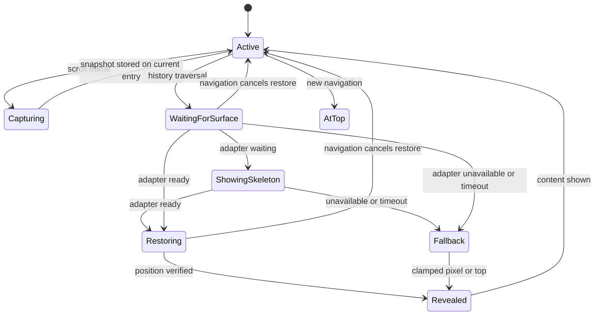

# 页面导航与滚动恢复架构

> Status: Proposed

本文定义 Scopify dashboard 页面之间统一的滚动所有权、导航语义和恢复协议。它先解决结构问题，再指导后续实现；当前不把任何现有 hook 或第三方组件视为必须保留的约束。

相关一手资料与第三方能力核验见 [导航滚动恢复研究](./research/navigation-scroll-restoration.md)。

## 目标

- 浏览历史后退或前进时，恢复目标历史条目离开前的内容位置。
- 新建导航条目时，从目标页面顶部开始。
- 普通长页面、异步页面和虚拟列表使用同一套导航语义。
- 一个模块拥有滚动恢复，页面、Header、虚拟列表和动画不得竞争写入 `scrollTop`。
- 历史恢复期间不短暂展示错误的顶部位置；目标尚未就绪时继续呈现页面 Skeleton。
- Sidebar、Queue、弹窗、歌词时间线等局部滚动区域保持独立生命周期。
- Web 与 Electron 使用相同的行为和测试契约。

## 非目标

- 不在应用重启后恢复上一进程的页面位置。
- 不持久化滚动位置到账号、Zustand 或 Remote Music Data 缓存。
- 不为所有局部 `ScrollArea` 提供跨路由恢复。
- 不通过保活所有页面组件树来间接保存滚动位置。

## 当前结构与根因

当前 dashboard 的所有路由内容共用 `MainLayout` 中长期存在的 Radix `ScrollArea.Viewport`。该 DOM 节点被存入 Zustand，随后被多个模块直接使用：

```text
MainLayout
└── shared Radix ScrollArea.Viewport
    ├── Header 读取 scrollTop
    ├── route page content
    └── TracklistTable
        ├── TanStack Virtual 读取共享 DOM
        └── useSmoothPlaylistScroll 持续写 scrollTop
```

这带来以下结构性问题：

1. 路由内容已经切换，滚动 DOM 却没有切换；旧页面和新页面共享同一个瞬时位置。
2. DOM 节点进入 Zustand，使布局实现泄漏到任意页面，无法限制读写者。
3. Next.js 导航滚动、恢复 hook、平滑滚动动画和虚拟列表都可能修改或解释同一个位置。
4. playlist 卸载时会清空 `albumList`。返回时内容高度先回到很小的值，像素恢复会被浏览器截断到顶部，随后才从页面缓存或 API 重建列表。
5. 旧恢复实现依赖动画帧、超时和 `ResizeObserver` 重复写入位置，既没有明确的就绪协议，也可能触发 ResizeObserver loop 错误。
6. URL 级 Map 无法区分同一 URL 的多个浏览历史条目，不符合已确认的导航语义。

因此，问题不是单独替换 Radix、增加一个 hook 或延长等待时间可以解决的。滚动所有权、历史条目状态和异步内容生命周期必须一起重构。

## 统一语言

### Navigation Entry Scroll State

属于一个浏览历史条目的滚动快照。后退或前进恢复该条目；新建导航条目不继承旧条目的位置。

### Primary Scroll Surface

当前 dashboard 路由内容唯一的主滚动区域。Header、导航恢复和页面虚拟化通过它协作，但只有协调器拥有恢复写入权。

### Nested Scroll Surface

Sidebar、Queue、弹窗或编辑器内部的局部滚动区域。它不参与主路由的滚动恢复。

### Restoration Adapter

在 Primary Scroll Surface 上捕获和恢复某种位置语义的适配器。初始架构包含像素适配器与虚拟集合适配器，因此这是一个真实的 seam，而不是预留抽象。

## 导航语义

| 导航行为 | 目标位置 |
| --- | --- |
| `Link` / `router.push` | 新历史条目，从顶部开始 |
| 查询参数 `push` | 新历史条目，从顶部开始 |
| `router.replace` | 当前条目内容被替换，从顶部开始 |
| 每日推荐切换 `dailyDate` | 曲目集合被替换，从顶部开始 |
| 歌单内搜索、播放或随机模式 | 非导航交互，保持当前位置 |
| 浏览器或 Header 后退 | 恢复目标历史条目的快照 |
| 浏览器或 Header 前进 | 恢复目标历史条目的快照 |
| 当前标签页刷新 | best effort；有效 session 快照可恢复，否则从顶部开始 |
| 应用重启或新标签页 | 从顶部开始 |
| Skeleton 恢复阶段的滚轮/触控板输入 | 暂不响应，不取消待处理恢复 |

## 目标结构

```text
app/(dashboard)/layout.tsx
└── MainLayout
    └── NavigationScrollProvider
        ├── Header (只消费 isAtTop 和导航命令)
        └── route content slot (overflow: hidden)

app/(dashboard)/template.tsx
└── RouteScrollSurface
    └── active route page
        └── optional VirtualCollectionRestorationAdapter
```

### 1. 路由拥有 Primary Scroll Surface

`MainLayout` 不再把所有页面包在一个永久存在的主 `ScrollArea` 中。dashboard route template 为当前导航页面创建 `RouteScrollSurface`，页面离开时该 surface 与其监听器一起卸载。

Primary Scroll Surface 使用项目现有的 Radix/shadcn `ScrollArea`，但它的 viewport
必须由当前 route template 独占。协调器只读写该 viewport；ScrollArea 只负责原生
滚动与滚动条外观，不拥有导航恢复状态。这样既保留一致的交互，也不会让两个路由
共享一个长期存在的滚动 DOM。

Sidebar、Queue、弹窗和歌词等 Nested Scroll Surface 继续使用各自独立的
`ScrollArea`，不参与路由恢复。

### 2. Navigation Scroll Coordinator 是唯一所有者

`NavigationScrollProvider` 内部承载 Navigation Scroll Coordinator。它是一个深模块：页面只声明 surface 或虚拟集合能力，历史事件、状态序列化、节流、等待、取消和验证全部隐藏在模块内部。

协调器负责：

- 尽早设置 `history.scrollRestoration = "manual"`。
- 在滚动帧结束时捕获当前快照，并合并写入当前 `history.state` 的 Scopify 命名空间。
- 区分新导航与 `popstate` 历史遍历。
- 新导航将新 surface 置顶；历史遍历读取目标条目的快照。
- 等待 active Restoration Adapter 报告可恢复，再执行一次受控恢复。
- 在用户输入、路由再次变化或 surface 卸载时取消旧任务。
- 恢复后验证实际位置，并记录可诊断但不含凭据的事件。

任何页面 hook、Header 或动画都不得绕过协调器执行导航恢复。

### 3. 每个历史条目保存自己的身份

协调器只把一个小型 entry ID 合并进 Next.js 已有的 `history.state`，不得替换 Next 内部字段：

```text
history.state.__scopify.navigationScrollEntryId
```

完整快照由以 entry ID 为 key 的内存 registry 保存；`sessionStorage` 只用于当前标签页刷新的 best-effort 恢复，不构成应用重启或数据变化后的强保证。这样既保持 history-entry 语义，也避免把 Virtual measurements 等较大数据写入受浏览器大小限制的 `history.state`。

registry 中的快照结构：

```ts
type NavigationScrollSnapshot =
  | {
      kind: "pixel";
      top: number;
    }
  | {
      anchorKey: string;
      anchorOffset: number;
      fallbackTop: number;
      kind: "virtual-collection";
      measurements?: VirtualizerSnapshot;
    };
```

每个 session-history entry 携带自己的 ID，因此同一 URL 的两次访问可以拥有不同位置，不需要 URL Map，也不需要把 DOM 或位置放进 Zustand。registry 必须设置容量上限，并在不可达条目淘汰或 session 结束时释放测量快照。

### 4. 两种 Restoration Adapter

#### Pixel Restoration Adapter

所有普通页面默认使用。它保存精确 `scrollTop`，等待 surface 的可达高度满足目标后恢复；若内容最终不足，则恢复到合法最大值。

`ResizeObserver` 只能通知协调器重新安排下一帧检查，禁止在 observer callback 内直接写入滚动位置。

#### Virtual Collection Restoration Adapter

供 playlist 等主页面虚拟集合使用。当前第一阶段仅 playlist 的 `TrackTable` 需要注册；Queue Popover 与 Lyric Queue 属于 Nested Scroll Surface，不参与路由恢复。它保存：

- 首个稳定可见项的业务 key，例如歌曲 ID。
- 该项相对 viewport 顶部的像素偏移。
- 原始 `scrollTop` 作为 fallback。

恢复顺序：

1. 等待查询数据可用。
2. 等待 virtualizer 已绑定当前 RouteScrollSurface 并完成测量。
3. 按业务 key 找到当前索引。
4. 使用 virtualizer 定位索引，再校正项内偏移。
5. 若业务 key 已不存在，则使用 fallback 像素并 clamp。

该适配器属于虚拟集合能力，不应命名为 playlist 专用实现；未来搜索结果或大型资料列表可复用同一 seam。

TanStack Virtual 的 `takeSnapshot()` 与当前 offset 一起捕获。重新挂载时优先把 measurements 作为 `initialMeasurementsCache`、像素位置作为 `initialOffset` 提供给 virtualizer，再用稳定业务 key 校验并校正最终位置。

### 5. 数据就绪属于恢复契约

滚动恢复不能猜测异步页面何时完成。每个 adapter 明确返回 `ready | waiting | unavailable`：

- 普通页面根据可达高度判断。
- 虚拟集合根据数据、业务 key 和 virtualizer 测量状态判断。
- `unavailable` 使用可解释的 fallback，而不是无限重试。

playlist 的曲目属于 Remote Music Data，应遵循 [ADR 0001](./adr/0001-axios-tanstack-query-client-data.md) 由 TanStack Query 管理生命周期。页面卸载不得清空一份全局 `albumList` 后再依靠时序恢复；返回导航应先获得缓存数据，再允许虚拟集合恢复。

### 6. 恢复期间的呈现策略

历史遍历进入 `waiting` 后，RouteScrollSurface 不揭示尚未定位的页面内容，而是继续呈现该路由现有的 Skeleton。协调器在 adapter 返回 `ready` 并完成位置校验后一次性揭示内容，避免先显示顶部再跳到旧位置。

若 adapter 返回 `unavailable` 或超过有界等待时间，协调器先计算并应用合法 fallback，再揭示页面。定位失败只写入诊断日志，不显示 toast；数据请求失败仍由页面自身的错误状态处理。

新建 `push`/`replace` 条目不进入历史恢复等待：页面按正常 loading 流程加载，并从顶部开始。

## 模块接口与落位

建议目录：

```text
app/(dashboard)/template.tsx                 # 路由层组装 RouteScrollSurface
components/shared/RouteScrollSurface.tsx     # Primary Scroll Surface
lib/navigation-scroll/coordinator.ts         # 状态机与取消逻辑
lib/navigation-scroll/historyState.ts        # History API 命名空间读写
lib/navigation-scroll/snapshotRegistry.ts    # entry ID 对应的内存/session 快照
lib/navigation-scroll/pixelAdapter.ts        # 默认 adapter
lib/navigation-scroll/virtualAdapter.ts      # TanStack Virtual adapter
lib/hooks/usePrimaryScrollSurface.ts          # 少量特殊消费者的只读入口
types/navigation-scroll.ts                    # 快照、adapter、结果类型
tests/navigationScrollCoordinator.test.ts     # 模块接口测试
```

页面默认无需调用 hook；route template 已提供普通像素恢复。只有虚拟集合需要显式注册 adapter。

推荐的页面侧接口保持很小：

```tsx
const scrollElement = usePrimaryScrollSurface();
const virtualizer = useVirtualizer({
  getScrollElement: () => scrollElement,
  // ...
});

useVirtualCollectionRestoration({
  getItemKey: (index) => tracks[index].id,
  itemCount: tracks.length,
  virtualizer,
});
```

协调器的状态机、History API、observer 和 fallback 不出现在页面接口中。

## 与 Header 的关系

Header 不再接收 `HTMLDivElement`。协调器提供只读的 `isAtTop` 派生状态，Header 只根据它渲染背景。这样 Header 不知道 surface 使用原生 div、Radix 还是测试 adapter。

## 页面内精确定位

导航恢复的唯一写入权只覆盖路由切换生命周期，不禁止页面正常响应用户滚动。若未来页面需要“跳到某个 section/歌曲”的主动定位，必须通过协调器暴露的 `requestPosition` 命令提交明确意图；协调器在 Restoration Pending State 结束后执行，避免与历史恢复同时写入。

当前代码审计结果：

| 消费者 | 当前行为 | 迁移后处理 |
| --- | --- | --- |
| Header | 只读取主 surface 的 `scrollTop` | 改读协调器派生的 `isAtTop` |
| playlist `useSmoothPlaylistScroll` | 持续写主 surface 的 `scrollTop` | 删除，由原生滚动与 Virtual adapter 协作 |
| Lyrics Timeline | 写自己的 modal 容器 | 保持不变，属于 Nested Scroll Surface |
| Queue virtualizers | 写自己的队列容器 | 保持不变，属于 Nested Scroll Surface |

目前没有其他 dashboard 页面直接写主 surface。迁移测试仍需逐页覆盖，防止 `scrollIntoView()` 等间接滚动在未来绕过协调器。

## 页面接入分类

| 页面/区域 | 接入方式 |
| --- | --- |
| home、artist、album、profile、search、comment、me、setting | 默认 Pixel Restoration Adapter，页面代码零接入 |
| playlist `TrackTable` | Virtual Collection Restoration Adapter |
| Sidebar、Queue、Dialog、Lyrics Timeline、tray | 不接入，保留各自 ScrollArea 与生命周期 |

## 第三方技术决策

| 技术 | 决策 | 理由 |
| --- | --- | --- |
| 浏览器 History API | 使用 | session-history entry 是正确的状态所有权位置 |
| Next.js App Router | 保留 | 继续拥有 RSC、layout 和路由；统一关闭其隐式滚动 |
| TanStack Virtual | 保留 | 已解决虚拟渲染，且提供索引/offset 定位能力 |
| Radix/shadcn ScrollArea | route-owned 主 surface 与局部区域都保留 | 它解决原生滚动与外观；协调器负责历史条目恢复 |
| 自定义平滑滚轮 hook | 移除 | 它是第二个滚动写入者，会与恢复竞争；使用平台原生滚动 |
| TanStack Router / React Router | 不引入 | 为滚动恢复替换 Next 路由的成本和冲突远大于收益 |
| 页面 Keep Alive 库 | 不引入 | 保留完整页面树会扩大内存、数据和副作用生命周期问题 |
| 通用 Next 滚动恢复包 | 暂不引入 | 通常面向 window 或像素恢复，不能提供虚拟集合就绪协议 |

第三方包只有在它能替代协调器内部的一块实现、且不扩大页面接口时才考虑；不得为了“少写代码”引入第二套导航状态所有者。

## 生命周期



恢复任务必须绑定 navigation token。任何后续导航都会使旧 token 失效，旧 observer、animation frame 和 promise 不得再写 active surface。

## 迁移计划

### Phase 0: 建立可重复回归

- 添加浏览器测试：长页面滚动、导航离开、后退、断言位置。
- 添加 playlist 测试：延迟数据与 virtualizer 测量后恢复歌曲锚点。
- 断言恢复期间只呈现 Skeleton，不出现顶部内容闪现或恢复后跳动。
- 覆盖 Link、push、replace、Header back/forward 和浏览器按钮。

### Phase 1: 引入协调器但只观察

- 建立 history-state 命名空间与 navigation token。
- 建立有容量上限的 entry ID snapshot registry；history state 只保存 ID。
- 捕获快照并记录诊断事件，但不执行恢复。
- 验证不会覆盖 Next.js history state。

### Phase 2: 拆出 RouteScrollSurface

- `MainLayout` 改为 `overflow-hidden` 内容槽。
- dashboard template 挂载 route-owned `ScrollArea` viewport。
- Header 改为消费 `isAtTop`。
- 删除 DOM 节点在 Zustand 中的所有权。

### Phase 3: 普通页面像素恢复

- 启用 Pixel Restoration Adapter。
- 逐页验证 home、artist、album、profile、search、comment、me、setting。
- 新导航置顶，后退/前进恢复。

### Phase 4: 虚拟集合与 playlist 数据生命周期

- 将 playlist 曲目迁入 TanStack Query，并停止在页面卸载时清空全局列表。
- TracklistTable 改用当前 RouteScrollSurface。
- 接入 Virtual Collection Restoration Adapter。
- 删除 `useSmoothPlaylistScroll`。
- 不改造 Queue Popover 与 Lyric Queue；它们继续拥有各自的局部 virtualizer 与滚动生命周期。

### Phase 5: 删除旧机制

- 删除 URL Map、导航前快照、重复 animation-frame 恢复和恢复专用 ResizeObserver 写入。
- 删除 `scrollContainer` Zustand 字段。
- 删除 MainLayout 中长期共享的主内容 ScrollArea。
- 保留局部 ScrollArea，不做无关迁移。

## 验证矩阵

| 场景 | 预期 |
| --- | --- |
| 普通页面 A → B → 后退 | A 恢复离开前像素位置 |
| A → B → 后退 → 前进 | A、B 分别恢复自己的历史条目位置 |
| 同一 URL 两个历史条目 | 两个位置互不覆盖 |
| 新 Link/push 进入旧 URL | 从顶部开始 |
| playlist 数据立即命中缓存 | 恢复歌曲锚点与项内偏移 |
| playlist 数据延迟 | 等待 ready 后恢复，不提前锁死在 0 |
| playlist 数据延迟期间 | 保持 Skeleton，目标位置就绪后一次揭示 |
| 锚点歌曲被删除 | fallback 像素 clamp 到合法位置 |
| 快照过期或定位验证失败 | Skeleton 后台完成 fallback，静默揭示并记录诊断日志 |
| Skeleton 恢复阶段用户滚动 | 不响应，不提前揭示错误位置 |
| 快速连续导航 | 只有最后一个 navigation token 可写入 |
| Sidebar/Queue/Modal 滚动 | 不被主协调器读取或修改 |
| Electron 与 Web | 相同导航序列得到相同结果 |

## 完成标准

- 页面代码中不存在跨路由滚动恢复逻辑。
- Zustand 中不存在 DOM 节点或 Navigation Entry Scroll State。
- 主 surface 只有协调器可以执行恢复写入。
- 普通页面不需要注册 adapter。
- 虚拟集合通过统一 adapter seam 恢复，而不是页面特例。
- 所有验证矩阵场景有自动化测试或明确的人工验收脚本。
- 浏览器日志中不再出现恢复机制导致的 ResizeObserver loop。

## 已确认决策

- 历史恢复等待期间保持页面 Skeleton，定位完成后一次性揭示，不允许明显跳动。
- 当前标签页刷新只做 best effort；应用重启后不恢复。
- 第一阶段仅 playlist 注册 Virtual Collection Restoration Adapter；接口保持可复用，Queue 类局部滚动不接入。
- 普通歌单切换和每日推荐日期切换都代表新的曲目集合，从顶部开始；歌单内本地交互保持位置。
- 恢复定位失败静默降级，不弹 toast；页面数据请求失败仍使用原有错误状态。
- Skeleton 恢复阶段暂不响应滚轮或触控板；恢复完成并揭示内容后立即恢复正常滚动。
- 页面正文使用路由独占的 `ScrollArea` viewport 作为 Primary Scroll Surface；Sidebar、Queue、弹窗、歌词等局部 shadcn/Radix ScrollArea 保持不变。
