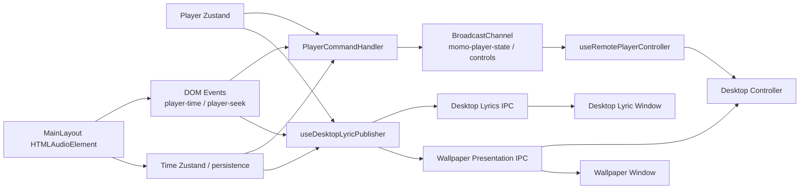
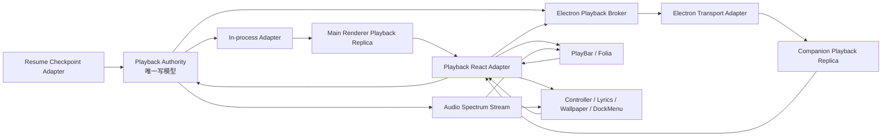
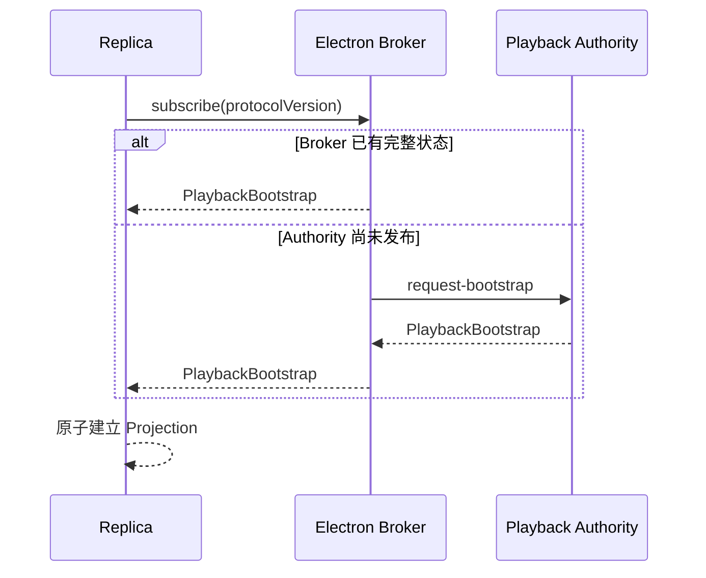
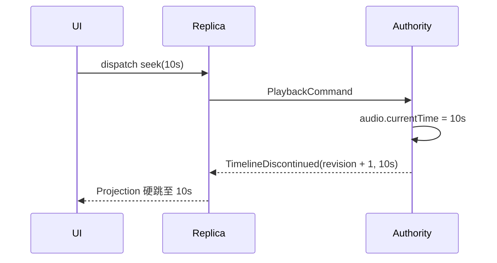

# 播放通讯与跨窗口时间同步架构

> Status: Accepted — implemented on `codex/playback-transport-refactor`

> 2026-08-12 follow-up: Electron Authority 迁入独立 Playback Host 已被采纳为后续分阶段实施方案，详见 [独立 Playback Host 与桌面壁纸运行时架构](./playback-host-wallpaper-runtime-architecture.md)。本文继续作为可靠协议、Broker、Replica 与时间投影语义的规范。

本文定义 Scopify Web 与 Electron 各 Renderer 之间统一的播放状态、播放时钟、命令和音频频谱通讯架构。它取代当前由 DOM Event、Zustand、BroadcastChannel、Desktop Lyrics IPC 与 Desktop Playback Wallpaper IPC 共同组成的多数据源体系。

本设计对应 [ADR 0011](../adr/0011-unify-playback-projection-across-renderers.md)，并细化 [ADR 0005](../adr/0005-adopt-folia-style-desktop-lyric-companion.md) 中“桌面伴随窗口接收播放呈现”的传输方式。第三方通讯与状态库的评估见 [播放通讯第三方库选型调研](../research/playback-communication-libraries.md)。

## 决策摘要

- 第一阶段继续由主 Renderer 中的 `HTMLAudioElement` 担任 Playback Authority。
- PlayBar、Folia、桌面歌词、桌面壁纸、控制器和 DockMenu 全部消费同一种 Playback Projection。
- UI 不再读取或组合多个播放数据源，也不理解 IPC、BroadcastChannel 或时钟插值。
- 播放时间通过 Clock Anchor 与本地投影推进，不通过 30–60Hz 的时间快照流驱动。
- 普通校准不得让可见时间倒退；只有显式 Timeline Discontinuity 可以硬跳。
- 播放状态与音频频谱使用不同通道：前者可靠、有序、可重放，后者高频、允许丢帧、禁止补发积压。
- `useTimeStore` 中的时间只作为 Resume Checkpoint，不再参与实时播放通讯。
- Authority 的位置通过 seam 隔离；统一接口稳定后，可在不修改 UI 的前提下把 Electron Authority 迁入独立 Playback Host。

## 实施状态（2026-08-10）

Phase 1–5 已在 `codex/playback-transport-refactor` 分支落地：

- `desktop-contract/playback.ts` 已提供版本化 Bootstrap、可靠状态、Clock Anchor、Timeline Discontinuity、命令/回执及运行时校验。
- 主 Renderer 的 `<audio>` 已通过 `PlaybackAuthorityProvider` 接入唯一 Authority；PlayBar 与 Folia 通过同一个进程内 Replica 消费 Projection。
- Electron Main 已通过原生 MessagePort Broker 授权并连接桌面歌词、桌面壁纸、独立控制器和 DockMenu Replica；新窗口会获得合成后的最新原子 Bootstrap。
- 播放位置由各 Renderer 使用同一 epoch 时钟本地投影；稳定播放只发送 1 Hz 健康锚点，频谱继续使用独立的 latest-wins 通道。
- `player-time`、`player-seek`、播放 BroadcastChannel、Desktop Lyric Snapshot、Wallpaper Presentation 及窗口私有时间轴启发式均已删除。
- `useTimeStore` 只保存恢复检查点、时长和缓冲进度，不再作为实时播放数据源；异步歌曲加载另有 `playbackLoadRevision`，旧请求不能覆盖新 Session。
- 换源恢复以精确媒体位置和 `playbackLoadRevision` 绑定；URL 刷新明确区分 `refreshed`、`superseded` 与 `failed`，旧失败回调不能误伤新歌曲。
- Broker 会请求缺失的 Bootstrap、按 Electron sender 绑定连接所有权，并为待处理命令设置有界超时；Replica 的软 stale 可由下一条有序消息自恢复。
- Phase 1–5 没有改变音频所有权；独立 Playback Host 已在 2026-08-12 的后续架构中采纳，尚未开始功能迁移。

## 目标

- 所有播放界面在同一时刻得到同一个歌曲、播放阶段、音量、歌词和时间投影。
- IPC 延迟、窗口隐藏、消息排队和普通状态更新不能导致进度条或歌词倒退。
- 主窗口与伴随窗口使用相同的状态机和时钟规则。
- 新打开或重连的窗口可以原子获得当前会话，而不是等待下一次偶然广播。
- seek、切歌、恢复位置和同曲重播拥有明确语义，不再通过时间差阈值猜测。
- 播放协议可独立测试，不依赖 React、Electron、真实音频或系统时钟。
- 删除重复发布者、重复时钟、重复命令通道和窗口特有的修复逻辑。

## 非目标

- 第一阶段不把真实音频播放迁入 Electron Main 或独立隐藏窗口。
- 不把 Remote Music Data、主题、窗口布局或壁纸偏好并入播放协议。
- 不要求每个动画帧都跨窗口发送播放位置。
- 不保证 Audio Spectrum Frame 不丢失。
- 不在本次重构中统一 Flutter 移动端的播放实现。
- 不为了迁移保留永久的双写或双读架构。

## 当前结构

当前实现存在五条相互重叠的路径：



### 当前模块与职责冲突

| 当前模块 | 当前职责 | 结构问题 |
| --- | --- | --- |
| `MainLayout.tsx` | 持有真实 `<audio>`，分发时间和 seek DOM Event | 正确拥有真实时钟，但没有统一 Authority 接口 |
| `usePlayerStore` | 歌曲、队列、播放状态、音量和歌词 | 被当作播放真相，但不持有真实音频位置 |
| `useTimeStore` | 每隔数秒保存位置以便恢复 | 粗粒度 Resume Checkpoint 被误用为实时位置 |
| `PlayerCommandHandler` | BroadcastChannel 状态与命令、媒体控制、DOM Event 转发 | 一个浅模块同时承担传输、状态选择和命令执行 |
| `remotePlayerState.ts` | 选择、去重、发布跨窗口快照 | 快照缺少会话、顺序、采样时刻和突变语义 |
| `useRemotePlayerController` | 接收 BroadcastChannel 并发送命令 | UI 直接了解传输，并维护一份独立播放状态 |
| `useDesktopLyricPublisher` | 构建桌面歌词与壁纸快照 | 与 BroadcastChannel 重复发布同一字段 |
| `useDesktopLyricSnapshot` | 接收快照并本地推进时间 | 拥有一套窗口特有时钟 |
| `useDesktopWallpaperFoliaPlayback` | 接收呈现、推进时间、驱动 Folia 和频谱 | 拥有第二套窗口特有时钟和跳变猜测 |
| Electron Wallpaper 模块 | 保存呈现并向壁纸、控制器扇出 | 被迫承载播放状态，和窗口生命周期耦合 |

### 已确认的回退根因

真实音频已经播放到 34 秒时，`useTimeStore.currentTime` 可能仍是 32 秒。普通歌曲状态更新会触发一次强制发布，而发布者在没有精确事件位置时读取这个持久化值。消费者收到 `32s` 后无法判断它是延迟快照还是主动 seek，只能根据差值猜测，最终把进度从 34 秒拉回 32 秒。

因此问题不是 IPC 频率不足，而是协议缺少：

- 数据源所有权；
- 源采样时间；
- Authority 生命周期；
- 播放会话身份；
- 消息顺序；
- 显式时间轴突变；
- 普通校准的单调性规则。

## 架构不变量

以下规则属于模块 Interface，而不是可调整的实现建议：

1. Playback Authority 是 Playback State 的唯一写入者。
2. 一个 Renderer 只允许存在一个活跃 Playback Replica。
3. UI 只能读取 Playback Projection，不得直接组合 Zustand、DOM Event 与跨窗口消息。
4. Track ID 不能充当 Playback Session ID；同一首歌重新加载必须产生新会话。
5. 每条可靠消息都带 Authority ID 和严格递增的 sequence。
6. 普通 Clock Anchor 不得使可见时间倒退。
7. 只有更高 timeline revision 的 Timeline Discontinuity 可以硬跳时间。
8. seek、切歌、恢复位置和同曲重播必须由 Authority 明确发布，消费者不得猜测。
9. 延迟消息按源采样时间投影到接收时刻，不能把接收时间伪装成采样时间。
10. Resume Checkpoint 只能在 Authority 初始化恢复时读取，不能进入实时校准路径。
11. 新 Replica 必须从一个原子 Bootstrap 开始，不能分别等待歌曲、歌词和时间通道碰巧到达。
12. Audio Spectrum Frame 允许丢失但不允许积压补发；播放状态则必须可靠、有序并可重放最新值。
13. 每次异步换源都必须带 Load Revision；旧 URL、旧媒体事件和旧失败结果不得修改当前 Session。
14. Session 切换必须使旧异步命令 epoch 失效；旧 `play()` 完成不得发布新 Session 的 phase。
15. duration 缩短若会校正媒体位置，必须发布 `media-correction` discontinuity，不能通过普通状态更新绕过单调地板。

## 目标结构



## 模块职责

| 模块 | 运行位置 | 负责 | 持有 | 明确不负责 |
| --- | --- | --- | --- | --- |
| Playback Authority | 第一阶段主 Renderer | 操作真实音频、串行执行命令、创建会话、发布可靠状态与时钟 | Authority ID、Playback Session、真实播放阶段、Clock Anchor、sequence、timeline revision | Electron 窗口、主题、壁纸偏好、UI |
| Playback Contract | `desktop-contract` 纯 TS 包 | 定义版本化消息、命令、投影和运行时校验 | 无状态 | React、Electron 对象、传输实现 |
| Playback Broker | Electron Main | 授权连接、缓存/请求 Bootstrap、保持顺序、重放最新状态、路由并超时命令 | 最新可靠消息、Authority 连接状态、Replica 注册表、有界 pending command | 推算时间、执行播放命令、修改状态 |
| Playback Replica | 每个 Renderer | 验证和应用消息、拒绝旧消息、本地推进时钟、平滑校准、生成 Projection | 当前 Authority、Session、revision、Clock Anchor、连接状态 | 直接访问 `<audio>`、直接调用 IPC、猜测 seek |
| Playback Transport Adapter | 进程内与 Electron 两种实现 | 传递可靠消息和命令，管理连接生命周期 | 临时连接状态 | 理解播放业务语义 |
| Playback React Adapter | Web 与伴随 Renderer | 把 Replica 暴露为 hooks、MotionValue 和命令函数 | React 订阅 | 时钟算法、消息排序、IPC |
| Resume Checkpoint Adapter | 主 Renderer 本地持久化 | 保存可恢复位置与音量，Authority 启动时一次读取 | 粗粒度恢复数据 | 实时播放时间、跨窗口同步 |
| Audio Spectrum Stream | Authority 与可视 Renderer | 发送最新频谱和频段能量 | 最多一帧 | 可靠状态、命令、歌词、重放 |
| Companion Window Host | Electron Main | 创建、隐藏、恢复伴随窗口和管理壁纸策略 | 窗口与壁纸生命周期 | Playback State 与播放时钟 |

## 深模块 Interface

所有 UI 最终只认识一个小 Interface：

```ts
interface PlaybackProjectionSource {
  getSnapshot(): PlaybackProjection;
  subscribe(listener: () => void): () => void;
  dispatch(command: PlaybackCommand): Promise<PlaybackCommandReceipt>;
}
```

React Adapter 在该 seam 上提供：

```ts
const playback = usePlaybackProjection();
const commands = usePlaybackCommands();
```

调用方不传入 `now`，不解释 sequence，不维护锚点，也不区分进程内或 Electron Adapter。复杂度必须留在 Playback Replica 内部；如果删除 Replica 后这些规则会重新散落到每个窗口，说明该模块具备足够 Depth。

## 协议模型

### 身份与排序

| 字段 | 含义 |
| --- | --- |
| `protocolVersion` | 协议版本；不兼容版本必须拒绝并记录诊断 |
| `authorityId` | 一次 Authority 生命周期的唯一 ID；Authority 重启后变化 |
| `sessionId` | 一次歌曲加载的唯一 ID；同 Track ID 重播也必须变化 |
| `sequence` | Authority 生命周期内每条可靠消息严格递增的序号 |
| `timelineRevision` | 当前 Session 内时间轴突变版本，只能递增 |
| `sampledAtMs` | Authority 读取真实媒体位置的源采样时刻 |

生产 Clock Adapter 使用跨 Renderer 可比较的高精度 epoch 时间；测试注入可控 fake clock。Replica 不得直接调用 `Date.now()` 形成不可测试的隐藏依赖。

### Playback Phase

```ts
type PlaybackPhase =
  | "idle"
  | "loading"
  | "playing"
  | "paused"
  | "buffering"
  | "ended"
  | "error";
```

`isPlaying` 由 phase 派生。时钟是否推进由 Clock Anchor 的 `rate` 决定：暂停、缓冲和错误阶段为零；正常播放通常为一。这样 Replica 不需要从互相矛盾的布尔值猜测状态。

### 可靠消息

```ts
type PlaybackMessage =
  | PlaybackBootstrap
  | PlaybackStateChanged
  | PlaybackClockAnchored
  | PlaybackTimelineDiscontinued;
```

#### Playback Bootstrap

新 Replica 的原子起点，包含：

- Authority、Session、sequence 与 timeline revision；
- 当前 Track、duration、phase、volume 与 liked；
- 当前歌词及歌词版本；
- 当前 Clock Anchor；
- Authority 是否可接受命令。

Broker 只缓存最近一次可构造完整 Bootstrap 的可靠状态。新窗口不得分别订阅旧歌曲快照和旧时间快照。

#### Playback State Changed

在歌曲元数据、歌词、phase、volume、liked 或可控制状态变化时发送。它是事件驱动的完整可靠状态，不随每个时间帧重复携带歌词。

#### Playback Clock Anchored

包含：

```ts
interface PlaybackClockAnchor {
  positionMs: number;
  sampledAtMs: number;
  rate: number;
  timelineRevision: number;
}
```

发送时机：

- 播放、暂停、缓冲、恢复播放或播放速率变化；
- Authority 定期健康校准，初始目标为 1Hz；
- 新 Replica Bootstrap；
- 媒体引擎报告位置异常但没有发生用户时间轴操作。

UI 仍在本地 animation frame 上更新；1Hz 是校准频率，不是 UI 帧率。

#### Playback Timeline Discontinued

显式表示：

- 用户 seek；
- 切歌；
- Resume Checkpoint 恢复；
- 同一歌曲重新加载；
- Authority 纠正媒体引擎确认的非连续位置。

消息必须带新的 `timelineRevision`、目标位置和原因。Replica 只有在 revision 增加时才允许硬跳；不存在“差值超过 500ms 就视为 seek”的启发式规则。

### 命令

```ts
type PlaybackCommand =
  | { commandId: string; type: "toggle" }
  | { commandId: string; type: "play" | "pause" }
  | { commandId: string; type: "previous" | "next" }
  | { commandId: string; type: "seek"; positionMs: number }
  | { commandId: string; type: "set-volume"; volume: number }
  | { commandId: string; type: "toggle-like" };
```

Authority 串行执行命令，并返回 accepted、rejected 或 unavailable receipt。命令携带当前 Session epoch；切歌后，旧异步命令只能返回 `command-superseded`，不得修改新 Session。Renderer 与 Broker 分别设置有界 receipt timeout，任何卡住的命令都不能永久占用 pending 路由。命令成功后的真相来自 Authority 发布的新状态；UI 不私自修改可靠 Playback State。

进度条拖动期间的预览是组件局部 UI 状态。松开后发送 seek；Authority 随后发布 Timeline Discontinuity，并可通过 `causedByCommandId` 关联此次操作。

### Audio Spectrum Frame

Spectrum Frame 独立于可靠协议，包含采样时刻、频段值和有界频谱数组。传输必须采用 latest-wins：当消费者跟不上时直接覆盖旧帧，禁止排队补播，因为过期频谱没有产品价值。

第一阶段可继续使用节流 IPC；只有性能测量证明需要时才将该 Adapter 替换为 MessagePort。该选择不改变 UI 或 Replica Interface。

## Playback Replica 时钟规则

Replica 使用注入的 Clock Adapter 和最近 Clock Anchor 计算：

```text
projectedPosition = anchor.positionMs
  + max(0, nowMs - anchor.sampledAtMs) * anchor.rate
```

并应用以下顺序：

1. 协议版本不兼容：拒绝。
2. 旧 Authority 的消息：拒绝。
3. 同 Authority 下 sequence 不大于已应用 sequence：拒绝。
4. 新 Session：原子替换全部 Session 状态。
5. timeline revision 增加：允许硬跳到新时间。
6. timeline revision 相同：普通校准，绝不立即向后跳。
7. 当前 phase 不推进：冻结可见时间，不把它拉回旧锚点。
8. Authority 超过有界时间无可靠消息：冻结并标记 disconnected，不无限盲推。
9. watchdog 造成的软 disconnected 保留已验证的 Authority/Session/order，下一条有序可靠消息可恢复；真实 MessagePort 断开后仍必须重新 Bootstrap。

普通校准出现负误差时，Replica 可以短暂冻结或降低投影速率等待 Authority 追上；出现正误差时可以有界加速或向前校正。具体平滑常数属于实现调优，但“同 revision 不向后硬跳”属于 Interface 不变量。

## 关键流程

### 新窗口连接



### 普通播放

Authority 在真实媒体事件与低频健康校准时发送 Clock Anchor。Replica 根据 `sampledAtMs` 抵消排队延迟，在本地 RAF 上连续推进。播放位置不是 React 高频 state；React 只订阅语义状态，进度条和 Folia MotionValue 直接消费 Replica 时钟。

### seek



### 延迟旧锚点

当 UI 已显示 34 秒而收到同 Session、同 revision、sequence 更新但源位置投影后仍只有 32 秒的 Anchor 时，Replica 不回退。它记录负 drift 并冻结或平滑等待；只有显式 revision 增加才能让时间回到 32 秒。

### 切歌与同曲重播

切歌产生新 Session ID 和 Bootstrap。同一 Track ID 从头重播也产生新 Session ID，因此消费者不依赖 Track ID 推断是否重置。旧 Session 的延迟消息即使 sequence 较大也会因 Session 不匹配被丢弃。

### Authority 重启

Authority 重启产生新 Authority ID。Broker 清除旧的可重放状态，Replica 冻结旧 Projection 并显示 disconnected；新 Bootstrap 到达后原子替换。不得把新 Authority 的 sequence 与旧 Authority 比较。

## Transport Adapters

技术选型采用 Electron 自带的 `MessageChannelMain` / `MessagePortMain` 作为跨 Renderer Transport，沿用 `@scopifymusicplayer/desktop-contract`、Zod 与 `zustand/vanilla`；本阶段不新增 `electron-trpc`、Comlink、`broadcast-channel`、XState 或 RxJS。原因不是这些库无效，而是它们分别只覆盖 RPC、广播、状态机或流组合，不能替代 Session、sequence、Clock Anchor、Timeline Revision、Bootstrap 与单调投影协议。完整证据和采用触发条件见 [库选型调研](../research/playback-communication-libraries.md)。

### In-process Adapter

主窗口 PlayBar 与 Folia 使用进程内 Adapter 连接同一个 Replica。它不经过 Electron IPC，但遵守完全相同的 Contract、排序和时钟规则，因此主窗口不会成为特殊消费者。

### Electron Adapter

控制器、桌面歌词、壁纸和 DockMenu 通过 preload 暴露的版本化接口连接 Playback Broker。Broker 使用 `webContents.id` 生成连接所有权，Renderer 提交的标签不能抢占另一个窗口；缓存缺失时 Broker 通过 `request-bootstrap` 控制消息要求 Authority 重发原子状态。Renderer 不得直接访问 `ipcRenderer`，Desktop 主进程也不得 import Web 源码；共享消息只来自 `desktop-contract`。

### In-memory Test Adapter

测试 Adapter 支持：

- 任意延迟；
- 乱序；
- 重复消息；
- 丢失 Spectrum Frame；
- Authority 断线与重连；
- 可控 Clock。

测试通过和生产相同的 Playback Projection Source Interface 验证，而不是测试内部函数调用顺序。

## 状态所有权

| 数据 | 唯一所有者 | 消费方式 |
| --- | --- | --- |
| 真实音频位置 | Playback Authority | Clock Anchor → Replica Projection |
| 播放 phase | Playback Authority | 可靠状态消息 |
| 当前歌曲与时长 | Playback Authority 的当前 Session | Bootstrap / State Changed |
| 队列与当前索引 | 现有 Player Store，Authority 执行命令时使用 | 初期不跨窗口完整复制；需要时加入可靠 Projection |
| 当前歌词 | Lyric Presentation Subsystem 提供，Authority 关联到 Session | Session 状态变化时发送一次 |
| liked | User State 提供，Authority 投影当前歌曲值 | 可靠状态变化 |
| 音量 | Playback Authority | 可靠状态变化 |
| Resume Checkpoint | Playback Persistence | 仅 Authority 初始化读取 |
| Folia MotionValue | Playback React Adapter | 由 Replica Projection 派生 |
| 频谱 | Audio analyser | latest-wins Spectrum Stream |
| 壁纸偏好与状态 | Desktop Playback Wallpaper 模块 | 保持现有独立模型 |
| 窗口位置与显示状态 | Companion Window Host | 保持 Electron Main 所有权 |

## 建议代码落位

```text
repo/frontend/packages/desktop-contract/src/playback.ts
    # 协议消息、命令、Projection 与运行时校验所需类型

repo/frontend/apps/web/lib/playbackProjection/
    authority.ts
    replica.ts
    inProcessTransport.ts
    clock.ts

repo/frontend/apps/web/hooks/player/
    usePlaybackAuthority.ts
    usePlaybackProjection.ts
    usePlaybackCommands.ts

repo/frontend/apps/web/types/playbackProjection.ts
    # Web 内部依赖与 React Adapter 类型；共享契约不重复定义

repo/frontend/apps/desktop/main/module/playbackBroker/
    index.ts
    authorization.ts
    ipcValidation.ts

repo/frontend/apps/web/tests/playbackProjection.test.ts
repo/frontend/apps/desktop/tests/playbackBroker.test.ts
```

`MainLayout` 只负责把 `audioRef` 交给 Authority hook 并组装 UI，不继续承载跨窗口通讯逻辑。UI 组件只导入 hooks，不导入 transport 或 desktop contract 消息。

## 现有代码迁移与删除清单

| 现有代码 | 迁移结果 |
| --- | --- |
| `MainLayout` 中 audio 生命周期 | 保留，由 `usePlaybackAuthority` 封装 |
| `PlayerCommandHandler` | 删除；快捷键保留在独立入口，播放通讯进入 Authority |
| `lib/player/remotePlayerState.ts` | 删除，行为由 Replica 接口测试覆盖 |
| `useRemotePlayerController` | 删除，控制器改用统一 Projection 与 Commands |
| `useDesktopLyricPublisher` | 删除，Authority 只发布一套可靠协议 |
| `useDesktopLyricSnapshot` 的私有时钟 | 删除，桌面歌词消费 Replica |
| `createDesktopPlaybackTimeline` | 删除，所有窗口使用 Replica 时钟 |
| Wallpaper Presentation 中的播放状态 | 删除，壁纸只消费统一 Projection |
| `momo-player-state` / `momo-player-controls` | Electron 下删除 |
| `REMOTE_PLAYER_SNAPSHOT_EVENT` | 删除 |
| `useTimeStore.currentTime` 的实时发布用途 | 删除，只保留恢复检查点 |
| 旧窗口特有回退阈值与 stale timer | 删除，统一为 Replica 连接与时钟规则 |
| Wallpaper Audio Publisher | 迁入 Spectrum Transport Adapter |

快捷键、Media Thumbar 和桌面命令最终都调用统一 Commands Interface，不直接操作 Player Store。窗口主题、布局、壁纸启停等非播放命令继续留在各自模块。

## 迁移计划

### Phase 0：协议回归

- 为 34 秒收到延迟 32 秒锚点建立确定性失败测试。
- 覆盖显式 seek、切歌、同曲重播、暂停、缓冲和恢复位置。
- 建立 Fake Clock 与 In-memory Transport Adapter。

### Phase 1：Contract 与 Replica

- 在 `desktop-contract` 添加版本化协议。
- 实现纯 Playback Replica 与 Projection Source Interface。
- 测试乱序、重复、延迟、断线和 Authority 重启。

### Phase 2：主窗口 Authority 与进程内消费者

- 从 `MainLayout` 提取 Authority hook，但保留现有 `<audio>`。
- 接入 In-process Adapter。
- 让 PlayBar 与 Folia 改读统一 Projection。
- 保持旧远程发布作为短期兼容 Adapter，但禁止同一个消费者双读。

### Phase 3：Electron Broker 与伴随窗口

- 实现 Broker、preload Contract 与 Electron Adapter。
- 按控制器、桌面歌词、桌面壁纸、DockMenu 顺序迁移。
- 每迁移一个消费者，立即删除它的旧订阅与私有时间轴。

### Phase 4：频谱独立通道

- 把频谱从 Wallpaper 专用 Publisher 提升为 Spectrum Stream Adapter。
- PlayBar/Folia 与 Wallpaper 复用相同源语义。
- 验证窗口隐藏后的 backpressure 与 latest-wins。

### Phase 5：删除旧体系

- 删除 BroadcastChannel 播放通道、Desktop Lyric Snapshot 播放字段和 Wallpaper Presentation 播放字段。
- 删除旧 publisher、remote controller、timeline heuristic 与重复测试。
- 更新 CodeGraph、README 与桌面 IPC 文档。

### Phase 6：已采纳的独立 Playback Host

统一 seam 已完成并具备迁移条件。Electron Authority 将按 [独立 Playback Host 与桌面壁纸运行时架构](./playback-host-wallpaper-runtime-architecture.md) 分阶段移入隐藏 Playback Host；该阶段替换 Authority Adapter，不修改 UI、Replica 或可靠协议，并同时补齐 Audio Feature latest-wins 通道、队列续播和 Wallpaper 独立运行规则。

## 验证矩阵

| 场景 | 预期 |
| --- | --- |
| UI 已到 34s，收到延迟的同 revision 32s Anchor | 可见时间不倒退 |
| 用户从 34s seek 到 10s | 新 revision 生效，所有窗口硬跳 10s |
| 用户向前 seek 到 90s | 新 revision 生效，所有窗口硬跳 90s |
| 同一歌曲重新播放 | 新 Session 生效，旧消息全部无效 |
| 快速连续切歌 A → B → C | 只保留 C Session，A/B 延迟消息无效 |
| Clock Anchor 延迟 2s 到达 | 先按 sampledAt 投影到接收时刻，不显示旧采样位置 |
| Anchor 乱序或重复 | sequence 过滤，不触发 UI 更新 |
| 播放进入 buffering | Projection 冻结但不倒退 |
| 暂停后长时间无 Anchor | 保持暂停位置 |
| Authority 无响应 | Replica 冻结并标记 disconnected |
| watchdog 软超时后收到下一条健康 Anchor | 同一连接自动恢复，不永久卡在旧歌 |
| Authority 重启 | 新 Authority Bootstrap 原子替换旧状态 |
| 新开控制器窗口 | 首帧即获得完整 Bootstrap |
| URL 过期时从 34s 换源 | 先保存精确媒体位置，新 source 就绪后显式校正，不读取落后的 3 秒检查点 |
| A 的 URL 刷新完成前切到 B | A 返回 superseded，不能清空、跳过或增加 B 的失败次数 |
| Authority 在 33s 暂停、消息到 34s 才处理 | 使用源 sampledAt 冻结；已显示位置保持单调，不按接收时刻凭空多走 1s |
| duration 从 35s 缩到 32s | 先发布更高 revision 的 media-correction；普通 state change 不能把 34s 偷偷裁成 32s |
| 命令执行超过 receipt timeout | Renderer/Broker 有界释放 pending；晚到 receipt 被拒绝 |
| Spectrum 消费者卡顿 | 丢弃旧帧，不积压回放 |
| 主窗口与桌面窗口并列观察 | 歌曲、phase、歌词行与时间误差保持在验收预算内 |
| Web 运行时 | 使用 In-process Adapter，不依赖 Electron |

## 可观测性

诊断日志允许记录：

- `authorityId`、`sessionId`、sequence 与 timeline revision；
- 消息类型、传输延迟和 drift；
- 被拒绝消息的原因；
- Replica 连接、冻结与恢复事件；
- Command ID 与结果。

不得记录音频 URL、NetEase Session Credential、歌词全文或用户敏感信息。生产日志应采样普通 Anchor，只完整记录异常与突变。

## 性能预算

- UI 时间更新：本地 animation frame，不跨进程逐帧传输。
- Clock Anchor：状态变化立即发送，稳定播放初始按 1Hz 校准。
- 可靠 Session 状态：事件驱动，歌词不随 Anchor 重发。
- Spectrum Frame：最多约 30Hz，latest-wins，有界频谱数组。
- Playback Projection 的语义变化可触发 React render；逐帧位置通过 MotionValue 或外部 store snapshot 更新，避免整棵 UI 高频渲染。

具体频率必须由性能测量调整，不能改变协议不变量。

## 完成标准

- 所有播放 UI 只消费 Playback Projection Source Interface。
- 只有 Playback Authority 读取真实音频时钟和执行播放命令。
- `useTimeStore` 不再参与实时跨窗口校准。
- 同 revision 的任何消息都无法让可见时间硬退。
- 所有真实 seek 都由 Timeline Discontinuity 表达。
- 新窗口通过一个 Bootstrap 建立完整状态。
- 播放状态与 Spectrum Stream 完全分离。
- BroadcastChannel、Desktop Lyrics 与 Wallpaper 不再各自维护播放快照。
- 旧 publisher、remote controller、私有 timeline 和启发式阈值被删除。
- 验证矩阵具备自动化覆盖或明确的 Electron 人工验收记录。

## 已确认决策

- 第一阶段保留主 Renderer 的 `HTMLAudioElement` 作为 Playback Authority。
- 所有播放界面，包括同窗口 PlayBar 与 Folia，都迁入统一 Playback Replica。
- 架构优先保证状态语义正确，不以提高 IPC 频率掩盖数据源问题。
- 独立 Playback Host 已在 seam 稳定后被采纳为第二阶段；它不回改已经落地的可靠协议与 Replica 语义。
