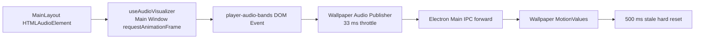
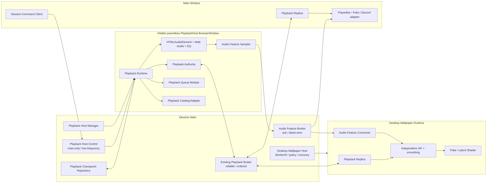

# 独立 Playback Host 与桌面壁纸运行时架构

> Status: Implemented on `feat/playback-host-wallpaper-runtime`; automated validation complete, Windows visual acceptance pending
>
> Decision date: 2026-08-12
>
> Scope: Electron 桌面端播放所有权、音频特征流、桌面壁纸生命周期与 Shader 空间尺度

本文把 [播放通讯与跨窗口时间同步架构](./playback-communication-architecture.md) 中原本可选的 Phase 6 收束为可执行方案。既有 Playback Contract、Broker、Replica 和 Projection 语义保持不变；本设计只迁移 Authority 的运行位置，并补齐高频音频特征、壁纸独立运行、队列续播和 Shader 尺度的缺口。

参考实现只用于验证架构方向：Lively 当前采用独立 Core、UI 客户端和壁纸播放器进程，而不是由管理 UI 持续喂渲染结果。Scopify 借鉴其生命周期边界，但不复制 Lively 源码，也不引入其 GPL-3.0 实现。[Lively 当前源码](https://github.com/rocksdanister/lively/tree/core-separation/src/Lively) [Lively LICENSE](https://github.com/rocksdanister/lively/blob/core-separation/LICENSE)

## 决策摘要

1. Electron 桌面端新增一个无父窗口、不可见、应用级长生命周期的 `PlaybackHost` BrowserWindow。
2. `PlaybackHost` 是桌面端唯一 Playback Authority，独占 `HTMLAudioElement`、AudioContext、EQ、音频特征采样、播放会话和最终队列游标。
3. Main Window、Tray、Desktop Lyrics、Controller 与 Desktop Wallpaper 全部降为平级 Playback Replica；主窗口收纳、隐藏、刷新或重建不得影响播放和音频特征生产。
4. 复用现有可靠 Playback Broker 和 MessagePort seam，只把 `getAuthorityWindow()` 从 Main Window 切换到 Playback Host。
5. Queue/Session 替换使用 Main Window 专属的低频 `PlaybackHostControl` 通道，不扩张现有 Playback Broker 的可靠协议职责。
6. 高频音频特征使用单独的 `AudioFeatureBroker`：每个消费者最多一帧 in-flight 和一帧 pending-latest，旧帧覆盖而不是排队补播。
7. Desktop Wallpaper 继续由现有 Capability/Driver 管理 WorkerW、窗口、策略与恢复；Wallpaper Renderer 自己运行 `requestAnimationFrame`，只消费 Projection 和 Audio Feature，不接收主窗口渲染切片。
8. Shader 使用每个渲染表面的真实 CSS 尺寸、DPR 和像素预算计算独立 viewport profile；任何 pixel-sized uniform 都补偿内部降采样比例。
9. Web 端不创建隐藏窗口，继续使用同一 `PlaybackRuntime` 的 In-page Adapter。桌面与 Web 在同一 seam 上提供两种真实 Adapter。
10. FFmpeg、mpv 与 WASAPI Loopback 不进入本阶段；它们解决媒体兼容或系统全局采集，不解决当前的 Authority 生命周期问题。

## 落地状态

截至 2026-08-12，Phase 1–5 已在功能分支完成代码迁移：

- `PlaybackHost` 是桌面端唯一媒体、Authority、Queue、Catalog 与 Audio Feature Publisher；Main Window 只保留 Replica、UI Projection 和低频 Session/Command Client。
- 音频特征通过独立 MessagePort Broker 传输；Host 以 33 ms scheduler 读取自己的 analyser，Wallpaper Renderer 使用独立 rAF、latest-only 排序、平滑与指数衰减。
- `PlaybackHostControl` 使用完整、版本化、无媒体 URL 的 Session Seed；Host 内的纯 Queue 是 repeat、shuffle、history、next/previous/ended 的唯一真相源。
- Electron Main 持有版本化 Checkpoint Repository。Host snapshot 串行原子持久化，崩溃重建后通过内部恢复命令重新装载 Session，并强制由 Catalog 重新解析 URL/歌词。
- Host Manager 已实现 `did-fail-load`、`render-process-gone`、`unresponsive` 和非退出 `closed` 恢复，默认退避为 0.5 / 1 / 2 / 5 秒。
- 打包门禁强制检查专用 Host preload 与 `playback-host/index.html`；旧的壁纸音频 `webContents.send` 转发链已删除。

Windows Explorer/WorkerW、真实 GPU/DPR、多显示器及十分钟隐藏运行仍属于人工验收项；自动化通过不替代这些平台验证。

## 现状与根因

当前音频特征链路是：



已确认的具体事实：

- `MainLayout` 持有真实 `<audio>`，并在同一个 Renderer 挂载 `useAudioVisualizer` 与 `useDesktopPlaybackWallpaperAudioPublisher`。
- `useAudioVisualizer` 使用 Main Window 的 `requestAnimationFrame` 调用 `AnalyserNode.getByteFrequencyData()`。
- Wallpaper Publisher 监听 Main Window DOM Event，最多约 30 Hz 发送一次帧。
- Electron Main 只接受 Main Window 作为发布者，再转发给 Wallpaper Window。
- Wallpaper Window 虽然设置了 `backgroundThrottling: false`，但它只能独立消费，不能独立生产上游数据。
- Wallpaper 连续 500 ms 收不到帧时会把全部频段和 spectrum 硬清零，于是视觉上出现“一段一段”的停顿。
- Latent Shader 使用 `1280 × 720` 的总像素预算上限。像素预算本身合理，但 pixel-sized uniform 若没有补偿内部 render scale，整屏拉伸后会显得颗粒和流光尺度偏大。

因此当前问题不是“Wallpaper BrowserWindow 不独立”，而是：

1. 音频时钟与音频特征生产者仍属于 Main Window 生命周期；
2. 高频通道没有真正的 latest-wins 背压；
3. 消费端用硬清零表达断流；
4. Shader 没有显式的跨 viewport 空间尺度契约。

## 目标

- 主窗口隐藏、最小化、收纳、刷新或重新创建时，当前歌曲无中断继续播放。
- Main Window 不运行时，Host 仍能完成当前歌曲播放、自动下一首、单曲循环、列表循环和播放地址刷新。
- Main Window 与 Desktop Wallpaper 获得同一份 Audio Feature 语义，但各自在本地渲染。
- 可靠播放状态不丢失、不乱序；高频音频特征允许丢帧，但不会积压回放。
- 音频特征短暂缺帧只造成平滑衰减，不停止 Shader 自身时间。
- 主窗口和桌面壁纸的流光在相同 tuning 下具有一致的相对空间尺度，而不是相同的内部像素尺寸。
- Host 崩溃后可恢复，并产生新的 Authority ID；旧消息不能污染新会话。
- Web 端行为不回退，且不承担 Electron Host 细节。

## 非目标

- 不把 Electron Main 变成音频解码器；Main Process 不拥有 DOM 与 Web Audio。
- 不为了独立 Host 重写成 .NET、WinUI、mpv 或 FFmpeg。
- 不通过 WASAPI 捕获系统混音作为 Scopify 默认音频源。
- 不把主题、窗口布局、桌面壁纸偏好或 Discord 配置并入 Playback 协议。
- 第一轮只支持现有 Primary Display 壁纸行为；架构允许后续每显示器一个 Wallpaper Runtime，但不在首轮扩张范围。
- 不保留长期双 Authority、双 `<audio>` 或双频谱发布路径。

## 架构不变量

以下条目属于模块 Interface，实施不得绕过：

1. 任意时刻一个应用实例最多存在一个桌面 Playback Authority。
2. Desktop Authority 只能由 Playback Host 的 Electron sender 身份注册；Main Window 不再有 Authority 权限。
3. Playback Host 没有 Main Window parent，其生命周期只依赖 Electron `app`。
4. Main Window 的隐藏、关闭到托盘和 Renderer reload 不得销毁 Host。
5. 只有 Authority 读取真实媒体时钟、执行 play/pause/seek 和发布可靠 Playback Message。
6. 所有 UI 只消费现有 `PlaybackProjectionSource` Interface，不读取 Host 内部状态。
7. 播放可靠消息继续遵守 `authorityId + sessionId + sequence + timelineRevision` 规则。
8. Audio Feature 与可靠 Playback Message 分通道；Audio Feature 不进入 Bootstrap，也不参与时间投影。
9. 每个 Audio Feature 消费者最多保留一帧 in-flight 和一帧 pending-latest。
10. Wallpaper Renderer 的动画时间来自自身单调时钟，不来自音频帧到达频率。
11. 暂停、结束和断线由可靠 Projection 表达；不得伪造“呼吸音频帧”表达空闲动画。
12. Queue、repeat、shuffle、history 与 ended-next 最终由 Host 内的纯 Queue Module 决策；UI toast 不是 Queue Module 的职责。
13. 恢复数据不保存过期 CDN 音频 URL；Host 恢复时重新解析媒体地址。
14. Web Adapter 与 Desktop Host Adapter 必须通过相同的 Playback Runtime seam；UI 不判断具体 Adapter。
15. Desktop Wallpaper Host 只拥有窗口与桌面策略，永远不成为 Playback Authority。

## 目标结构



## 深模块与 seam

| Module | 运行位置 | Interface | 负责与持有 | 明确不负责 |
| --- | --- | --- | --- | --- |
| Playback Runtime | Host Renderer；Web 时为 Main Renderer | `start / seedSession / dispatch / stop` | 媒体、Authority、Queue、source load revision、Audio Graph、恢复协调 | React UI、Electron 窗口、WorkerW |
| Playback Host Manager | Electron Main | `start / getWindow / getStatus / dispose` | 创建 Host、ready handshake、崩溃重启、Authority sender 身份 | 播放业务、频谱计算 |
| Playback Host Control | Electron Main 与 Host 间 | `dispatchSession / getSessionSnapshot / subscribe` | Main-only Queue/Session 命令、回执、Session Snapshot | 普通播放命令、Projection、频谱 |
| Playback Broker | Electron Main，现有模块 | 现有 Authority/Replica MessagePort Interface | 可靠消息、Bootstrap、命令回执、连接授权 | 高频频谱、播放算法 |
| Audio Feature Broker | Electron Main，新模块 | Publisher/Subscriber MessagePort Interface | 高频帧授权、ACK、覆盖旧 pending 帧、统计延迟 | 可靠状态、频谱计算、Shader 平滑 |
| Playback Queue Module | Playback Runtime 内部 | `replace / select / next / previous / getSnapshot` | queue、cursor、repeat、shuffle、history 的纯状态转移 | API、缓存、toast、React |
| Playback Catalog Port | Playback Runtime 内部 seam | `resolve(entry, quality, signal)` | 根据 Track ID 取得播放地址、时长与歌词 | Queue 决策、UI 错误展示 |
| Playback Checkpoint Repository | Electron Main Adapter；测试用 memory Adapter | `load / save / clear` | 粗粒度可恢复 Session，不保存过期 URL | 实时时钟、消息路由 |
| Playback Replica | 每个 Renderer，现有模块 | `PlaybackProjectionSource` | 验证、排序、时间投影、连接状态 | 真实媒体、IPC 细节 |
| Desktop Wallpaper Host | Electron Main，现有 Capability/Driver | `configure / retry / subscribe` | BrowserWindow、WorkerW、策略、显示器、重挂载 | Playback State、Audio Feature |
| Wallpaper Runtime | Wallpaper Renderer | Projection + Audio Feature Consumer | rAF、MotionValue、平滑、Folia 呈现 | 播放控制权、队列、桌面挂载 |
| Shader Viewport Resolver | Web 纯模块 | `resolveShaderViewport(input)` | DPR、像素预算、render scale、pixel uniform 补偿 | 主题、音频、窗口创建 |

`Playback Runtime` 是主要的深模块。删除它后，媒体加载、命令串行化、Queue、恢复、音频图和 Authority 规则会重新散落到 MainLayout、Zustand 与各窗口，因此它具备足够 Depth。

### UI 保持不变的 Interface

所有 UI 继续只认识既有 seam：

```ts
interface PlaybackProjectionSource<TLyrics = unknown> {
  getSnapshot(): PlaybackProjection<TLyrics>;
  subscribe(listener: () => void): () => void;
  dispatch(command: PlaybackCommand): Promise<PlaybackCommandReceipt>;
}
```

Desktop Main Window 从“本地 Authority + 本地 Replica”切换为“Electron Replica”后，PlayerBar、Folia、Tray 和 Wallpaper 不需要理解 Authority 移到了哪里。

### Playback Session 控制契约

普通播放命令沿用 `PlaybackCommand`。只有被授权的 Main Window 可以提交 Queue/Session 变更：

```ts
interface PlaybackQueueEntry {
  albumTitle?: string;
  artistNames: string[];
  artworkUrl?: string;
  durationMs: number;
  id: number | string;
  title: string;
}

interface PlaybackSessionSeed {
  currentIndex: number;
  intent: "pause" | "play";
  quality: string;
  queue: PlaybackQueueEntry[];
  repeatMode: "all" | "none" | "one";
  revision: number;
  resumePositionMs: number;
  volume: number;
}

type PlaybackSessionCommand =
  | { commandId: string; seed: PlaybackSessionSeed; type: "replace-session" }
  | { commandId: string; index: number; revision: number; type: "select-queue-index" }
  | { commandId: string; repeatMode: PlaybackSessionSeed["repeatMode"]; type: "set-repeat-mode" };

interface PlaybackSessionSnapshot {
  currentIndex: number;
  queue: PlaybackQueueEntry[];
  repeatMode: PlaybackSessionSeed["repeatMode"];
  revision: number;
  type: "session-snapshot";
}
```

规则：

- `revision` 严格递增，旧 seed 直接拒绝。
- `replace-session` 是原子操作；Host 不先换 queue 再等 current track。
- Session Command/Snapshot 走独立 `PlaybackHostControl` MessagePort；不加入 `PlaybackTransportPayload`，也不让 Wallpaper/Tray 获得 Queue 替换权限。
- Host 接受 seed 后成为 Queue 真相；Main Store 改为 Host Projection/Queue Snapshot 的 UI Adapter。
- 首次迁移可以由 Main Window 发送现有 Queue Snapshot；最终 Queue 的 next/previous/ended 逻辑必须从 Zustand 提取为纯 Module。
- `toggle-like` 暂时仍由 Main Window 的 User State Adapter 处理；它断线时可以返回 unavailable，但不得阻断播放。

### Playback Catalog Port

```ts
interface ResolvedPlaybackMedia<TLyrics = unknown> {
  durationMs: number;
  lyrics: TLyrics | null;
  sourceUrl: string;
}

interface PlaybackCatalogPort<TLyrics = unknown> {
  resolve(
    entry: PlaybackQueueEntry,
    quality: string,
    signal: AbortSignal,
  ): Promise<ResolvedPlaybackMedia<TLyrics>>;
}
```

生产 Adapter 复用现有网易云 API、URL/歌词缓存和默认 Electron session；测试 Adapter 使用内存结果。Host 不反向 import Main Window 的 Zustand，也不在 Queue Module 内弹 toast。

## Playback Host 运行形态

首选实现是 Electron `BrowserWindow`，不是 `utilityProcess`：当前媒体实现依赖 `HTMLAudioElement`、AudioContext 和 Web Audio Graph，而 `utilityProcess` 面向 Node 子进程。Electron 官方说明 `backgroundThrottling: false` 会让 hidden/minimized window 保持可见调度语义；`BrowserWindow` 也提供明确的 `autoplayPolicy`。[BrowserWindow 官方文档](https://www.electronjs.org/docs/latest/api/browser-window) [utilityProcess 官方文档](https://www.electronjs.org/docs/latest/api/utility-process)

建议 Host 窗口配置：

```ts
new BrowserWindow({
  show: false,
  skipTaskbar: true,
  focusable: false,
  webPreferences: {
    autoplayPolicy: "no-user-gesture-required",
    backgroundThrottling: false,
    contextIsolation: true,
    nodeIntegration: false,
    preload: playbackHostPreload,
    sandbox: true,
  },
});
```

Host Manager 对外状态必须是可诊断的联合类型，而不是一个 `isReady` boolean：

```ts
type PlaybackHostStatus =
  | { state: "stopped" }
  | { state: "starting" }
  | { authorityId: string; state: "ready" }
  | { attempt: number; reason: "closed" | "crashed" | "unresponsive"; state: "recovering" }
  | { diagnostic: string; retryable: boolean; state: "faulted" };
```

附加规则：

- 不设置 `parent`，不附着 WorkerW，不跟随 Main Window close/hide。
- 加载专用 `/playback-host` 路由；页面不包含导航、业务 UI 和主题树。
- 使用默认 Electron session，以复用登录 Cookie、HTTP Cache 与代理配置。
- 禁止新窗口、外部导航和非预期 IPC；保持 `webSecurity: true`。
- 只有 `did-finish-load + host-ready + authority-connected` 全部完成后才标记 ready。
- Host readiness 不依赖 `ready-to-show`，因为它永不显示。
- 桌面模式冷启动时 Authority 选择在创建 Renderer 前确定；不支持运行中同时激活两套 Authority。

## 音频图与特征采样

### Audio Graph

```text
HTMLAudioElement
  -> MediaElementAudioSourceNode
  -> Equalizer BiquadFilter chain
  -> AnalyserNode
  -> AudioContext.destination
```

EQ 与 analyser 必须和真实播放共用同一图，避免主窗口与 Host 各建一套 `MediaElementAudioSourceNode`。

### 采样调度

第一版在 Host 中使用独立的 33 ms scheduler 读取 `AnalyserNode`，不得使用 `requestAnimationFrame`。Host 已设置 `backgroundThrottling: false`，同时记录实际 interval jitter。

只有当 10 分钟隐藏窗口测试中 `sample interval p95 > 50 ms` 或出现 `> 150 ms` 非媒体原因空洞时，才把特征计算迁入 `AudioWorklet`。这是内部 seam 的 Adapter 替换，不改变外部 Audio Feature Interface。

暂停或无媒体时不再发布当前的 sinusoidal “breath” 假数据。可靠 Projection 表达 paused/idle；各 Renderer 依据视觉产品规则生成本地 ambient motion。

### Audio Feature Contract

`DesktopPlaybackWallpaperAudioFrame` 提升为与具体消费者无关的版本化契约：

```ts
interface AudioFeatureFrameV1 {
  authorityId: string;
  bass: number;
  lowMid: number;
  mid: number;
  power: number;
  protocolVersion: 1;
  sampledAtMs: number;
  sequence: number;
  sessionId: string;
  spectrum: number[];
  streamId: string;
  treble: number;
  type: "audio-feature-frame";
  vocal: number;
}

interface AudioFeatureAck {
  sequence: number;
  streamId: string;
  type: "audio-feature-ack";
}
```

约束：

- 各频段与 spectrum 元素保持现有 `[0, 255]` 语义，避免首轮同时调整视觉 tuning。
- spectrum 最多 256 bins；默认约 30 Hz。
- `sequence` 在一个 `streamId` 内递增；Authority 或 Session 重建必须产生新 `streamId`。
- 消费者只接受当前 Authority/Session 的帧。
- `sampledAtMs` 用于诊断与延迟估算，不参与可靠播放时间投影。

### latest-wins 背压

现有 `webContents.send()` 每帧直发不能证明消费者卡顿时没有排队。新 Broker 使用 MessagePort，并在应用层执行 ACK gate。Electron 官方的 `MessageChannelMain`/`MessagePortMain` 可在 Main 与 Renderer 间建立独立 channel。[MessageChannelMain](https://www.electronjs.org/docs/latest/api/message-channel-main) [MessagePortMain](https://www.electronjs.org/docs/latest/api/message-port-main)

每个 Subscriber 保存：

```text
inFlight: AudioFeatureFrame | null
pendingLatest: AudioFeatureFrame | null
```

发送规则：

1. 没有 in-flight 时立即发送并设为 in-flight。
2. 有 in-flight 时只覆盖 pending-latest。
3. 收到匹配 ACK 后清除 in-flight；如有 pending-latest，立即发送最新一帧。
4. ACK 超时只记录 slow-consumer，并继续保持最多两帧；不补发中间帧。
5. Subscriber disconnect 时立即丢弃两帧。

## Wallpaper Runtime 规则

### 动画时间与音频时间分离

Wallpaper Renderer 每个 `requestAnimationFrame` 都推进 Shader 自身时间。音频帧只更新目标值：

```text
0–250 ms 无新帧：朝最后目标继续平滑
250–1000 ms：指数衰减到 0
>1000 ms：音频目标保持 0，但 Shader 继续以 ambient/base speed 运行
paused / ended：在 200–300 ms 内平滑衰减，不清空 Shader 时间
```

禁止：

- 500 ms 后把 spectrum 换成空数组；
- 因音频断线取消 Shader rAF；
- 用 Main Window 的渲染帧或 DOM 尺寸驱动桌面；
- 收到迟到音频帧后补播旧峰值。

### Shader 空间尺度契约

每个 Renderer 独立计算：

```ts
interface ShaderViewportInput {
  cssHeight: number;
  cssWidth: number;
  devicePixelRatio: number;
  maxPixelCount: number;
}

interface ShaderViewportProfile {
  aspectRatio: number;
  renderHeight: number;
  renderScale: number;
  renderWidth: number;
  uniformPixelScale: number;
}
```

建议算法：

```text
nativeWidth  = cssWidth  * devicePixelRatio
nativeHeight = cssHeight * devicePixelRatio
renderScale  = min(1, sqrt(maxPixelCount / (nativeWidth * nativeHeight)))
renderWidth  = round(nativeWidth  * renderScale)
renderHeight = round(nativeHeight * renderScale)
uniformPixelScale = renderScale
```

所有基于内部 render pixel 的 size/blur/radius uniform 乘以 `uniformPixelScale`；归一化坐标、颜色、速度和比例型 uniform 不变。这样在 1400×900 主窗口、1920×1080、4K 和 ultrawide 桌面上，视觉元素占屏比例一致，像素预算仍受控。

`MAX_SHADER_PIXELS = 1280 * 720` 可以作为首轮性能预算保留，但必须通过 `ShaderViewportResolver` 显式暴露 render scale，不能只把低分辨率 Canvas 拉伸到整屏后继续使用原始 pixel-size tuning。

## 关键流程

### 冷启动

1. Electron Main 创建 Playback Broker、Audio Feature Broker 与 Playback Host Manager。
2. Host Manager 创建 parentless hidden BrowserWindow 并加载 `/playback-host`。
3. Host 初始化 Playback Runtime，加载 Checkpoint，并以 Authority 身份连接现有 Broker。
4. Main Window、Tray 和 Wallpaper Window 只以 Replica 身份连接。
5. Main Window 若持有更新的 Queue revision，发送一个原子 `replace-session`。
6. Host 发布 Bootstrap；各 Replica 建立 Projection。
7. Host 开始真实播放后才启动 Audio Feature Stream。

### 主窗口收纳或隐藏

1. Main Window 的 visibility、rAF 和 React 生命周期可以停滞。
2. Host 的媒体、33 ms sampler、Queue 和 Broker 连接保持运行。
3. Wallpaper 的 rAF 与 Feature Consumer 保持运行。
4. 不发生 Authority 切换，不产生新 Session，不触发硬清零。

### 自动下一首

1. Host 收到真实 media `ended`。
2. Queue Module 根据 repeat/shuffle/history 计算下一个结果。
3. Catalog Adapter 解析新 Track 的 URL/歌词，并受 load revision 与 AbortSignal 保护。
4. Authority `beginSession`，发布 Timeline Discontinuity 和 Bootstrap/State。
5. Main Window 是否可见不参与该流程。

### Host 崩溃

1. Host Manager 监听 `render-process-gone`、`unresponsive` 和窗口 closed。
2. Broker 注销旧 Authority；Replica 进入 disconnected，但保留最后可呈现 Projection。
3. Wallpaper 音频目标平滑衰减，Shader 继续 ambient motion。
4. Host Manager 以 `0.5s / 1s / 2s / 5s` 有界退避重建，最多连续 4 次。
5. 新 Host 从 Checkpoint/Queue Snapshot 恢复，生成新 Authority ID、Session ID 与 Audio streamId。
6. 连续恢复失败后进入 faulted，不循环拉起；Main Window 展示可重试诊断。

### Explorer / WorkerW 重建

该流程只属于 Desktop Wallpaper Host：重建 WorkerW、重挂 Wallpaper Window、恢复显示器 bounds。Playback Host 和 Authority 不重启；Wallpaper Replica 重连后请求 Bootstrap，Feature Subscriber 建立新通道。

## 状态所有权

| 状态 | 唯一 Owner | 消费方式 |
| --- | --- | --- |
| 真实播放位置、phase、duration、volume | Playback Host Authority | Reliable Projection |
| Queue、cursor、repeat、shuffle、history | Host Queue Module | Session/Queue Snapshot |
| 当前 URL 与 load revision | Host Playback Runtime | 不向 UI 暴露 URL |
| 歌词与 Track Presentation | Host Catalog/Authority Session | Reliable Projection |
| liked 与用户库 | Main User State Adapter | 可靠 patch；断线不阻塞播放 |
| Audio Feature | Host Audio Graph | Audio Feature Stream |
| Main UI 状态 | Main Renderer | React/Zustand 本地 UI 状态 |
| 壁纸偏好、层与运行状态 | Desktop Wallpaper Capability | Wallpaper Model |
| WorkerW、显示器和 Wallpaper BrowserWindow | Desktop Wallpaper Host | Electron Main 内部 |
| Shader 动画时间与平滑值 | 每个 Renderer | 本地 rAF |
| Resume Checkpoint | Electron Main Repository | Host 启动/突变时读写 |

## 安全与授权

- Playback Broker 的 `getAuthorityWindow()` 只返回 Playback Host。
- Main Window、Wallpaper、Tray、Controller 和 Desktop Lyrics 只能注册 Replica。
- `replace-session` 等 Session Command 只接受 Main Window sender；普通 Playback Command 仍按现有 Replica 授权。
- Audio Feature Publisher 只接受 Playback Host sender；订阅者使用显式 allowlist。
- preload 只暴露类型化最小 Interface；所有输入在 Main Process 做运行时校验。
- Host 保持 `sandbox: true`、`contextIsolation: true`、`nodeIntegration: false` 和 `webSecurity: true`。
- Host 只允许项目 renderer origin/app protocol；拒绝 `window.open`、任意导航和未授权下载。
- Checkpoint 不持久化 Cookie、鉴权头或过期音频 URL。

## 建议代码落位

```text
frontend/packages/desktop-contract/src/
    playback.ts                 # 保留可靠 Projection/Command
    playbackHost.ts             # Session Seed、Host Status、Checkpoint 摘要
    audioFeature.ts             # 高频帧、ACK 与运行时校验

frontend/apps/desktop/main/module/
    playbackHost/
        index.ts                # 深 Module Interface
        window.ts               # BrowserWindow Adapter
        control.ts              # Main-only Session Command/Snapshot
        recovery.ts             # 有界重启策略
        checkpoint.ts           # 文件 Repository Adapter
    playbackBroker/             # 复用现有可靠 Broker
    audioFeatureBroker/
        index.ts                # ACK + latest-wins
        ipc.ts
        port.ts
    desktopPlaybackWallpaper/   # 保留 Capability/Driver/WorkerW 职责

frontend/apps/web/app/playback-host/
    page.tsx                    # 只组装 Host Root

frontend/apps/web/components/player/
    PlaybackHostRoot.tsx

frontend/apps/web/lib/playbackHost/
    runtime.ts                  # Playback Runtime 深 Module
    queue.ts                    # 纯 Queue Module
    catalog.ts                  # Catalog Port 与 Web Adapter
    audioFeatureSampler.ts

frontend/apps/web/lib/desktopPlaybackWallpaper/
    shaderViewport.ts           # 纯尺度解析
    audioFeatureSmoothing.ts    # 纯衰减/插值规则

frontend/apps/web/hooks/player/
    usePlaybackProjection.ts    # UI seam 保持不变

frontend/apps/web/hooks/desktopWallpaper/
    useDesktopWallpaperFoliaPlayback.ts

frontend/apps/web/tests/
    playbackHostRuntime.test.ts
    playbackQueue.test.ts
    audioFeatureSmoothing.test.ts
    shaderViewport.test.ts

frontend/apps/desktop/tests/
    playbackHost.test.ts
    audioFeatureBroker.test.ts
```

不在 `app/playback-host/` 创建局部 `_components`、types 或 hooks；路由只负责组装，类型和实现进入全局目录。

## 分阶段迁移

### Phase 0：基线与诊断

- 在现有 publisher、Electron Main forward 和 Wallpaper consumer 记录 sequence、sampledAt、receivedAt、appliedAt。
- 自动化重现 Main Window visible、hidden、minimized、关闭到托盘四种状态。
- 记录 10 分钟 frame interval、最大空洞、Wallpaper rAF 和 IPC 数量。
- 固化 1920×1080、2560×1440、3840×2160 与 ultrawide 的 Shader 截图基线。

完成门：能用日志明确区分 producer stall、transport queue 与 consumer stall。

### Phase 1：Audio Feature 与 Wallpaper 稳定化

- 新增通用 `AudioFeatureFrameV1`、sequence 和 streamId。
- 实现 Audio Feature Broker 的 ACK/latest-wins 测试；首轮 Publisher 仍可暂时来自 Main Window。
- Wallpaper 改为独立 rAF、短缺帧平滑衰减，删除 500 ms hard reset。
- 引入 Shader Viewport Resolver 和 pixel uniform 补偿。

完成门：主窗口保持可见时视觉与现状一致；人为丢帧不会造成 Shader 时间停止或峰值补播。

### Phase 2：提取 Playback Runtime seam

- 把 MainLayout 中 `<audio>` source load、Authority callback、Audio Graph 和 Queue 依赖整理进 Playback Runtime。
- 桌面与 Web 暂时都使用 In-page Adapter，行为不变。
- Queue 算法从 Zustand/Toast 中提取成纯 Module，以 Interface 测试 repeat/shuffle/history/ended。

完成门：MainLayout 不再包含媒体加载状态机，只负责选择 Adapter 和组装 UI。

### Phase 3：Desktop Host 冷启动切换

- 创建 Host Manager 与 `/playback-host`。
- 将 Broker `getAuthorityWindow` 原子切换到 Host；Main Window 改连 Replica。
- Host 成为 Audio Feature 唯一 Publisher。
- 使用启动配置选择 `main-renderer` 或 `desktop-host`，一次启动只能选择一个；回滚需要重启应用，禁止热切换双播放。

完成门：Main Window hidden/minimized 10 分钟无非媒体原因的 Audio Feature 长空洞，当前歌曲不中断。

### Phase 4：完整队列与数据所有权

- Main Store 发送原子 Session Seed，Host 接管 Queue 真相。
- Catalog Adapter 迁入 Host，支持 URL 过期刷新、歌词加载和自动下一首。
- Main Store 改为 Projection/Queue Snapshot 的 UI Adapter。
- 删除 Desktop 下 MainLayout `<audio>`、`useAudioVisualizer`、DOM `player-audio-bands` 与 Wallpaper 专用 Publisher。

完成门：Main Window Renderer 被销毁后，Host 仍可完成 ended-next、repeat-one、repeat-all 与 URL refresh。

### Phase 5：恢复、打包与清理

- 接入 Checkpoint Repository、Host 崩溃重建和诊断状态。
- 将 Host route/preload/native desktop host 纳入 packaged renderer 验证与 electron-builder 制品。
- 删除兼容双写、旧 sender 授权和旧 Desktop Wallpaper Audio Frame。
- 更新 README、CodeGraph 索引覆盖与桌面测试矩阵。

完成门：开发版与打包版均通过全部验证矩阵，旧链路没有残留调用者。

## 验证矩阵

| 场景 | 预期 |
| --- | --- |
| Main Window 普通显示 | 主窗口与桌面视觉一致，播放命令正常 |
| Main Window 收纳/隐藏 | Host 采样 p95 ≤ 50 ms，Wallpaper 无可见硬断流 |
| Main Window 最小化 10 分钟 | 音频、下一首和 Wallpaper 连续运行 |
| Main Renderer reload | Host 不重启；Main Replica 重连后收到 Bootstrap |
| Main Renderer 被销毁 | 当前曲继续，ended-next 与 URL refresh 成功 |
| Wallpaper Renderer 卡顿 2 秒 | Broker 不积压；恢复后只应用最新帧 |
| Audio Feature 丢失 300 ms | 视觉平滑衰减，Shader 时间持续 |
| Audio Feature 断开 >1 秒 | 音频响应归零，ambient motion 继续 |
| seek / 切歌 / replay | 可靠协议产生正确 discontinuity；旧 Audio stream 被拒绝 |
| Host crash | 旧 Authority 断开，新 Authority 有界恢复；无双重播放 |
| Explorer 重启 | Wallpaper 重挂；Playback Host 不重启 |
| 4K / ultrawide | 流光空间尺度与主窗口相对一致，无局部放大裁切感 |
| 音频 URL 过期 | Host 原位刷新且不回退到旧 load revision |
| 打包版 | Host route、preload、WorkerW host 与恢复路径均存在 |

## 可观测性与预算

至少记录：

- `authorityId`、`sessionId`、Audio `streamId`；
- Host ready、Authority connected、first audio、first feature frame 的耗时；
- sample interval p50/p95/max；
- Broker publisher received、subscriber sent、pending overwrite、ACK latency、ACK timeout；
- Wallpaper received/applied sequence、frame age、decay state；
- Host crash reason、restart attempt、recovery duration；
- Shader css size、DPR、render size、renderScale、maxPixelCount。

首轮预算：

- Audio Feature 约 30 Hz，最多 256 bins；
- 每个消费者最多 1 in-flight + 1 pending-latest；
- Main Window hidden 时 sample interval p95 ≤ 50 ms；
- 非暂停/切歌/缓冲场景不得出现 >150 ms 的 producer gap；
- Wallpaper 收到帧到应用 MotionValue 的 p95 ≤ 75 ms；
- Shader resize 只在 viewport/DPR/预算变化时重新计算，不在每帧计算。

## 被否决方案

### 继续由 Main Window 发布频谱

不能满足“上游不受窗口 UI 生命周期影响”的核心目标；`backgroundThrottling: false` 只能保护当前窗口，不能改变 ownership。

### Wallpaper 自行 WASAPI Loopback

会混入系统其他声音，并让每个 Wallpaper 实例重复采集。它适合作为未来“系统全局可视化” Adapter，不适合作为 Scopify 当前歌曲的权威特征源。

### Electron Main 直接播放 Web Audio

Main Process 没有 DOM/HTMLAudioElement；把解码搬到 Node/native 会迫使现有 EQ、CORS、媒体事件和 Web 端路径全部重写。

### utilityProcess 作为第一版 Host

`utilityProcess` 适合 Node 子进程和原生工作负载，但当前 Playback Runtime 依赖 Web Audio。只有未来引入原生解码 Adapter 时才重新评估。

### 立即引入 FFmpeg/mpv

会产生第二套媒体状态、鉴权 URL、seek、EQ 和资源生命周期，不能修复现有 Main Window rAF 所有权问题。

### 把主窗口画面切片传给桌面

它把两个独立渲染表面重新耦合，并放大比例、帧率和窗口可见性问题；Wallpaper 必须本地绘制。

## 完成标准

- Desktop 只有 Playback Host 一个真实 `<audio>` 和一个 Authority。
- Main Window、Wallpaper、Tray、Controller、Desktop Lyrics 都只消费 Replica。
- Main Window Renderer 销毁后仍能继续播放、切歌和刷新 URL。
- Desktop Wallpaper Publisher 不再依赖 DOM `player-audio-bands`；该事件仅保留给浏览器内 Folia 的本地兼容消费。
- Audio Feature Broker 有 ACK/latest-wins 自动化覆盖，慢消费者不会产生无界队列。
- Wallpaper 不再用 500 ms hard reset，也不因特征断流停止 Shader 时间。
- Shader viewport/scale 有 1080p、2K、4K 与 ultrawide 的纯函数测试和截图验收。
- Host crash、Main reload、Explorer restart 和 packaged build 有明确测试记录。
- Web 端仍通过 In-page Adapter 使用同一 Playback Runtime seam。
- 旧 Main Renderer Authority 路径和兼容双写全部删除，而不是永久保留开关。

## 与现有架构的关系

[播放通讯与跨窗口时间同步架构](./playback-communication-architecture.md) 继续定义可靠协议、Replica、Clock Anchor、Timeline Discontinuity 和 UI seam；本文只对以下事项作出后续决策：

- Electron Authority 从 Main Renderer 迁入 Playback Host；
- Audio Spectrum Phase 4 具体化为通用 Audio Feature Broker；
- Desktop Wallpaper 补齐独立动画、背压和空间尺度规则；
- Queue 与媒体解析迁入 Host，达到 Main Window 真正可替换的目标。

若两份文档出现冲突，以本文对 Electron Authority 位置与 Audio Feature/Wallpaper Runtime 的规定为准。
