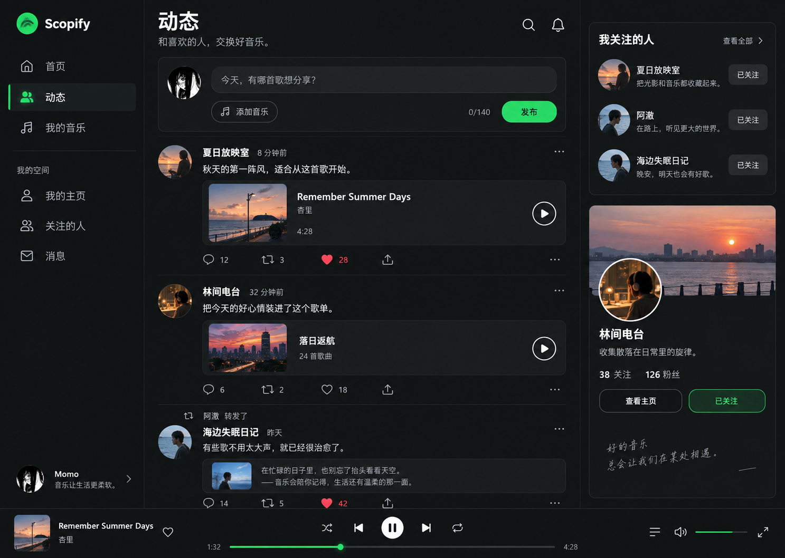
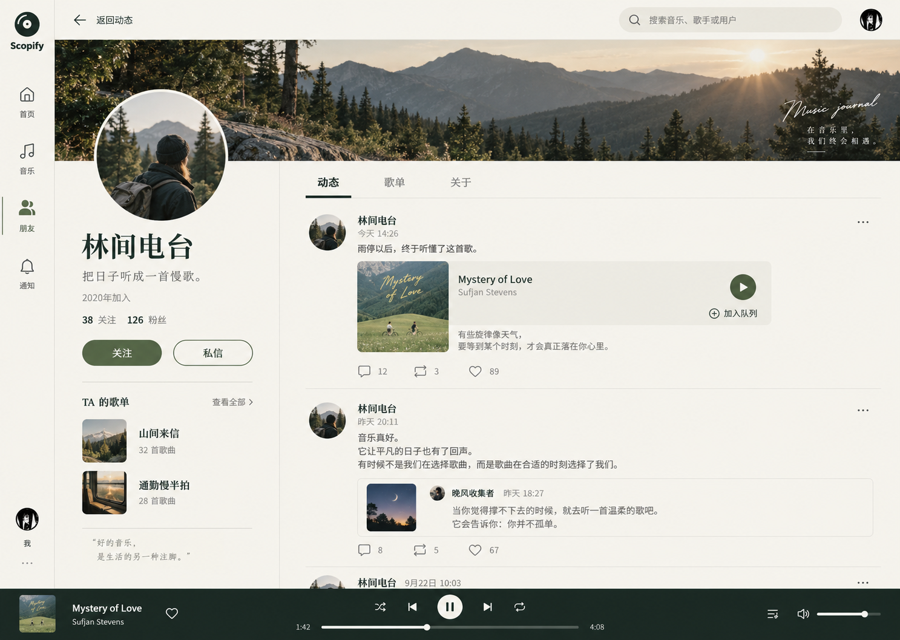
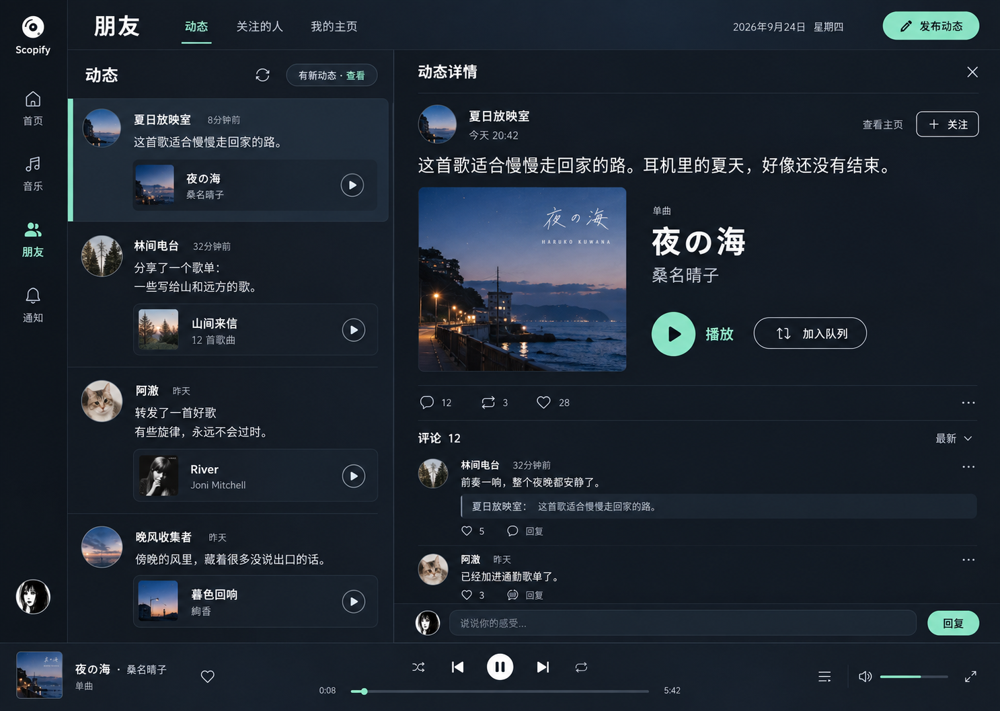

# Scopify 用户动态：设计评审稿

日期：2026-09-24。状态：视觉方向评审，尚未实现业务 UI。

## 结论与建议

把「动态」做成一个可独立进入的音乐社交空间，让 Profile 成为这个空间里的个人主页。核心体验是：看分享 → 听音乐 → 评论或转发 → 认识作者 → 关注 → 从互动通知返回原文。

建议优先考虑以时间线为主的结构，同时吸收个人主页的表达力，以及详情分栏的连续阅读体验。本轮三张稿是三种方向，不是三个必须同时开发的页面；先选交互结构，再统一视觉。

首轮闭环包括动态流、个人动态、关注/粉丝、点赞、评论/回复、转发、文字/音乐发布及通知回跳。私信作为已有能力的衔接入口，不把首轮扩大为完整即时通讯产品。全局播放器持续存在。

## 三个视觉方向

| 方向 | 页面重点 | 优势 | 取舍 |
| --- | --- | --- | --- |
| 声流 | 连续动态时间线 + 紧凑关系侧栏 | 接近 Twitter 的浏览习惯，浏览效率高 | 个人特色需要通过资源内容和主页补充 |
| 音乐手记 | 封面、个人名片 + 个人动态 | Profile 更有辨识度，适合从内容认识一个人 | 高频刷动态仍需独立的公共入口 |
| 边听边聊 | 左侧动态流 + 右侧原文和评论 | 保持阅读位置，音乐与对话连贯 | 窄窗口需退化成单栏详情 |

视觉稿使用虚构用户与动态，仅用于评审。图片里的控件是拟议交互，不表示已经接通接口；文字排版和图标将在选定方向后细化。

## 视觉稿

以下编号按本轮对话中的实际展示顺序确定。生成图原样保留；使用真实音乐数据实现时，应保留真实封面，不能用概念图里的示例封面替换。

### 1 · 声流

### 2 · 音乐手记

### 3 · 边听边聊

第三张的评论时间是生成式示例，未严格匹配原文时间；实际实现按响应时间排序。三张稿的 logo、示例封面和字形均属于概念表达，最终使用项目正式资产与排版。

## 实际界面观察

本轮通过浏览器操作了当前登录的 Scopify：从头像菜单进入 Profile，观察主页，点击好友图标，打开通知中心，最后关闭浮层。

1. Profile 首屏由大头像、大字号昵称、个人统计和最近播放歌单组成，适合展示身份，但缺少可继续浏览和互动的动态。
2. 关注/粉丝展示为静态文本，没有关系列表入口；动态数量为零时不显示，所以没有稳定的动态入口。
3. 顶栏好友图标点击后没有页面变化；源码中也没有事件处理。
4. 别人的 Follow 按钮在源码中仅切换本地布尔状态，尚未调用 `/follow`。本轮没有执行任何关注写操作。
5. 通知浮层已经显示私信、评论、@我、通知等内容，社交摘要不是空白能力；目前仍以摘要展开为主，没有完整的原动态跳转目标。
6. 自己的最近播放是私人内容入口；别人主页只读公开歌单。改版应保留这种边界，不能把自己的听歌记录直接作为公共动态。

实际参考截图：`profile-social-design/profile-current.png`。截图只作为本地研究证据；设计稿内容另用虚构数据。

源码依据：

- `repo/frontend/apps/web/app/(dashboard)/profile/page.tsx`
- `repo/frontend/apps/web/hooks/profile/useUserData.ts`
- `repo/frontend/apps/web/components/profile/UserHero.tsx`
- `repo/frontend/apps/web/components/profile/UserHeroStats.tsx`
- `repo/frontend/apps/web/components/profile/UserActionBar.tsx`
- `repo/frontend/apps/web/components/Header/RightActions.tsx`
- `repo/frontend/apps/web/components/notifications/NotificationCenter.tsx`
- `repo/frontend/packages/desktop-contract/src/notifications.ts`

## 页面与关键交互

### 动态空间

- 顶栏好友图标和主导航「动态」进入同一空间；主入口不埋在自己的 Profile 底部。
- `/event` 承接朋友动态来源。上游接口没有显式的“推荐/仅关注/互关”筛选参数，首轮不虚构这三种服务端 feed。
- 「关注的人」是关系列表入口，可切换关注/粉丝，再进入某人的 Profile。若以后增加“只看关注”，须确认完整关系集合并明确过滤的是已加载范围，不能把空的已加载结果当作全局没有动态。
- 首屏小型发布框：文字、添加音乐、140 字计数、发布；支持附加当前播放歌曲，但不自动替用户发布。
- 动态主体依次呈现作者、时间、正文、音乐/歌单等资源、互动行。正文点击打开动态详情；头像进入作者页；资源播放和动态点赞互不混淆。
- 新内容用「有新动态 · 查看」提示，用户点击后更新顶部，避免浏览中自动插入导致跳动。
- 转发显示原作者和原文；失效原文保留转发文字并标注不可用。

### Profile

- 压缩首屏个人信息，使用真实头像/背景图/签名，增加稳定的「动态 / 歌单 / 关于」导航；有无动态都保留动态 Tab。
- 他人主页：关注/已关注/互相关注、私信、关注和粉丝列表。关系状态必须来自服务端；重复点击锁定同一操作，失败回滚。
- 自己主页：编辑资料、发动态、我的动态；本人可见的非公开动态有清楚的范围标识。最近播放放在只对自己展示的音乐区域，不混成公开分享。
- 点击数量进入对应列表，不把上游统计总量当作分页实际条数；返回 feed 保留位置和已加载内容。

### 动态详情与回复

- 宽窗口在侧栏/分栏显示，窄窗口使用单栏详情，返回后恢复浏览位置。
- 原文、资源、评论、回复输入同屏；回复某人时显示引用和取消回复操作。
- 发评论或转发失败保留草稿；点赞失败回滚；提交中避免重复提交。
- 通知点击能回到动态和对应评论。当前契约只有展示字段，需增加可验证的目标数据，例如作者 ID、动态 ID、threadId、评论 ID；旧通知缺少目标时继续显示摘要。
- 没有确认单条动态详情 API。首轮优先使用列表/通知携带的完整动态及缓存；冷启动链接必要时有限分页定位作者动态，找不到时显示原文不可用，不能无限扫描。

## API 清单与约束

依据当前后端 `repo/backend/api-enhanced/public/docs/home.md` 及对应 `module/` 实现交叉阅读。后端基线：`61b33bbd03e5e9934441164724417f46b090c8f6`。下表代表源码支持情况，未执行真实账号写操作或逐接口联调。

### 动态读写

| 接口 | 参数与能力 | 设计含义 |
| --- | --- | --- |
| `/event` | `pagesize=20`、`lasttime=-1` 起始，朋友动态流 | 用响应游标增量翻页；不是 offset 分页，也没有可配置排序/关系筛选 |
| `/user/event` | `uid`、`limit=30`、`lasttime=-1`；内部 `fromRN=true` | 自己和别人主页动态；本人可读取上游允许的非公开内容 |
| `/user/event/all` | 从登录账号取得 uid，内部循环全部分页、去重 | 适合个人整理/管理，不能用于普通 feed 首屏；上限和游标停滞有保护 |
| `/share/resource` | `type`、`msg`、`id`；文本用 `noresource`；文档列出 song/playlist/mv/djradio/djprogram/album | 文字和音乐分享；文档 140 字，支持 @用户名；暂不支持图片上传 |
| `/event/forward` | `evId`、原作者 `uid`、`forwards` 文本 | 带评论的转发；不等同于简单分享链接 |
| `/event/del` | `evId` | 本人动态管理；删除需产品确认 |
| `/event/privacy` | `evId`、`privacy`：0 所有人，1 我关注的人，2 仅自己，6 互相关注 | 修改已发布动态的独立操作；发布接口不带 privacy，不能伪装成原子私密发布 |
| `/resource/like` | 动态用 `type=6`、原始 `threadId`、`t=1/0` | 动态赞/取消赞；不要拿动态 ID 替代 threadId |
| `/topic/detail/event/hot` | `actid` | 话题下热门动态；不是全站推荐 feed，放后续 |

`/user/event` 文档列出的事件类型：18 单曲，19 专辑，17/28 电台节目，22 转发，39 发布视频，35/13 歌单，24 专栏，41/21 视频。类型识别应依据真实 payload，保留未知类型的正文和来源，不猜测所有事件都有歌曲。正文可能在序列化的 `json` 内；转发可能嵌套，需要安全解析和有界展开。

上游 `size` 可能包含已删除/屏蔽/失效或旧类型记录；`/user/event/all` 的 `retrievedCount` 才是实际枚举数量，`unavailableCount` 不代表可恢复数据。

### 评论

| 接口 | 参数与能力 | 使用边界 |
| --- | --- | --- |
| `/comment/event` | 原始 `threadId`、`limit=20`、`offset=0`、`before=0` | 动态评论首选读取入口 |
| `/comment` | `type=6`、`threadId`，`t=1` 新评论、`t=2` 回复、`t=0` 删除；内容 `content`，回复/删除 `commentId` | 实现中显式支持完整动态 threadId |
| `/comment/like` | `type=6`、`threadId`、`cid`、`t=1/0` | 评论赞，与动态赞分开 |
| `/comment/new` | `type`、`id`、pageNo/pageSize、sortType/cursor | 内部直接拼接资源前缀与 id，没有动态 threadId 特例；不直接套现有歌曲评论调用 |
| `/comment/floor` | `type`、`id`、parentCommentId、time、limit | 同样直接拼接 threadId；动态楼中楼需单独核实组合 ID |
| `/comment/add`、`/comment/reply`、`/comment/delete` | type/id、content、cid 等，直接拼接资源前缀 | 这些新接口不能未经核实就传完整 threadId；优先使用显式支持动态的 `/comment` |
| `/comment/info/list` | `type`、`ids`，批量评论统计 | 不是动态详情接口；动态复合 ID 语义需核实 |

### 人与关系

| 接口 | 参数与能力 | 对应界面 |
| --- | --- | --- |
| `/user/detail` | `uid` | 头像、签名、背景、统计和关系等用户详情 |
| `/user/playlist` | `uid`、limit/offset | 个人公开歌单；保留现有自己/他人分支 |
| `/user/follows` | `uid`、`limit=30`、`offset` | 关注列表、@候选用户名 |
| `/user/followeds` | `uid`、`limit=20`、`offset` | 粉丝列表 |
| `/user/follow/mixed` | size/cursor、scene=0 全部/1 歌手/2 用户 | 当前账号的混合关注；不可把歌手 ID 直接当用户 ID |
| `/user/mutualfollow/get` | `uid` → `friendid` | 验证互关关系；不是实时在线状态 |
| `/follow` | `id`、`t=1` 关注，其余取消 | 真实关注/取消；同步相关用户卡片与计数 |
| `/search` | keywords、`type=1002`、limit/offset | 通过昵称发现用户，空关注态有可执行入口 |
| `/user/comment/history` | uid、time/limit | 用户历史评论，后续按返回权限展示；不是用户发布的动态 |

### 通知与私信衔接

| 接口 | 分页或关键参数 | 用途 |
| --- | --- | --- |
| `/msg/comments` | uid、before、limit | 评论/回复互动 |
| `/msg/forwards` | offset、limit | @我/转发相关通知，按内容解析 |
| `/msg/notices` | lasttime、limit | 通知，包括已识别的点赞摘要 |
| `/pl/count` | 无业务参数 | 上游未读统计；与 Scopify 本地 readAt 区分 |
| `/msg/private` | offset、limit | 私信会话列表，现有 Web API 已封装 |
| `/msg/private/history` | uid、before、limit | 会话历史，现有 Web API 已封装 |
| `/msg/recentcontact` | 无业务参数 | 最近联系人 |
| `/send/text` | user_ids、msg | 文本私信，已有 Web API 封装 |
| `/send/song`、`/send/album` | user_ids、id、msg | 给某人分享音乐资源 |
| `/send/playlist` | user_ids、`playlist`、msg | 参数名是 playlist，不是 id |

通知现状已按当前代码和界面更新：`notification-core/src/social.ts` 已实现拉取、游标和去重，`socialPresentation.ts` 已区分评论、回复、@和点赞展示。下一步应扩展目标标识并复用这套机制，而不是再造独立未读计数。现有接口未提供这里可用的社交实时推送或好友正在听歌能力。

## 状态与验收目标

| 状态 | 预期体验 |
| --- | --- |
| 未登录 | 展示登录引导；不把未授权请求当空列表 |
| 无关注 | 引导搜索用户或打开已有用户主页；不伪造推荐用户 |
| 无动态 | 明确空态，保留关注列表和发布入口 |
| 分页失败 | 已有内容保留，在列表尾部重试；游标不丢失 |
| 新动态到达 | 提示用户主动加载，保持当前滚动位置 |
| 资源不可播放 | 保留原文、评论和资源名称，播放操作解释不可用 |
| 原文不可用 | 保留可确认的引用，不显示假原文 |
| 发布/评论失败 | 保留文字和选中资源，不重复提交、不谎报成功 |
| 账号切换 | 清空账号隔离的草稿/缓存可见状态，避免串号 |

选定方向后的验收重点：一次完整的浏览→播放→评论→作者主页→关注→返回，以及一条互动通知→原动态→对应回复的路径；确认期间播放器持续工作、返回位置稳定、写入失败可恢复。

## 后续实施顺序

1. 按 review 选定的方向细化动态首页、他人/本人 Profile、详情/回复、发布框及空态，先交互原型。
2. 类型与解析层区分 eventId、authorId、threadId、resourceId；与现有播放入口对接。
3. 接入只读动态与关系分页，再接点赞、评论、关注、转发和发布。
4. 扩展通知目标标识并完成回跳；接入私信入口。
5. 依据用户明确给定的验证范围做真实账号与 UI 验收。

本轮仅浏览现有界面、阅读源码/文档、制作视觉稿与评审说明；没有执行测试、构建、lint、真实发帖、评论、关注或隐私修改，也未修改应用业务代码。
