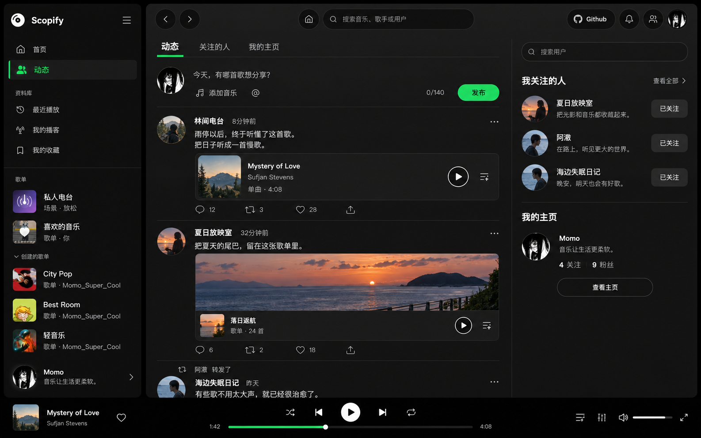
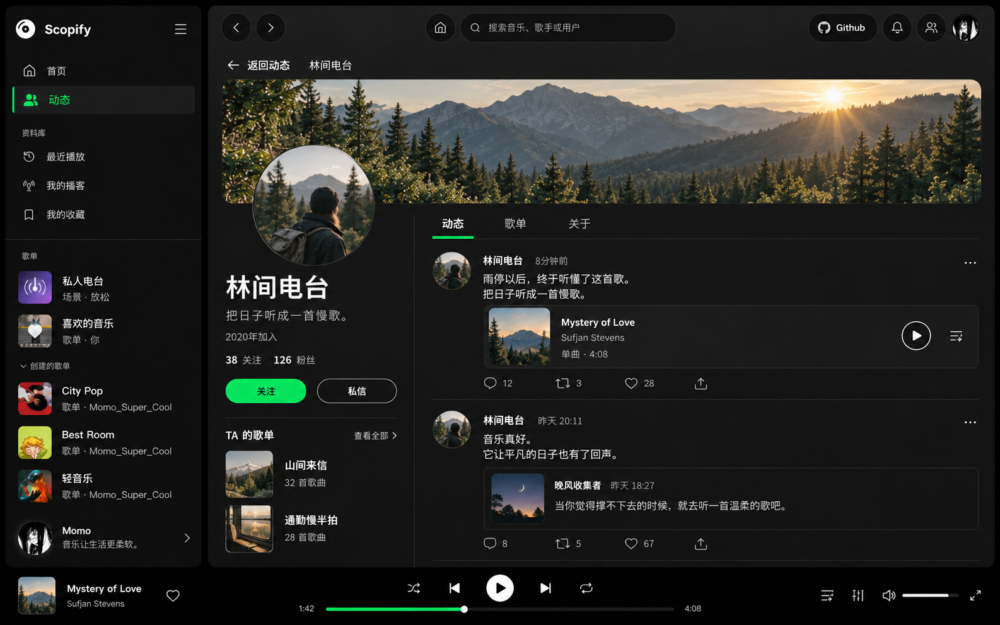

# 用户动态融合设计 · V2

2026-09-24 · 同一套设计的动态首页与用户主页，视觉评审稿，尚未实现。

## 本次方向

依据本轮反馈，将第一版的推特式动态浏览与第二版的个人主页组合，统一回 Scopify 的深色视觉。用户补充的 X 截图用于参考信息密度、连续信息流和细分隔线。

两张图是同一套界面的两个状态：浏览动态 → 点击作者头像 → 查看对方主页 → 返回原浏览位置。

## 动态首页

- 保留 Scopify 音乐侧边栏、全局顶栏和底部播放器，将动态作为明确入口。
- 中间以连续信息流承载发布框、动态正文、音乐附件和互动栏；动态之间使用细线分隔。
- 正文与作者是阅读主线，音乐资源可直接播放；点赞动态与喜欢歌曲是独立动作。
- 右侧只放关注关系和自己的主页入口，保持浏览的主次关系。

## 用户主页

- 保持与动态首页一致的侧边栏、顶栏和播放器。
- 沿用第二版的横幅封面、个人名片与个人动态布局，转换为深色主题。
- 左侧个人名片包含头像、昵称、签名、关注/粉丝、关注与私信；歌单作为补充信息。
- 右侧以「动态 / 歌单 / 关于」切换内容，默认呈现这个人的动态，复用首页的动态行与音乐附件。
- 「返回动态」恢复离开时的浏览位置；打开主页和切换内容不中断播放。

## 统一视觉

| 要素 | 本轮方向 |
| --- | --- |
| 背景 | Scopify 的黑色与中性炭灰层次 |
| 强调色 | 绿色用于主按钮、选中导航和播放状态 |
| 字体 | 清楚的中文无衬线正文，白色标题与灰色辅助文字 |
| 层次 | 优先留白、排版、细分隔线，减少外围卡片 |
| 个性 | 来自用户封面、头像、签名与分享内容 |
| 持续性 | 两个页面的音乐导航与全局播放器保持一致 |

## 交互和接口边界

沿用 [首轮接口与闭环说明](profile-social-design-review.md)，本轮没有改变 API 判断。

- 朋友动态以已有 `/event` 为基础，关注列表单独进入；不直接承诺算法推荐流。
- 发布框支持文字、音乐资源和 @，图片上传仍未在发布接口中确认支持。
- 主页关注、评论、转发和通知回跳均是拟议交互，后续实现需要连接真实状态。
- 图片中的音乐封面、用户和内容用于示例；正式界面保留服务端原始封面和用户资料，不能用生成图替换真实内容。
- 生成稿用于确认整体结构与气质，图标、字号和局部间距在后续实现前细化。

本轮只新增两张融合设计稿与本说明，并更新 changelog。未修改应用业务代码，也未执行构建、测试或真实账号写操作。
