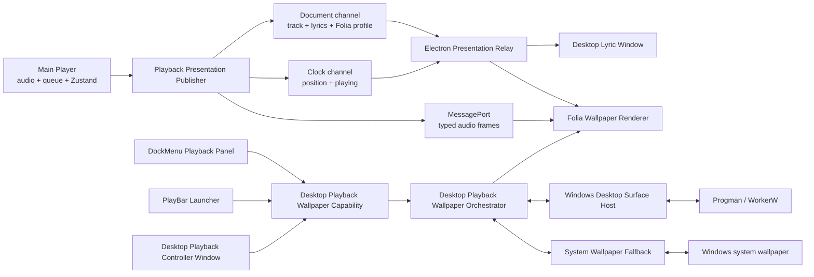
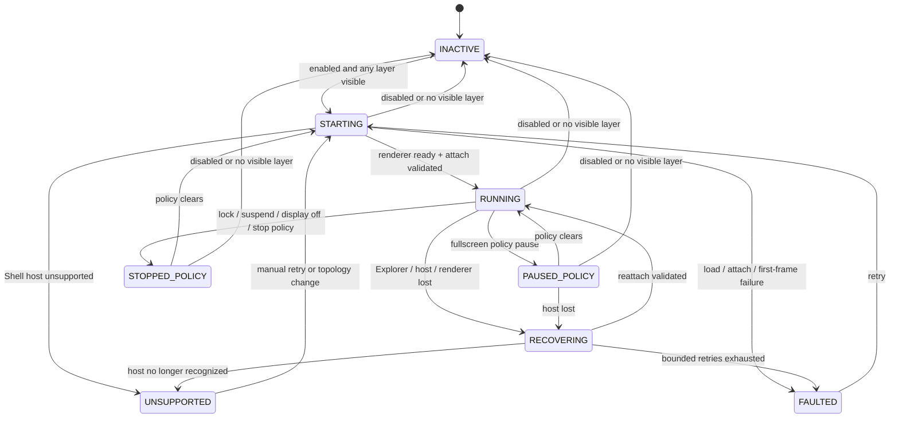

# Folia 桌面播放壁纸实施计划

- 状态：Phase 2 开发版纵向切片已落地
- 日期：2026-08-09
- 目标平台：Windows，第一版仅主显示器
- 技术依据：[Windows 动态桌面壁纸宿主调研](../research/windows-live-wallpaper-hosting.md)
- 已完成前置：`codex/desktop-playback-wallpaper-spike` 上的 Phase 0 Windows 宿主与系统壁纸恢复 Spike

## 当前实现快照（2026-08-09）

当前分支已经可以从 PlayBar 直接开启/关闭真实 Folia 桌面壁纸：

- bridge protocol v2、版本化偏好、状态机、可取消 reconcile 与 sender 权限矩阵已落地；
- 主 Lyric Stage 与桌面 renderer 共用 `FoliaPresentationSurface`，支持背景/歌词两层的四种组合语义；
- 正式 `/desktop-wallpaper` renderer 接收歌曲、标准化歌词、播放时钟和节流后的音频频谱；时钟在本地插值并在发布器断流后冻结；
- Electron development driver 会按图层选择 opaque/transparent BrowserWindow，加载后挂入 WorkerW，校验完整 display bounds，再 `showInactive()`；
- PlayBar 右侧提供最小调试开关。启用、持久化、WorkerW exact-bounds attach、Folia 出帧以及关闭后 HWND/renderer 回收均已在 1920×1080 Windows 主屏实测通过；
- 当前 feed 暂时复用兼容快照和普通单向 IPC（音频约 30 Hz、最多 256 bins），正式 Document/Clock revision 与 MessagePort 仍属于后续优化；
- 专用 Controller Window、DockMenu panel、Explorer/电源/全屏恢复策略、System Wallpaper Fallback 正式接线和 packaged native helper 尚未实现。打包构建会明确返回 unsupported，不会退化为普通置底窗口。

## 1. 目标结果

把 Scopify 当前的 Folia 播放表现扩展为一个可选的 **Desktop Playback Wallpaper（桌面播放壁纸）**：动态画面位于 Windows 桌面图标后方，仍由 Scopify 主播放器提供歌曲、歌词、进度和音频分析数据。

用户既可以从 Windows 托盘右键打开紧凑的 **DockMenu Playback Panel**，也可以从该面板或 PlayBar 右侧的 **Desktop Playback Controller Launcher** 唤起专门的 **Desktop Playback Controller Window**。这些 surface 共享同一能力层，用它控制以下内容：

- 桌面播放壁纸总开关；
- Wallpaper Background Layer（Folia 共享背景层）开关；
- Wallpaper Lyric Layer（Folia Visualizer Mode）开关；
- 当前运行、暂停、恢复或错误状态；
- 重试和进入详细设置。

本功能不是第二个播放器，也不是现有 Desktop Lyric Window 的放大版。主窗口中的播放器继续唯一拥有音频元素、队列、播放状态和 NetEase 会话。

## 2. 已确定的产品与技术原则

1. **使用混合桌面架构。** Explorer/WorkerW 子窗口承载动态 Folia 画面；可选的静态 System Wallpaper Fallback 只补齐 Windows 11 任务栏、Mica 和 Shell 回退画面。
2. **一个专用控制窗口，多个入口。** 新建 Desktop Playback Controller Window；现有 `/tray` 成为紧凑 DockMenu Playback Panel，PlayBar 提供 Launcher。三者只消费同一 capability model，不各自拥有窗口或壁纸逻辑。
3. **图层彼此独立。** 总开关和两个图层开关是三个不同偏好；两个图层都关闭是合法状态，此时保留偏好但不创建渲染窗口。
4. **沿用当前 Folia 视觉配置。** 第一版桌面壁纸镜像当前 Lyric Stage 的 Visualizer Mode、Background、Theme、Tunings 和本地资产，不建立第二套桌面专属主题库。
5. **主播放器是唯一播放所有者。** 壁纸 renderer 不创建 `<audio>`、第二个 `AudioContext`、队列或播放 store。
6. **桌面宿主失败必须安全。** Attach 或覆盖校验失败时立即销毁 renderer 并恢复 System Wallpaper Fallback；禁止退化成普通全屏置底窗口。
7. **初版 Windows-only、主屏-only。** 多显示器、逐虚拟桌面和桌面交互均不阻塞第一版。
8. **System Wallpaper Fallback 默认关闭。** 用户明确开启后才允许临时修改系统壁纸，并始终使用恢复 journal 与条件恢复。

## 3. 图层语义

Folia 当前由两部分组合：`VisualizerShell` 内的共享 Background Renderer，以及所选 Visualizer Mode 自己的歌词和模式构图。产品图层按这个真实结构定义，避免把某些模式中的装饰错误承诺为“纯文字”。

| 总开关 | 背景层 | 歌词层 | 有效结果 |
| --- | --- | --- | --- |
| 关 | 任意 | 任意 | 销毁壁纸 renderer，恢复 Scopify 接管前的 Windows 壁纸 |
| 开 | 开 | 开 | 完整 Folia：共享背景 + Visualizer Mode |
| 开 | 开 | 关 | 只挂载共享 Folia Background Renderer |
| 开 | 关 | 开 | 在透明桌面 surface 上挂载 Visualizer Mode；模式自带构图仍属于歌词层 |
| 开 | 关 | 关 | 不渲染，控制器显示“未选择显示图层”；偏好仍保留 |

实现时不能用 `visualizerOpacity = 0` 模拟图层关闭，因为它会同时隐藏整个 `VisualizerShell`。建议新增一个深模块 `FoliaPresentationSurface`，内部选择：

- 背景和歌词都开：正常 `VisualizerRenderer`；
- 仅歌词：向 `VisualizerRenderer` 传入透明 background；
- 仅背景：直接复用 `VisualizerShell`/`VisualizerBackgroundRenderer`，不挂载 Visualizer Mode；
- 两者都关：返回空并由主进程卸载 BrowserWindow。

每个已注册 Visualizer Mode 都必须进入组合验收矩阵，尤其是 Canvas/WebGL/Pixi 模式。

BrowserWindow profile 也由图层决定：Background Layer 可见时使用已验证的 opaque profile；仅 Lyric Layer 时使用 transparent profile。由于 Electron 的 `transparent` 不能在窗口创建后可靠切换，改变 Background Layer 会触发一次受控窗口替换：先在 hidden 状态创建、加载、attach 并校验新窗口，再交接并销毁旧窗口。是否能统一为 always-transparent profile 留到性能与兼容性数据证明后决定。

## 4. 用户场景规则

| 场景 | 第一版行为 |
| --- | --- |
| 没有当前歌曲 | 背景层显示中性的 Folia 空闲画面；歌词层不显示“暂无歌词”等占位文案 |
| 当前歌曲无歌词 | 背景继续工作；歌词层为空，不影响壁纸状态 |
| 播放暂停 | 歌词时间冻结；视觉进入 Folia paused 状态，不伪造 FFT |
| Seek / 切歌 | 立即发送新的时钟或文档 revision，不等待周期校准 |
| 主窗口隐藏到托盘 | 音频和发布器继续工作，壁纸不受主窗口可见性影响 |
| 主 renderer reload/crash | 停止歌词时间外推并显示“等待播放器”；恢复连接后重新同步，不启动第二个播放器 |
| Scopify 退出 | 销毁动态 surface，并尝试条件恢复原系统壁纸 |
| Explorer 重启 | 进入 recovering，重新探测 Shell host；恢复前不显示普通窗口 |
| 用户运行中手动改 Windows 壁纸 | System Wallpaper Fallback 放弃恢复所有权，不覆盖用户的新选择 |

## 5. 状态所有权

| 状态 | 唯一所有者 | 消费者 |
| --- | --- | --- |
| 音频、队列、播放/暂停、seek、当前歌曲 | 主播放器 renderer / Zustand | Lyric Stage、Desktop Lyric Window、壁纸、托盘 |
| 原始与标准化歌词、chorus ranges | 主播放器 renderer 的歌词表现发布器 | Desktop Lyric Window、Folia runtime |
| Folia Theme、Mode、Background、Tunings | `useLyricStageStore` | 主 Lyric Stage、桌面壁纸 renderer |
| 自定义 Folia 图片和字体 | 现有 Folia IndexedDB 存储 | 每个 renderer 在本窗口重新生成 object URL / 注册字体 |
| 壁纸总开关、图层和策略偏好 | Electron main 的 Wallpaper Orchestrator | 托盘控制器、详细设置、壁纸 renderer |
| 壁纸运行状态、错误和恢复进度 | Electron main 的 Wallpaper Orchestrator | 托盘控制器、诊断 UI |
| HWND、Explorer host、物理屏幕坐标 | Windows Desktop Surface Host | Wallpaper Orchestrator |
| 系统壁纸恢复 journal | System Wallpaper Fallback | Wallpaper Orchestrator |

Renderer 不能持久化“正在运行”这类操作状态；main 不能成为播放状态的新权威；Windows sidecar 不理解歌曲或歌词。

## 6. 总体架构



## 7. 深模块与 seam

### 7.1 Playback Presentation Publisher

位置：Web renderer，替代当前只面向 Desktop Lyric Window 的 `useDesktopLyricPublisher`。

它隐藏：

- Zustand selector 和 `player-time` DOM 事件；
- NetEase lyric normalization、Folia lyric adaptation 所需的 chorus ranges；
- 文档 revision、时钟采样和发布节流；
- 主窗口内 Folia 配置变化监听；
- FFT 是否存在桌面消费者的需求计数。

它只发布三个稳定概念：Presentation Document、Playback Clock 和 Audio Frame。完整歌词不再随当前时间每约 90ms 重复序列化。

### 7.2 Folia Playback Runtime

位置：`hooks/player/` 与 `lib/lyrics/` 的组合 seam。

两个真实 adapter：

- `MainPlayerFoliaFeed`：读取本窗口 Zustand、time event 和 audio event；
- `DesktopWallpaperFoliaFeed`：读取 Electron document/clock channel 与 MessagePort。

两者都交给同一个 runtime 建立 MotionValue、时间插值、当前歌词行和 AudioBands。这样 Lyric Stage 与壁纸的视觉时钟只实现一次，测试也只穿过这一 interface。

### 7.3 Desktop Playback Wallpaper Orchestrator

位置：Electron main。

这是本功能的核心深模块。控制器只提交偏好 patch，Orchestrator 原子持久化并执行 reconcile；调用者不直接调用 `createWindow`、`attach`、`pause`、`capture` 或 `restore`。

建议的内部 interface：

```ts
interface DesktopPlaybackWallpaperOrchestrator {
  configure(update: DesktopPlaybackWallpaperPreferencesUpdate): Promise<DesktopPlaybackWallpaperModel>;
  dispose(): Promise<void>;
  getModel(): DesktopPlaybackWallpaperModel;
  initialize(): Promise<DesktopPlaybackWallpaperModel>;
  retry(): Promise<DesktopPlaybackWallpaperModel>;
}
```

它隐藏 BrowserWindow 生命周期、首次出帧握手、host attach、fallback、策略传感器、重试退避和诊断。

### 7.4 Windows Desktop Surface Host

位置：Electron main 的 Windows adapter；开发期可使用已验证 PowerShell host，发布前必须经过打包形态决策门。

稳定 interface 只暴露 `probe`、`attach`、`validate`、`detach` 和 host-loss 通知。所有 WorkerW 类名、`0x052C`、窗口 style、DPI 与物理像素换算都留在 implementation 内。生产 adapter 与 in-memory test adapter 使这里成为真实 seam。

### 7.5 System Wallpaper Fallback

只负责 initialize/recover、apply captured frame、conditional restore 和 ownership status。它不捕获页面、不决定何时应用，也不感知歌曲。

静态帧必须是 **background-only capture**：捕获期间隐藏歌词层与诊断 UI，避免冻结歌词出现在任务栏/Mica 中。

### 7.6 Desktop Playback control surfaces

新增专用 Desktop Playback Controller Window，同时扩展现有 `/tray` 页面为紧凑 DockMenu Playback Panel，并在 PlayBar 右侧加入 Launcher。三个调用方全部依赖同一个 `desktopPlaybackWallpaper` runtime interface，不自行推断 WorkerW、复制偏好或直接创建 BrowserWindow。

DockMenu panel 只保留高频操作与状态摘要；专用窗口承载完整播放/壁纸控制；PlayBar 按钮只负责 `showController()`。性能、全屏策略及 System Wallpaper Fallback 仍放到专用窗口或 Desktop Settings 的详细区域。

## 8. 契约模型

建议在 `frontend/packages/desktop-contract/src/desktopPlaybackWallpaper.ts` 定义纯 TS 契约，并在落地时把 bridge protocol 升到 v2、增加 `desktop-playback-wallpaper` capability。

### 8.1 用户偏好

```ts
interface DesktopPlaybackWallpaperPreferences {
  enabled: boolean;
  layers: {
    background: boolean;
    lyrics: boolean;
  };
  fullscreenPolicy: "keep-running" | "pause" | "stop";
  systemWallpaperFallback: boolean;
}
```

第一版默认值：总开关关、两个图层开、全屏暂停、System Wallpaper Fallback 关。帧率选项暂不进入公开契约；当前 Folia 内存在多个独立 rAF/WebGL/Pixi loop，在建立统一 frame governor 前不能把“30 FPS”做成无效设置。

### 8.2 运行 view model

```ts
type DesktopPlaybackWallpaperStatus =
  | { state: "inactive"; reason: "disabled" | "no-visible-layer" }
  | { state: "starting" }
  | { state: "running"; displayId: string }
  | { state: "policy-paused"; reason: WallpaperPolicyReason }
  | { state: "policy-stopped"; reason: WallpaperPolicyReason }
  | { state: "recovering"; attempt: number; reason: "explorer-restarted" | "host-lost" | "renderer-crashed" }
  | { state: "unsupported"; diagnostic: string }
  | { state: "faulted"; diagnostic: string; retryable: boolean };

interface DesktopPlaybackWallpaperModel {
  preferences: DesktopPlaybackWallpaperPreferences;
  status: DesktopPlaybackWallpaperStatus;
}
```

Controller 始终消费完整 model，避免偏好和状态分两次到达而闪现错误组合。

### 8.3 播放数据

```ts
interface DesktopPresentationDocument<TLyrics = unknown, TFoliaProfile = unknown> {
  revision: number;
  track: DesktopLyricTrack | null;
  isLiked: boolean;
  lyrics: TLyrics | null;
  chorusRanges: Array<{ startTimeMs: number; endTimeMs: number }>;
  foliaProfile: TFoliaProfile;
}

interface DesktopPlaybackClock {
  documentRevision: number;
  sequence: number;
  isPlaying: boolean;
  positionMs: number;
  sampledAt: number;
}

interface DesktopAudioFrame {
  sequence: number;
  sampledAt: number;
  bass: number;
  lowMid: number;
  mid: number;
  vocal: number;
  treble: number;
  power: number;
  spectrum: Uint8Array;
}
```

Main process 可以保存和转发 document/clock，但不解释 Folia profile。Wallpaper renderer 在使用前按 `schemaVersion` 归一化。自定义图片 Blob 和字体文件不经过 IPC；各 renderer 从同一 IndexedDB 读取，并通过 asset revision 通知重新加载。

### 8.4 Runtime role interfaces

WebRuntime 下使用一个 `desktopPlaybackWallpaper` namespace，但按 renderer 角色拆为三个小 interface：

- `controller`：`getModel`、`configure`、`retry`、`showController`、`onModelChanged`；
- `publisher`：`publishDocument`、`publishClock`、音频 port 握手；
- `surface`：`getInitialPresentation`、`onPresentation`、`onRenderDirective`、`reportReady`、`reportFault`、接收音频 port。

IPC main 必须按 `webContents.id` 校验 sender。主窗口中的 PlayBar 可 publish、配置和打开控制窗口；DockMenu panel 可配置并打开控制窗口；控制窗口可读取/配置；壁纸 renderer 只可读取 presentation、报告自身状态；Desktop Lyric Window 继续只拥有歌词伴随窗权限。

## 9. 数据通道

### 9.1 Presentation Document

只在曲目、歌词、喜欢状态、chorus ranges、Folia 配置或资产 revision 变化时发送。Document 带单调递增 revision；wallpaper 忽略旧 revision。

### 9.2 Playback Clock

播放状态、seek、切歌时立即发送；播放中低频校准，wallpaper 使用 `positionMs + (now - sampledAt)` 在本地推进 MotionValue。断开或超过 freshness TTL 后停止外推。

### 9.3 Audio Frame

通过 `MessageChannelMain` 把主 renderer 的一个 port 与 wallpaper renderer 的一个 port 配对，使用 `Uint8Array`，不通过普通 `ipcRenderer.invoke` 或 BroadcastChannel 每帧发送 JSON 数组。

- Audio analyser 仍只有主播放器中的一份；
- 没有 wallpaper 消费者时不发送桌面音频帧；
- `policy-paused`/`policy-stopped` 时断开或停止 port 数据；
- renderer reload 后重新握手，旧 sequence 和旧 port 失效；
- 多显示器阶段由 relay 明确 fan-out，不让 renderer 之间自行发现彼此。

## 10. 运行状态机



状态转换由一个纯 reducer/reconcile plan 计算，副作用结果再提交状态。这样可用 fake host、fake window、fake policy sensor 和 fake fallback 覆盖所有转移，不需要测试内部字段。

### 启动顺序

1. 恢复未完成的 System Wallpaper journal；
2. 读取并归一化版本化偏好；
3. 若 effective intent 关闭，进入 inactive；
4. 按当前图层选择 opaque 或 transparent profile，创建 hidden、不可聚焦、跳过任务栏且忽略鼠标的主屏 BrowserWindow；
5. 加载 `/desktop-wallpaper` 并注入最新 document/clock；
6. renderer 报告可见内容首帧 ready；
7. Windows host attach，并校验 native 实际 bounds 等于目标 display bounds；
8. 如明确启用 fallback 且背景层可见，捕获 background-only 静态帧并 apply；
9. `showInactive()`，状态进入 running。

任何步骤失败都按相反顺序回滚，且不显示未 attach 的窗口。

## 11. 策略行为

| 信号 | 默认策略 | 实际动作 |
| --- | --- | --- |
| 独占或无边框全屏应用 | pause | renderer 保留，设置 Folia `paused/staticMode`，停止 FFT 传输 |
| 锁屏 | stop | 销毁 surface、释放 GPU；不进入锁屏层 |
| suspend | stop | 销毁 surface；resume 后延迟 probe + start |
| 显示器 off | stop | 销毁 surface；显示器恢复后重新创建 |
| Explorer 重启 | recover | 立即隐藏/销毁旧 surface，重新探测并 attach |
| 播放暂停 | 非系统策略 | 冻结歌词时钟，保留 Folia 的 paused presentation |

“全屏继续运行”和“全屏停止并释放”可以作为详细设置选项。电池降帧需要统一 frame governor，推迟到性能阶段；第一版不提供一个实际上无法约束所有 Canvas/WebGL loop 的开关。

## 12. System Wallpaper Fallback 生命周期

Fallback 仅在以下条件同时成立时持有系统壁纸：

- 总开关开；
- Background Layer 开；
- 用户明确开启 fallback；
- 动态 renderer 已 ready 且 host attach 已验证；
- captured frame 写入成功。

曲目封面或 Folia 背景配置变化时 debounce 捕获；只在内容 hash 变化后写系统壁纸。关闭 Background Layer、关闭总开关、进入 unsupported/faulted 或 Scopify 退出时立即条件恢复。

恢复 journal 使用 ASCII recovery copy、UTF-8 显式读取和“当前系统壁纸仍是 Scopify 设置值”的 ownership check；正式实现沿用 Phase 0 已验证规则。

## 13. 建议文件落位

```text
frontend/packages/desktop-contract/src/
└── desktopPlaybackWallpaper.ts

frontend/apps/desktop/main/module/desktopPlaybackWallpaper/
├── index.ts                       # Orchestrator external interface
├── stateMachine.ts                # pure transition/reconcile plan
├── presentationRelay.ts           # latest document/clock + port pairing
├── preferences.ts                 # versioned persistence/normalization
├── policyMonitor.ts               # power/fullscreen/display signals
├── windowsDesktopSurfaceHost.ts   # native adapter
└── systemWallpaperFallback.ts     # apply/conditional restore adapter

frontend/apps/web/
├── app/desktop-playback-controller/page.tsx
├── app/desktop-wallpaper/page.tsx
├── components/desktopWallpaper/
│   ├── DesktopPlaybackWallpaperSurface.tsx
│   ├── DesktopPlaybackWallpaperStatus.tsx
│   └── DesktopPlaybackControllerWindow.tsx
├── components/lyrics/FoliaPresentationSurface.tsx
├── components/tray/DesktopPlaybackWallpaperCard.tsx
├── hooks/desktopWallpaper/
│   ├── useDesktopPlaybackWallpaperController.ts
│   └── useDesktopPlaybackWallpaperSurface.ts
├── hooks/player/usePlaybackPresentationPublisher.ts
├── lib/lyrics/foliaPlaybackRuntime.ts
└── types/desktopPlaybackWallpaper.ts
```

`app/desktop-wallpaper/page.tsx` 负责组合 surface/status 与 hook，不做空壳转发；业务类型放 `types/`，业务 hook 放 `hooks/`。Prototype 文件保留到正式模块通过同一验收后再删除。

## 14. 分阶段交付

### Phase 0 — Windows host Spike（已完成）

- 主屏 exact bounds attach；
- 透明/不透明 surface；
- 可选静态系统壁纸 apply/restore；
- UTF-8 路径、recovery copy、journal 与用户改壁纸保护；
- 失败不显示普通全屏窗口。

### Phase 1 — 契约、领域状态与 presentation feed

1. 新增 desktop-contract 类型、capability 和 bridge v2；
2. 先写 Orchestrator state machine、偏好归一化、可取消 reconcile 和 sender matrix 测试；
3. 抽取 Presentation Document / Playback Clock publisher；
4. 让现有 Desktop Lyric Window 通过兼容 adapter 消费新 feed，确保行为不回归；
5. 抽取可由 main 和 desktop adapter 驱动的 Folia Playback Runtime。

其中第 1 项和第 2 项的 capability foundation 已落地：DockMenu、PlayBar 和未来控制窗口现在共享 `getModel/configure/retry/showController/onModelChanged` interface；真实 controller host、wallpaper driver 和 presentation feed 继续按后续切片接入。

完成标准：还未打开真实壁纸，也能用测试证明所有权、revision、时间外推、断线冻结和 IPC 权限。

### Phase 2 — 主屏 Folia 垂直切片

1. 新建正式 `/desktop-wallpaper` 路由；
2. 新建 `FoliaPresentationSurface`，实现四种图层组合；
3. 将 Phase 0 host 包装成 `WindowsDesktopSurfaceHost` adapter；
4. 创建图层驱动的 opaque/transparent BrowserWindow profile，完成 first-frame/attach/show 与受控替换握手；
5. 接入 Document、Clock 和 Audio MessagePort；
6. 新建专用控制窗口，在 DockMenu panel 加入紧凑操作，并在 PlayBar 右侧加入只负责唤起该窗口的 Launcher。

完成标准：主窗口隐藏后，用户仍可通过托盘右键控制或打开专用窗口；PlayBar Launcher 唤起的是同一个窗口；歌词、seek、暂停、切歌和 FFT 与主播放器一致；壁纸从不获取焦点。

### Phase 3 — 生命周期与 Shell fallback

1. 接入 Explorer host-loss、锁屏、suspend/resume、显示器状态和全屏策略；
2. 实现 bounded backoff 与诊断状态；
3. 正式化 background-only capture 与 System Wallpaper Fallback；
4. 增加设置页中的策略与 fallback 选项；
5. 增加自定义 Folia asset revision 同步。

完成标准：Explorer 重启、锁屏/解锁、睡眠恢复和用户改系统壁纸均可安全恢复，不遗留 journal 或错误窗口。

### Phase 4 — 性能、打包与发布门

1. 审计全部 Visualizer/Background 的 paused/staticMode 行为；
2. 建立 1080p/4K CPU、GPU、显存、dropped frame 和恢复耗时基线；
3. 设计真正覆盖各独立 rAF/WebGL/Pixi runtime 的 frame governor 后再提供帧率设置；
4. 决定 PowerShell host 是否只保留开发用途，以及生产 native helper 的语言、签名和打包方式；
5. 通过 Windows 10/11、DPI、Shell 模式和冲突软件矩阵；
6. 验证 packaged static renderer、runtime bundle guard、安装/卸载与崩溃恢复。

完成标准：形成可发布的 Windows-only feature flag，诊断信息足够区分 unsupported、host lost、renderer fault 和 fallback restore fault。

### Phase 5 — 多显示器（后续）

- 一屏一 BrowserWindow；
- duplicate / independent / span 产品语义；
- 热插拔、负坐标、旋转、主屏切换、混合 DPI/刷新率；
- 每屏静态 fallback 与独立恢复状态。

逐虚拟桌面不同壁纸和桌面鼠标交互继续延后。

## 15. 验收清单

### 产品行为

- 四种图层组合逐一通过；
- 无歌曲、无歌词、暂停、seek、切歌、喜欢状态和主窗口隐藏均符合场景表；
- DockMenu panel、PlayBar Launcher 和专用控制窗口共用同一 model，不把“偏好已开”误报为“正在运行”；
- 壁纸与 Desktop Lyric Window 可同时使用且互不改变所有权。

### Windows 行为

- Desktop icons、框选、右键、刷新和 `Win + D` 保持正常；
- 壁纸不出现在 Alt+Tab、任务栏或任务视图中，也永不获得焦点；
- native bounds 覆盖完整 display bounds，而不是 work area；
- attach/validate 失败后没有普通全屏窗口残留；
- Explorer 重启和主屏变化可恢复或明确进入 unsupported。

### 数据与安全

- 完整歌词只在 document revision 变化时发送；
- clock 本地插值并在 freshness TTL 后冻结；
- FFT 使用 typed MessagePort，壁纸 paused/stopped 时不发送；
- main、tray、wallpaper 和 desktop-lyrics sender 权限均有负向测试；
- wallpaper renderer 不含播放、登录、文件写入或任意 Win32 权限。

### Fallback

- 只在 Background Layer 可见时允许 apply；
- captured frame 不含歌词和控制 UI；
- Apply → Restore 路径、非 ASCII 原壁纸路径、崩溃恢复和用户中途改壁纸均通过；
- 无 journal、无 Scopify 动态进程时系统壁纸保持用户值。

### 验证命令

实现阶段至少运行：

```powershell
bun --cwd frontend/packages/desktop-contract run typecheck
bun --cwd frontend/apps/web run typecheck
bun --cwd frontend/apps/desktop run typecheck
bun --cwd frontend/apps/web test
bun --cwd frontend/apps/desktop test
bun --cwd frontend/apps/desktop run build
```

在并行主题重构未修复 `border-surface-base` 前，真实 Windows 验证继续使用 static renderer 路径，避免把无关 CSS 500 误判为壁纸故障。

## 16. 决策门与非目标

当前不新增 ADR。生产 native host 的交付形态尚未决定；只有当 PowerShell 与 compiled helper 的兼容性、签名、包体和维护成本比较完成后，才满足“难以逆转、未来读者会疑惑、存在真实取舍”三个 ADR 条件。

第一版明确不做：

- 壁纸直接接收鼠标/键盘控制；
- 每个虚拟桌面不同内容；
- 多显示器独立配置；
- 锁屏动态画面；
- 壁纸独立主题库或独立播放器；
- 未真正覆盖各渲染 loop 的伪帧率开关；
- attach 失败时退回普通 fullscreen/bottom-most window。

## 17. 推荐的第一个实现切片

从 Phase 1 的纯状态和契约开始，而不是直接把 Spike 文件改名：

1. 新建 `desktopPlaybackWallpaper.ts` 契约；
2. 写 state machine 与偏好 normalization 测试；
3. 在 preload/runtime 中加入 controller 的 `getModel/configure/retry/showController/onModelChanged`，默认仍 disabled；
4. 用 fake host 证明四种图层 intent、失败回滚与 sender 权限；
5. 再接入真实 BrowserWindow 和 Phase 0 host adapter。

这样第一批改动不触碰 Folia 大型 renderer，也不会在 Orchestrator interface 尚未稳定时把 WorkerW 细节扩散进 main、tray 和 web 三处。
