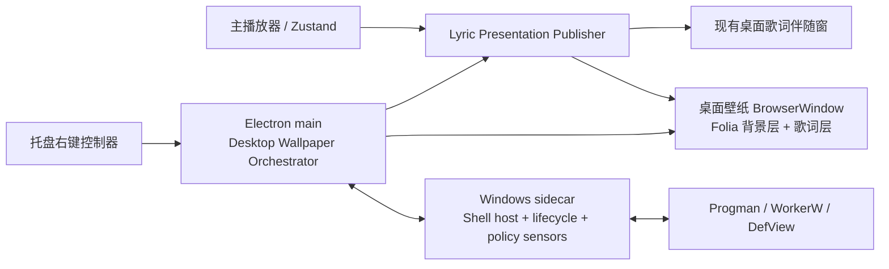

# Windows 动态桌面壁纸宿主调研

> 调研日期：2026-07-29  
> 项目基线：Scopify、Electron `42.7.1`、Next.js `16.1.6`、React `19.2.3`  
> 文档性质：Folia 桌面播放壁纸的技术可行性与架构输入，不是最终 ADR，也不修改实现代码。  
> 结论适用范围：Windows 10/11 桌面应用；Web 版不具备本文所述的 Shell 嵌入能力。

## 结论摘要

1. **可以实现 Wallpaper Engine 类的“真桌面背景”效果。** 核心不是把普通窗口全屏、置底或设为点击穿透，而是把一个实时渲染 `HWND` 放进 Windows Explorer 的桌面窗口树，使它处于桌面图标层之后。
2. **Windows 没有公开的“任意动态内容壁纸”API。** 受支持的 `IDesktopWallpaper` 只管理图片路径、颜色、布局与幻灯片；第三方动态壁纸通常依赖 Explorer 的 `Progman`、`WorkerW`、`SHELLDLL_DefView` 窗口结构及私有消息 `0x052C`。这些不是稳定的 Shell 合约。
3. **不能断言 Wallpaper Engine 当前版本具体使用了哪段 WorkerW 流程。** 官方确认其壁纸被集成到 Windows 桌面并与 Explorer 合成，也公开了 Chromium/CEF、暂停策略和多显示器能力，但没有公开 `Progman`、`WorkerW`、`0x052C` 或 `SetParent` 的实际实现。
4. **Electron 可以负责 Folia 渲染，但不能独立完成桌面挂载。** `BrowserWindow.getNativeWindowHandle()` 能给出 Windows `HWND`；Electron 公共 API 没有“把窗口设为任意原生 HWND 的子窗口”的能力，需要一个很小的 Windows 原生桥接层。
5. **不能只实现经典 WorkerW 分支。** 公开源码 Lively 当前同时处理经典桌面树和 newer Windows 的 raised-desktop 树；后一种结构要求把自有窗口设为 `WS_CHILD | WS_EX_LAYERED`、挂到 `Progman`，再将 Z 序放在 `SHELLDLL_DefView` 之下、系统 `WorkerW` 之上。
6. **建议 Scopify 使用独立的 Windows 原生 sidecar 管理 Shell 宿主，Electron 继续管理渲染和控制器。** sidecar 隔离未文档化的窗口操作、Explorer 重启监控和系统状态轮询；主窗口、现有桌面歌词伴随窗与桌面壁纸窗保持三种不同产品形态。
7. **MVP 应先做单主屏、非交互、默认全屏暂停。** 背景层和歌词层独立开关；两层都关闭时销毁/卸载渲染窗。多显示器随后采用“一屏一窗”，虚拟桌面差异化壁纸延后。

## 1. 证据分级与术语

本文用以下标签避免把推断写成平台保证：

| 标签 | 含义 |
| --- | --- |
| **官方事实** | Microsoft、Electron 或 Wallpaper Engine 的官方文档明确说明 |
| **公开源码证据** | 可在固定提交的公开实现中直接看到，但不代表 Microsoft 或 Wallpaper Engine 的合约 |
| **推断/建议** | 由官方能力和公开实现推导出的 Scopify 设计判断，必须通过原型验证 |

本文所称：

- **桌面壁纸窗**：承载 Folia 背景和/或歌词的全屏 Electron `BrowserWindow`。
- **桌面歌词伴随窗**：Scopify 已有的 `450 × 230` 透明小窗，不是本文的桌面壁纸窗。
- **控制器**：普通 Electron UI，从系统托盘右键窗口进入，控制启停、图层和性能策略。
- **经典桌面树**：桌面图标视图位于一个顶层 `WorkerW`/`Progman` 分支，另一个顶层 `WorkerW` 可承载壁纸窗。
- **raised desktop**：`Progman` 作为无重定向表面的顶层窗口，`SHELLDLL_DefView` 与 `WorkerW` 作为其子窗口分层组合的变体。

## 2. Wallpaper Engine 官方公开了什么

### 2.1 官方能够确认的事实

- **官方事实：壁纸被集成进桌面合成。** Wallpaper Engine 说明其壁纸是桌面的一部分，并与 Windows Explorer 桌面组合；因此在多 GPU 机器上，它建议壁纸与 Explorer 使用同一 GPU，避免跨 GPU 拷贝。[Wallpaper Engine：Desktop Window Manager 与多 GPU](https://help.wallpaperengine.io/en/performance/dwm.html)
- **官方事实：Web 壁纸使用 Chromium/CEF。** 官方调试文档明确使用 CEF 的远程调试能力；这说明“网页渲染器作为壁纸内容”是成熟的产品路线，与 Electron/Chromium 承载 Folia 的技术形态相近。[Wallpaper Engine：Debugging Web Wallpapers](https://docs.wallpaperengine.io/en/web/debug/debug.html)
- **官方事实：渲染必须主动受性能策略约束。** Wallpaper Engine 默认在游戏中暂停，并允许用户在全屏应用时选择停止并释放内存；Web 壁纸文档还要求遵守 FPS 上限并使用 `requestAnimationFrame`。[全屏/游戏性能策略](https://help.wallpaperengine.io/en/performance/game.html) [Web 壁纸 FPS 规范](https://docs.wallpaperengine.io/en/web/performance/fps.html)
- **官方事实：多显示器是显式产品模型。** Wallpaper Engine 支持按显示器加载独立壁纸、播放列表和 profile；命令行也用显示器位置标识或索引寻址目标显示器。[按应用与多屏 profile](https://help.wallpaperengine.io/en/functionality/wallpaperperapp.html) [命令行控制](https://help.wallpaperengine.io/en/functionality/cli.html)
- **官方事实：显示器关闭与休眠要单独处理。** Wallpaper Engine 允许在显示器关闭时停止并释放壁纸；其文档也指出 Web/音频流可能影响休眠。[休眠与显示器关闭](https://help.wallpaperengine.io/en/general/brokensleep.html)
- **官方事实：动态内容不进入 Windows 锁屏。** Wallpaper Engine 明确拒绝把动态壁纸注入登录/锁屏，只支持静态快照或独立屏保。[Windows 锁屏说明](https://help.wallpaperengine.io/en/general/lockscreen.html)
- **官方事实：同类桌面修改器可能互相冲突。** Wallpaper Engine 要求用户不要同时运行另一个也修改 Windows 壁纸的应用。[壁纸不可见与冲突排查](https://help.wallpaperengine.io/en/noshow/nowallpaper.html)

### 2.2 官方没有公开确认的部分

在本次检索到的 Wallpaper Engine 官方产品页、帮助中心和设计器文档中，没有找到以下实现承诺：

- 是否使用 `Progman`、`WorkerW` 或 `SHELLDLL_DefView`；
- 是否发送 `0x052C`，以及使用何种参数；
- 是否通过 `SetParent`、DirectComposition、DWM thumbnail 或其他内部通路挂载；
- Explorer 重启后的具体恢复算法；
- Windows 11 raised-desktop 分支的具体处理代码；
- 进程隔离、每屏窗口数量和窗口样式的精确实现。

因此，“Wallpaper Engine 的体验需要进入图标后方的桌面层”有官方产品行为支持；“Wallpaper Engine 当前一定逐字采用常见 WorkerW 教程代码”则是**无一手证据的推断**，本文不作该断言。

## 3. Windows 桌面窗口关系与挂载机制

### 3.1 受支持 API 的边界

**官方事实：** Microsoft 的 `IDesktopWallpaper` 可设置/读取每个显示器的图片、背景色、位置与幻灯片；`SetWallpaper` 接收的是图片文件路径，不接收 `HWND`、HTML、视频或实时 GPU surface。[`IDesktopWallpaper`](https://learn.microsoft.com/en-us/windows/win32/api/shobjidl_core/nn-shobjidl_core-idesktopwallpaper) [`IDesktopWallpaper::SetWallpaper`](https://learn.microsoft.com/en-us/windows/win32/api/shobjidl_core/nf-shobjidl_core-idesktopwallpaper-setwallpaper)

结论是：

- 静态专辑封面可以走受支持接口；
- Folia 动画歌词、模糊背景、音频可视化不能只靠该接口；
- 真动态壁纸必须持续拥有一个渲染 surface/window，或不断生成静态图片。后者无法达到逐字歌词和可视化的帧率要求。

### 3.2 经典 WorkerW 路径

**公开源码证据：** Lively 在固定提交 `c1036feb` 中采用以下流程：

1. 找到 `Progman`。
2. 对其发送私有消息 `0x052C`，当前参数为 `wParam = 0xD`、`lParam = 0x1`，尝试创建/准备图标后的 `WorkerW`。
3. 用 `EnumWindows` 遍历顶层窗口，在每个候选下用 `FindWindowEx` 查找 `SHELLDLL_DefView`。
4. 找到包含 DefView 的顶层窗口后，再在全局 Z 序中取其后继的 `WorkerW` 作为壁纸宿主。
5. 把壁纸窗口 `SetParent` 到目标 `WorkerW`。[Lively `SetupDesktopLayer`](https://github.com/rocksdanister/lively/blob/c1036feb664960722e34bf4309042c247d6a909d/src/Lively/Lively/Core/WinDesktopCore.cs#L122-L222) [Lively `TryAttachToDesktop`](https://github.com/rocksdanister/lively/blob/c1036feb664960722e34bf4309042c247d6a909d/src/Lively/Lively/Core/WinDesktopCore.cs#L1012-L1051)

该公开实现观察到的经典窗口树可简化为：

```text
Desktop top-level Z order
├─ WorkerW / Progman
│  └─ SHELLDLL_DefView
│     └─ SysListView32 "FolderView"    ← 图标、选择、桌面菜单
├─ WorkerW                              ← 目标壁纸宿主
│  └─ ScopifyWallpaperRenderer          ← Folia 背景/歌词
└─ 其他 Shell 窗口
```

**官方事实：** 这条流程使用的通用原语本身有文档：`EnumWindows` 枚举顶层窗口，`FindWindowEx` 搜索指定父级的直接子窗口，`SetParent` 改变子窗口父级。[`EnumWindows`](https://learn.microsoft.com/en-us/windows/win32/api/winuser/nf-winuser-enumwindows) [`FindWindowExW`](https://learn.microsoft.com/en-us/windows/win32/api/winuser/nf-winuser-findwindowexw) [`SetParent`](https://learn.microsoft.com/en-us/windows/win32/api/winuser/nf-winuser-setparent)

**官方事实 + 推断：** `0x052C` 落在 `0x0400–0x7FFF` 范围。Microsoft 把该范围定义为私有窗口类消息，而不是受支持的系统消息，所以它的含义、参数和未来行为都没有平台合约。[Windows 消息编号范围](https://learn.microsoft.com/en-us/windows/win32/winmsg/about-messages-and-message-queues#application-defined-messages)

发送该消息时应使用带超时的 `SendMessageTimeout`，避免 Explorer 无响应时卡住调用线程；Microsoft 提供了 `SMTO_ABORTIFHUNG` 等超时策略。[`SendMessageTimeoutW`](https://learn.microsoft.com/en-us/windows/win32/api/winuser/nf-winuser-sendmessagetimeoutw)

### 3.3 newer Windows 的 raised-desktop 路径

**公开源码证据：** Lively 当前不按“Windows 11 版本号”硬编码，而是检查 `Progman` 是否具有 `WS_EX_NOREDIRECTIONBITMAP`。命中时，它将桌面理解为另一种窗口树：

```text
Progman [WS_EX_NOREDIRECTIONBITMAP]
├─ SHELLDLL_DefView [WS_EX_LAYERED]
│  └─ SysListView32 "FolderView"       ← 图标与桌面输入层
├─ ScopifyWallpaperRenderer             ← 应位于 DefView 下、WorkerW 上
└─ WorkerW                               ← Windows 自身的壁纸层
```

Lively 在这条分支中：

1. 将自有渲染窗口设为 `WS_CHILD`；
2. 确保 `WS_EX_LAYERED` 并把 alpha 设为 `255`；
3. 将窗口 `SetParent` 到 `Progman`；
4. 用 `SetWindowPos` 把它排到 `SHELLDLL_DefView` 之下；
5. 确保系统 `WorkerW` 仍处于该子树底部；
6. 监听目标 WorkerW 被销毁并重建桌面层。[Lively raised-desktop 检测](https://github.com/rocksdanister/lively/blob/c1036feb664960722e34bf4309042c247d6a909d/src/Lively/Lively/Core/WinDesktopCore.cs#L129-L205) [Lively raised-desktop 挂载和 Z 序](https://github.com/rocksdanister/lively/blob/c1036feb664960722e34bf4309042c247d6a909d/src/Lively/Lively/Core/WinDesktopCore.cs#L1021-L1073)

Microsoft 文档确认 `WS_EX_NOREDIRECTIONBITMAP` 表示窗口不渲染到 DWM redirection surface，`WS_EX_LAYERED` 从 Windows 8 起可用于 child window；但文档没有把上述 Shell 树声明为稳定扩展点。[Extended Window Styles](https://learn.microsoft.com/en-us/windows/win32/winmsg/extended-window-styles)

**推断/建议：** Scopify 必须运行时探测两种结构，并把“未知结构”作为显式失败状态。不能仅判断 `process.getSystemVersion()`，也不能假定所有 Windows 11 机器都落在同一分支。

### 3.4 为什么图标、框选和右键仍正常

**公开源码证据 + 推断：** 在两种已知结构里，`SHELLDLL_DefView`/其 `SysListView32` 子窗口仍位于 Scopify 渲染窗之上。Explorer 继续拥有图标命中、空白区域右键、拖拽框选和刷新；Scopify 只提供后方像素。

这与“普通全屏置底窗”有本质区别：

- 普通置底窗仍是独立顶层窗口，`Win + D`、任务视图、虚拟桌面和 Shell 重排都可能暴露它的普通窗口身份；
- 正确嵌入的渲染窗是桌面树的一部分，图标层自然覆盖它；
- `BrowserWindow.setIgnoreMouseEvents(true)` 可作为额外保险，但不能替代正确的父子关系和 Z 序。[Electron `setIgnoreMouseEvents`](https://www.electronjs.org/docs/latest/api/browser-window#winsetignoremouseeventsignore-options)

**建议：** 第一版壁纸窗完全不接收输入、不获取焦点、不进入任务栏。用户从 Scopify 托盘右键打开控制器；不要劫持 Windows 桌面右键菜单。若未来需要鼠标视差，应像 Lively 公开源码那样从独立 raw-input 通道读取全局指针，而不是把图标后的网页变成可点击窗口。[Lively raw input 接线](https://github.com/rocksdanister/lively/blob/c1036feb664960722e34bf4309042c247d6a909d/src/Lively/Lively/Core/WinDesktopCore.cs#L88-L96)

## 4. Electron 能做什么、缺什么

### 4.1 能力矩阵

| 需求 | Electron 公共 API | 结论 |
| --- | --- | --- |
| 创建 Chromium 渲染窗口 | `BrowserWindow` | 可直接承载 Folia React/Canvas/CSS/WebGL |
| 获取原生窗口句柄 | `getNativeWindowHandle()`，Windows 返回 `HWND` 的 `Buffer` | 可把句柄交给原生桥接 |
| 不进任务栏 | `skipTaskbar` / `setSkipTaskbar` | 可用 |
| 不抢焦点 | `focusable: false` / `setFocusable(false)` | 可用 |
| 点击穿透 | `setIgnoreMouseEvents(true)` | 可用，但只是防御层 |
| 监听窗口消息 | `hookWindowMessage` | 可接收已知消息编号，仍不能调用 `SetParent` 等 Win32 API |
| 设置 Electron 父窗口 | `setParentWindow(parent: BrowserWindow | null)` | 只能接收 Electron `BrowserWindow`，不能传 Explorer `HWND` |
| 显示器拓扑与缩放 | `screen.getAllDisplays()`、`display-added/removed/metrics-changed` | 可发现 UI 层显示器变化；坐标是 DIP |
| 休眠、恢复、锁定、电池 | `powerMonitor` | 可用 |
| 显示器物理关闭 | 无对应高级 API | 需要 Win32 power notification |
| Windows 所有虚拟桌面可见 | `setVisibleOnAllWorkspaces` 在 Windows 无效 | 不能靠 Electron 解决 |

来源：[Electron `BrowserWindow`](https://www.electronjs.org/docs/latest/api/browser-window) [Electron `screen`](https://www.electronjs.org/docs/latest/api/screen/) [Electron `powerMonitor`](https://www.electronjs.org/docs/latest/api/power-monitor/)

### 4.2 必须存在的原生边界

最小原生能力至少包括：

```ts
type DesktopHostMode = "classic-workerw" | "raised-desktop" | "unsupported";

interface DesktopHostBridge {
  probe(): DesktopHostProbe;
  attach(renderHwnd: bigint, targetDisplay: NativeMonitorIdentity): AttachResult;
  detach(renderHwnd: bigint): DetachResult;
  refresh(reason: "explorer-restart" | "display-change" | "resume" | "manual"): AttachResult;
}
```

桥接内部需要集中使用：

- `FindWindow` / `EnumWindows` / `FindWindowEx`；
- `GetWindowLongPtr` / `SetWindowLongPtr`，同步 `WS_CHILD`、`WS_POPUP` 与 raised-desktop 所需扩展样式；
- `SetParent`；
- `SetWindowPos`，管理尺寸、坐标和 Z 序；
- `SendMessageTimeout`，尝试准备 WorkerW；
- `GetWindowThreadProcessId`、`IsWindow` 或 WinEvent，验证宿主生命周期；
- `RegisterWindowMessage("TaskbarCreated")` 或等价 Explorer 重启信号；
- `RegisterPowerSettingNotification`，监听显示器开关；
- `SHQueryUserNotificationState` 和前台窗口几何，用于全屏策略。

`SetParent` 不会自动修改 `WS_CHILD`/`WS_POPUP`，Microsoft 要求调用方同步这些样式；这不是可省略的清理步骤。[`SetParent` remarks](https://learn.microsoft.com/en-us/windows/win32/api/winuser/nf-winuser-setparent#remarks) [Window Styles](https://learn.microsoft.com/en-us/windows/win32/winmsg/window-styles)

### 4.3 原生 add-on 与 sidecar

| 方案 | 优点 | 风险 |
| --- | --- | --- |
| Node-API 原生 add-on | 调用短、可直接接收 `Buffer` HWND | 原生崩溃会带走 Electron 主进程；构建、ABI、打包与代码签名耦合主应用 |
| 独立 Win32 sidecar | 未文档化 Shell 操作和消息循环与 Electron 隔离；可单独重启；接口可保持很窄 | 多一个二进制、进程间协议和签名/发布步骤 |

**建议：选择 sidecar。** 让 Electron 主进程把壁纸窗 HWND、目标显示器和命令交给 `scopify-wallpaper-host.exe`；sidecar 只操作 Scopify 自己的 HWND，不重父级 DefView、不隐藏图标、不销毁 WorkerW。若 sidecar 失效，主进程销毁壁纸窗并回到 Windows 原壁纸。

这仍是**工程建议**，不是 Electron 官方保证。Electron 没有承诺 Chromium 顶层 HWND 在被外部改成 Explorer child window 后的所有组合行为，因此必须用真实 BrowserWindow 做原型，而不能只用 Win32 纯色测试窗得出上线结论。

## 5. 生命周期与兼容性

### 5.1 Windows 11 与 Explorer 重启

**官方事实：** Shell 创建任务栏时会广播注册名为 `TaskbarCreated` 的消息；Windows 10 主显示器 DPI 改变时也可能广播同一消息，所以它不是“Explorer 一定崩溃”的唯一证据。[Microsoft Taskbar Creation Notification](https://learn.microsoft.com/en-us/windows/win32/shell/taskbar#taskbar-creation-notification)

**公开源码证据：** Lively 记录 Explorer PID，只在 `TaskbarCreated` 到来且 PID 改变时按崩溃处理；它也监听 WorkerW 销毁并重新探测、重新挂载所有壁纸。[Lively Explorer 重启处理](https://github.com/rocksdanister/lively/blob/c1036feb664960722e34bf4309042c247d6a909d/src/Lively/Lively/Core/WinDesktopCore.cs#L1075-L1098) [Lively WorkerW 销毁处理](https://github.com/rocksdanister/lively/blob/c1036feb664960722e34bf4309042c247d6a909d/src/Lively/Lively/Core/WinDesktopCore.cs#L224-L250)

**建议的恢复协议：**

1. 收到 `TaskbarCreated`、WorkerW 销毁、`resume` 或手动刷新后进入 `HOST_LOST`；
2. 停止 renderer 的动画/高频 IPC；
3. 比较 Explorer PID 并重新 `probe()`；
4. 校验候选窗口类、进程归属、父子关系和 Z 序；
5. 幂等地重新 attach；
6. 成功后重新布局各显示器并恢复；失败则退回 Windows 原壁纸，不创建一个可见的普通全屏窗。

### 5.2 多显示器

**官方事实：** Windows 的所有显示器形成虚拟屏幕，主屏原点是 `(0, 0)`，其他屏幕可以有负坐标。[Microsoft Virtual Screen](https://learn.microsoft.com/en-us/windows/win32/gdi/the-virtual-screen) Electron 的 `screen` 坐标以 DIP 表示，并在显示器增加、移除、bounds、scaleFactor 或 rotation 变化时发事件。[Electron `screen`](https://www.electronjs.org/docs/latest/api/screen/)

**建议：**

- MVP 只支持主屏，先验证 Shell 和 Chromium 组合；
- 多屏版采用“一屏一个 BrowserWindow”，每个窗独立控制背景/歌词、FPS 和暂停；
- 原生 sidecar 自己查询 native monitor rectangle，并负责父窗口 client 坐标转换；不要把 Electron DIP bounds 原样传给 `SetWindowPos`；
- 显示器热插拔、旋转、主屏切换和 scaleFactor 变化统一走重布局；
- 提供 `primary`、`all-independent`、后续可选 `span` 三种明确策略；不要在第一版混合“跨屏画布”和“每屏独立缩放”。

### 5.3 虚拟桌面

**官方事实：** Microsoft 公开的 `IVirtualDesktopManager` 只提供：查询某个**顶层窗口**所属桌面、判断其是否在当前桌面，以及把顶层窗口移到指定桌面；公开接口没有枚举所有虚拟桌面或订阅切换通知的能力。[`IVirtualDesktopManager`](https://learn.microsoft.com/en-us/windows/win32/api/shobjidl_core/nn-shobjidl_core-ivirtualdesktopmanager)

Electron 的 `setVisibleOnAllWorkspaces` 在 Windows 上不执行任何操作。[Electron `BrowserWindow`](https://www.electronjs.org/docs/latest/api/browser-window#winsetvisibleonallworkspacesvisible-options)

**建议：** 第一版把桌面壁纸视为 Shell 级共享背景，在所有 Windows 虚拟桌面使用同一内容。不要承诺“每个虚拟桌面不同背景”。壁纸窗挂载后是 Explorer child window，公开的 `IVirtualDesktopManager` 顶层窗口接口也不是可靠的控制点。差异化虚拟桌面需另立实验项目，并接受 Windows 私有接口随更新失效的风险。

### 5.4 DPI 与坐标

**官方事实：** `SetParent` 的父子 HWND 处于不同 DPI awareness mode 时会出现错误或 DPI reset；跨进程 `SetParent` 在文档列出的 Windows 版本上可能强制重置 child window 所属进程的 DPI awareness。[`SetParent` DPI 表](https://learn.microsoft.com/en-us/windows/win32/api/winuser/nf-winuser-setparent#remarks)

这对 Scopify 是高风险点，因为父窗口属于 Explorer，子窗口属于 Electron。原型必须记录 attach 前后：

- Electron renderer HWND 与目标 Shell HWND 的 DPI awareness context；
- `devicePixelRatio`、Electron `Display.scaleFactor`、native monitor rect；
- 100%、125%、150%、200% 混合 DPI 下的实际像素尺寸；
- 从主屏切换、Explorer 重启和显示器旋转后的缩放是否突变；
- raised-desktop 下 `transparent: true` BrowserWindow 是否出现黑底、裁剪或 GPU surface 消失。

原生层应拥有“DIP → native parent-client pixel”的唯一转换权，避免 TypeScript、Electron 和 Win32 各自缩放一次。

### 5.5 休眠、锁屏与显示器关闭

**官方事实：** Electron `powerMonitor` 在 Windows 提供 `suspend`、`resume`、`lock-screen`、`unlock-screen`、`on-battery` 和 `on-ac`。[Electron `powerMonitor`](https://www.electronjs.org/docs/latest/api/power-monitor/)

**官方事实：** Win32 应用可注册 power setting notification。`GUID_CONSOLE_DISPLAY_STATE`/用户会话对应的 `GUID_SESSION_DISPLAY_STATUS` 能区分显示器关闭、开启和变暗；Microsoft 还建议主动渲染的应用在显示器关闭时停止图形渲染。[Power Setting GUIDs](https://learn.microsoft.com/en-us/windows/win32/power/power-setting-guids) [Registering for Power Events](https://learn.microsoft.com/en-us/windows/win32/power/registering-for-power-events)

**建议策略：**

| 状态 | 默认动作 |
| --- | --- |
| 锁屏 | 立即暂停动画和 FFT；不尝试进入锁屏层 |
| 解锁 | 重新验证 Explorer host，再恢复 |
| suspend | 暂停并保存轻量运行状态 |
| resume | 等待显示/GPU 稳定后 probe + attach；必要时 reload renderer |
| 显示器 off | 停止渲染；可销毁窗口释放显存 |
| 显示器 dim | 降 FPS 或暂停，由用户策略决定 |
| battery | 默认降至 30 FPS；提供“电池时暂停”选项 |

### 5.6 全屏应用与暂停策略

**官方事实：** `SHQueryUserNotificationState` 可报告锁屏/用户不在、busy、演示模式和独占 D3D 全屏；Microsoft 同时明确：普通应用开始或结束全屏时没有通知消息，因此需要轮询或其他检测。[`SHQueryUserNotificationState`](https://learn.microsoft.com/en-us/windows/win32/api/shellapi/nf-shellapi-shqueryusernotificationstate) [`QUERY_USER_NOTIFICATION_STATE`](https://learn.microsoft.com/en-us/windows/win32/api/shellapi/ne-shellapi-query_user_notification_state)

**建议：** sidecar 以低频轮询组合以下信号：

- `SHQueryUserNotificationState`；
- 前台窗口是否覆盖其所在 monitor bounds；
- 前台窗口是否被 DWM cloak、是否属于 Shell/Scopify 排除项；
- 当前全屏发生在哪个显示器。

控制器提供 Wallpaper Engine 类的三档策略：

| 策略 | 行为 | 适用 |
| --- | --- | --- |
| 保持运行 | 原 FPS 继续渲染 | 用户明确希望后台持续 |
| 暂停（默认） | 冻结 Folia 动画/FFT，保留资源，快速恢复 | 大多数游戏和全屏视频 |
| 停止并释放 | 销毁/卸载对应显示器的 renderer | 显存紧张或兼容性问题 |

不能依赖网页 `document.visibilityState` 自动暂停。Electron 文档说明，在 Windows 上窗口只有被最小化或显式隐藏时才会变为 hidden；被其他窗口完全覆盖不会自动进入 occluded hidden 状态。[Electron Page Visibility](https://www.electronjs.org/docs/latest/api/browser-window#page-visibility)

## 6. 对 Scopify Folia 的可行架构

### 6.1 当前已有基础

Scopify 已具备大量可复用基础：

- 现有桌面歌词模块已经创建透明、无边框、跳过任务栏并可点击穿透的 Electron `BrowserWindow`，并在 main/renderer 之间发布播放快照。[`main/module/desktopLyric.ts`](../../main/module/desktopLyric.ts) [`types/desktopLyric.ts`](../../types/desktopLyric.ts)
- `useDesktopLyricSnapshot` 会用 `positionMs + (now - updatedAt)` 在 renderer 本地推算播放位置，避免主进程每帧广播时间。[`hooks/player/useDesktopLyricSnapshot.ts`](../../hooks/player/useDesktopLyricSnapshot.ts)
- Folia/歌词舞台已有统一 `LyricVisualizerFrame`，包含歌词、播放状态、当前时间和 `audioBands`；比桌面歌词的低频 snapshot 更适合作为动态背景渲染输入。[`types/lyrics.ts`](../../types/lyrics.ts)
- 当前系统托盘右键已经打开一个独立、隐藏任务栏的控制窗口，适合作为桌面播放壁纸控制器入口。[`main/module/tray.ts`](../../main/module/tray.ts)
- 已有 ADR 把 Folia 桌面歌词伴随窗纳入产品，但它描述的是 always-on-top/click-through 小窗，不等于本文的 Shell 壁纸宿主。[ADR 0005](../adr/0005-adopt-folia-style-desktop-lyric-companion.md)

### 6.2 建议的模块边界



职责建议：

| 模块 | 职责 | 不应负责 |
| --- | --- | --- |
| Presentation Publisher | 统一播放/歌词/封面/FFT 数据；事件驱动发布低频状态 | Shell HWND、窗口样式 |
| Wallpaper Renderer | Folia 背景和歌词的纯渲染；执行 pause/resume | 直接调用 Win32、持久化系统策略 |
| Wallpaper Orchestrator | 创建/销毁 BrowserWindow，校验 IPC，保存偏好，协调状态机 | 枚举 WorkerW 的细节 |
| Native Host sidecar | 探测 Shell 树、attach/detach、Z 序、Explorer/显示/全屏信号 | 音乐状态、React UI、业务偏好 |
| Controller | 主开关、图层开关、显示器与性能策略、故障状态 | 承载真正的壁纸画面 |

不要把 WorkerW 类名、`0x052C` 和 Win32 常量散落在 `main/module/*.ts`。原生桥接应是一个深模块，TypeScript 只消费稳定、可测试的结果对象。

### 6.3 产品开关语义

建议把“是否运行”与“显示哪些层”分开：

| 主开关 | 背景层 | 歌词层 | 结果 |
| --- | --- | --- | --- |
| 关 | 任意 | 任意 | 无壁纸 renderer，显示原 Windows 壁纸 |
| 开 | 开 | 开 | Folia 背景 + Folia 歌词 |
| 开 | 开 | 关 | 仅动态背景 |
| 开 | 关 | 开 | 透明 renderer 上仅 Folia 歌词，底下保留 Windows 原壁纸 |
| 开 | 关 | 关 | 保留偏好但卸载 renderer；控制器显示“未渲染” |

“只显示歌词”要求 Electron 透明 child window 与 Shell 原壁纸正确混合，是 raised-desktop 原型中的单独验收项，不能用“背景设黑色”冒充。

### 6.4 建议状态机

| 状态 | 含义 | UI 呈现 |
| --- | --- | --- |
| `DISABLED` | 用户关闭或两层都隐藏 | 关闭 |
| `ATTACHING` | 创建 renderer、等待首帧并挂载 | 正在启动 |
| `RUNNING` | host 有效且正常渲染 | 运行中 |
| `PAUSED_POLICY` | 因全屏/电池/锁屏/显示关闭暂停 | 显示具体原因 |
| `STOPPED_POLICY` | 策略要求释放 renderer | 显示恢复条件 |
| `HOST_LOST` | Explorer/WorkerW 丢失，正在重试 | 正在恢复桌面宿主 |
| `UNSUPPORTED` | 未识别的 Shell 树或 attach 失败 | 明确报错并保留 Windows 原壁纸 |

故障时不能静默退化为一个普通全屏、点击穿透、置底窗口；那会在 `Win + D`、Alt+Tab、任务视图或 Shell 重排时产生不可预测行为。

### 6.5 渲染与 IPC 性能

**建议：**

- 桌面壁纸 renderer 不创建第二路音频播放或 `AudioContext`；音频仍由 Scopify 主播放器唯一拥有；
- 曲目、歌词、播放/暂停、seek 等低频事件继续用 snapshot + renderer 本地时间插值；
- FFT/audio bands 是高频数据，使用独立 MessagePort/紧凑帧通道，避免每帧把完整歌词对象通过普通 IPC 序列化；
- 默认 30 FPS，用户可选 60 FPS；逐字歌词进度可在 renderer 内根据当前时间平滑插值，不要求主进程 60 次/秒推送；
- `PAUSED_POLICY` 时取消 rAF、停止 FFT 传输和视觉定时器；
- `STOPPED_POLICY` 时销毁 renderer，释放 Chromium surface 和显存；
- 主窗口隐藏不应停止音乐状态发布，但壁纸 renderer 是否运行由独立策略决定；
- 记录每屏 renderer 的 CPU、GPU、Working Set、GPU memory、dropped frames 和恢复耗时，原型阶段形成基线。

当前桌面歌词 hook 每个 `requestAnimationFrame` 更新 React state；直接放大到 4K 全屏 Folia 前应做 profiler 验证，必要时把高频时间推进留在动画层，减少整棵 React 子树重渲染。

## 7. 主要风险

| 风险 | 等级 | 原因 | 缓解 |
| --- | --- | --- | --- |
| Explorer 私有窗口树随 Windows 更新改变 | 高 | `WorkerW`/`0x052C` 不是公开 Shell 合约 | 运行时探测、明确 unsupported、sidecar 隔离、持续 OS 矩阵测试 |
| raised-desktop + Electron Chromium 合成异常 | 高 | 公开源码针对通用 HWND；Electron child HWND 行为无官方保证 | 先做真实 BrowserWindow 原型；验证透明、GPU、resize、Z 序 |
| 跨进程 `SetParent` 改变 DPI awareness | 高 | Microsoft 明确记录 DPI reset/错误行为 | 查询并记录 awareness context；native 坐标单一所有者；混合 DPI 测试 |
| Explorer 重启后 HWND 全部失效 | 高 | 父窗口生命周期属于 Explorer | `TaskbarCreated` + PID + WinEvent；幂等重新探测和 attach |
| 全屏应用检测不完整 | 中高 | Windows 没有统一开始/结束通知；无边框与独占模式不同 | Shell 状态 + 前台窗口几何低频轮询；默认暂停；应用规则可覆盖 |
| 多显示器热插拔、负坐标、旋转和混合 DPI | 中高 | Electron DIP 与 Win32 parent-client 坐标不同 | 一屏一窗；native placement；拓扑变化统一重布局 |
| 只显示歌词时透明 surface 黑屏 | 中高 | layered child、Chromium 和 DWM 路径组合复杂 | raised/classic 两分支分别验收；失败时禁用该组合而非黑底替代 |
| GPU/显存影响游戏与 DWM | 中高 | 4K/多屏 Chromium/Folia 持续合成 | 默认全屏暂停、FPS cap、停止释放模式、逐屏资源统计 |
| 与 Wallpaper Engine/Lively/桌面增强软件冲突 | 中 | 多个程序争用同一 Shell 层与 Z 序 | 启动前检测/提示互斥；不主动重排他人窗口 |
| 虚拟桌面差异化需求扩大范围 | 中 | 公开 API 不提供完整枚举和通知，child HWND 也不适配 | 第一版统一壁纸；单独实验后再承诺 |
| renderer/sidecar 崩溃留下错误窗口样式 | 中 | 自有 HWND 可能仍挂在即将失效的父树 | renderer 随主进程销毁；sidecar watchdog；detach 恢复样式；失败回到系统壁纸 |
| 托盘控制器与壁纸窗抢焦点 | 中 | Chromium 新窗/加载可能激活普通窗口 | renderer `focusable: false`、`showInactive`、skipTaskbar；控制器保持独立窗口 |

## 8. 建议的验证顺序

### 阶段 0：技术 spike，不接 Folia

用真实 Electron `BrowserWindow` 渲染纯色、透明文字和简单 rAF 动画，验证：

1. 经典和 raised 两种宿主探测；
2. 图标、桌面框选、空白右键、刷新和 `Win + D`；
3. Electron HWND attach/detach 后 Chromium 是否持续出帧；
4. 透明背景能否透出 Windows 原壁纸；
5. Explorer 重启后自动恢复；
6. attach 失败是否安全回到系统壁纸。

### 阶段 1：单主屏 Folia MVP

- 独立 `/desktop-wallpaper` 渲染入口；
- 背景层、歌词层独立开关；
- 托盘右键控制器入口；
- 默认全屏暂停；
- 锁屏、休眠、显示器关闭停止；
- 不接收鼠标、不播放第二路音频。

### 阶段 2：完整生命周期与性能

- sidecar watchdog、Explorer/renderer/GPU 恢复；
- pause/stop/application rule；
- 电池策略、FPS 限制、性能遥测；
- Windows 10/11 支持矩阵与诊断包。

### 阶段 3：多显示器

- 一屏一窗；
- duplicate / independent / span 明确布局；
- 热插拔、旋转、主屏切换、负坐标、混合 DPI 与混合刷新率。

### 延后：虚拟桌面差异化与桌面交互

这两项都需要额外的 Windows 私有接口或全局输入模型，不应阻塞核心的“桌面背景 + Folia 歌词”功能。

## 9. 原型验收矩阵

至少覆盖：

- Windows 10 22H2 与仍支持的 Windows 11 版本；
- 能观测到的 classic 与 raised-desktop 两种窗口树；
- 100%、125%、150%、200% 单屏与混合 DPI；
- 横屏/竖屏、主屏在中间导致负坐标、多屏热插拔；
- `Win + D`、显示桌面、任务视图、虚拟桌面切换、桌面刷新；
- Explorer 手动重启、Explorer 崩溃恢复、Shell PID 变化；
- 锁屏/解锁、睡眠/恢复、休眠/恢复、显示器 off/on；
- 独占全屏、无边框全屏、最大化普通窗口、多屏只覆盖一个屏幕；
- 主窗口显示/隐藏/退出、renderer crash、GPU process crash；
- Windows 静态壁纸/幻灯片在 Scopify 运行中改变；
- 与 Wallpaper Engine、Lively、Fences 等软件的互斥提示；
- 背景+歌词、仅背景、仅歌词、两层都关四种组合；
- 托盘右键打开/关闭控制器，确保壁纸窗从不获取焦点。

## 10. 最终建议

建议把功能命名为“桌面播放壁纸”或“Folia 桌面壁纸”，并明确它与现有“桌面歌词伴随窗”并存：

- **伴随窗**服务于始终可见、可拖动、可控制播放；
- **桌面播放壁纸**服务于图标后方的沉浸式背景与歌词；
- **托盘控制器**是两者在主窗口隐藏时的管理入口。

技术决策上，先批准一个 Windows-only spike，而不是立即把 WorkerW 代码并入正式 main process。只有当真实 Electron BrowserWindow 在 classic/raised、Explorer 重启、透明歌词-only 和混合 DPI 四个关键场景全部通过，才进入正式 ADR 与产品实现。

## 参考资料

### Microsoft

- [`IDesktopWallpaper`](https://learn.microsoft.com/en-us/windows/win32/api/shobjidl_core/nn-shobjidl_core-idesktopwallpaper)
- [`EnumWindows`](https://learn.microsoft.com/en-us/windows/win32/api/winuser/nf-winuser-enumwindows)
- [`FindWindowExW`](https://learn.microsoft.com/en-us/windows/win32/api/winuser/nf-winuser-findwindowexw)
- [`SetParent`](https://learn.microsoft.com/en-us/windows/win32/api/winuser/nf-winuser-setparent)
- [Window Styles](https://learn.microsoft.com/en-us/windows/win32/winmsg/window-styles)
- [Extended Window Styles](https://learn.microsoft.com/en-us/windows/win32/winmsg/extended-window-styles)
- [About Messages and Message Queues](https://learn.microsoft.com/en-us/windows/win32/winmsg/about-messages-and-message-queues)
- [`SendMessageTimeoutW`](https://learn.microsoft.com/en-us/windows/win32/api/winuser/nf-winuser-sendmessagetimeoutw)
- [Taskbar Creation Notification](https://learn.microsoft.com/en-us/windows/win32/shell/taskbar#taskbar-creation-notification)
- [Multiple Display Monitors](https://learn.microsoft.com/en-us/windows/win32/gdi/multiple-display-monitors)
- [The Virtual Screen](https://learn.microsoft.com/en-us/windows/win32/gdi/the-virtual-screen)
- [`IVirtualDesktopManager`](https://learn.microsoft.com/en-us/windows/win32/api/shobjidl_core/nn-shobjidl_core-ivirtualdesktopmanager)
- [`SHQueryUserNotificationState`](https://learn.microsoft.com/en-us/windows/win32/api/shellapi/nf-shellapi-shqueryusernotificationstate)
- [Power Setting GUIDs](https://learn.microsoft.com/en-us/windows/win32/power/power-setting-guids)

### Electron

- [`BrowserWindow`](https://www.electronjs.org/docs/latest/api/browser-window)
- [`screen`](https://www.electronjs.org/docs/latest/api/screen/)
- [`powerMonitor`](https://www.electronjs.org/docs/latest/api/power-monitor/)

### Wallpaper Engine 官方

- [Desktop Window Manager / 多 GPU](https://help.wallpaperengine.io/en/performance/dwm.html)
- [Web 壁纸调试](https://docs.wallpaperengine.io/en/web/debug/debug.html)
- [Web 壁纸 FPS](https://docs.wallpaperengine.io/en/web/performance/fps.html)
- [全屏与游戏性能](https://help.wallpaperengine.io/en/performance/game.html)
- [多显示器 profile](https://help.wallpaperengine.io/en/functionality/wallpaperperapp.html)
- [休眠与显示器关闭](https://help.wallpaperengine.io/en/general/brokensleep.html)
- [Windows 锁屏](https://help.wallpaperengine.io/en/general/lockscreen.html)

### 公开源码实现证据

- [Lively Wallpaper](https://github.com/rocksdanister/lively/tree/c1036feb664960722e34bf4309042c247d6a909d)
- [Lively `WinDesktopCore.cs` 固定提交](https://github.com/rocksdanister/lively/blob/c1036feb664960722e34bf4309042c247d6a909d/src/Lively/Lively/Core/WinDesktopCore.cs)

