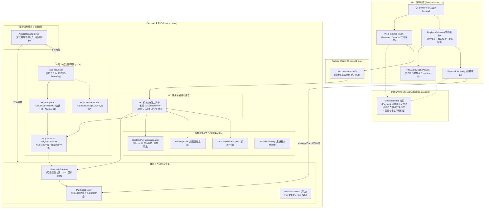
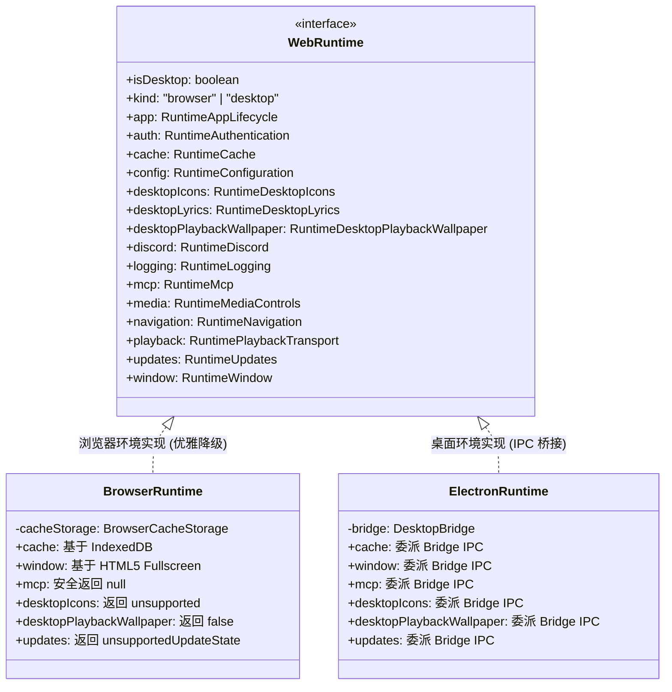
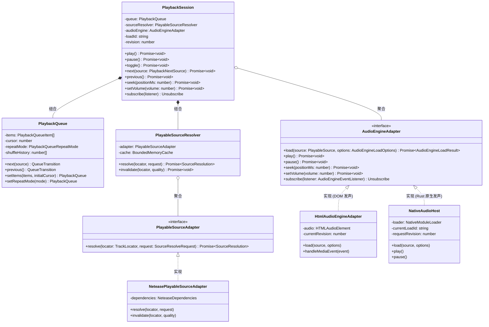
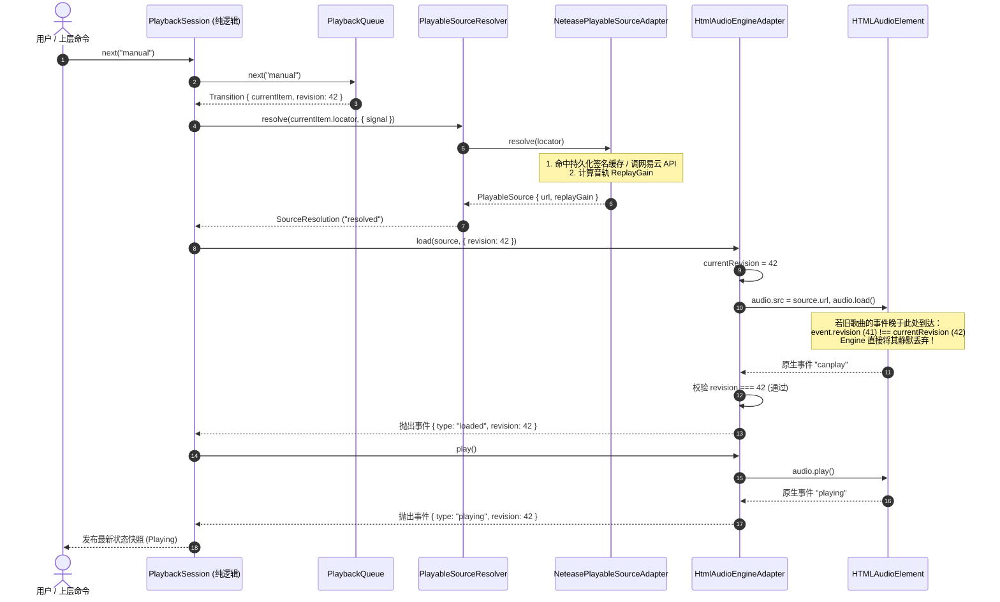
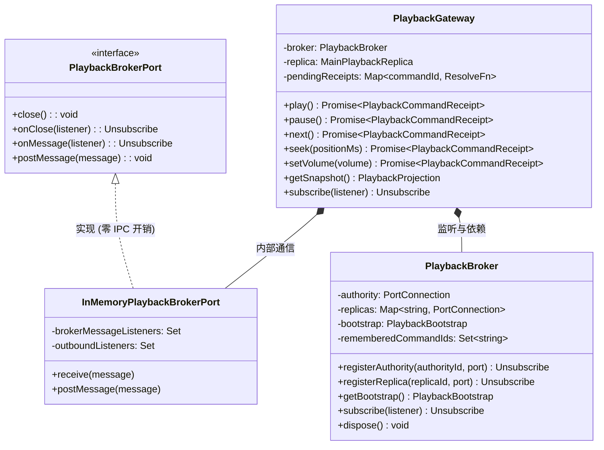
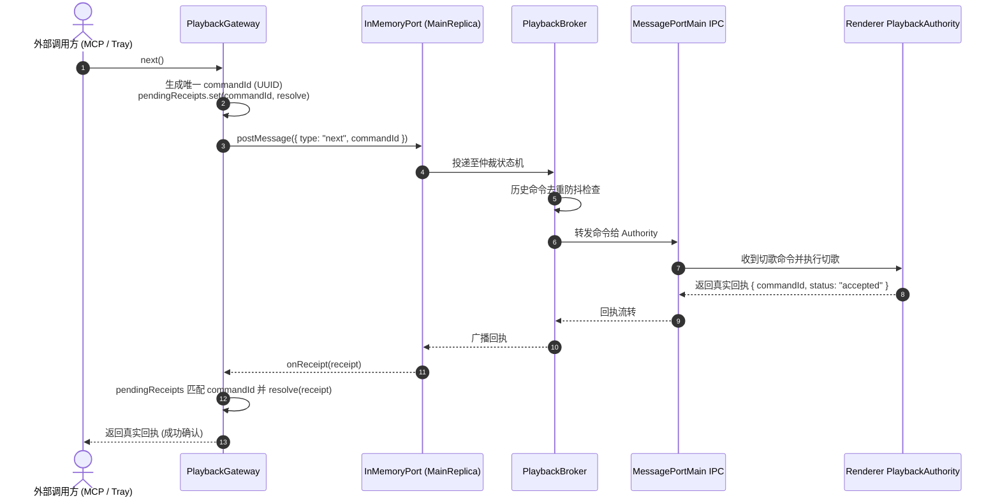
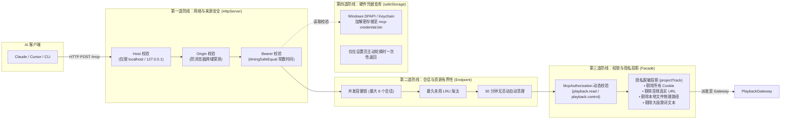
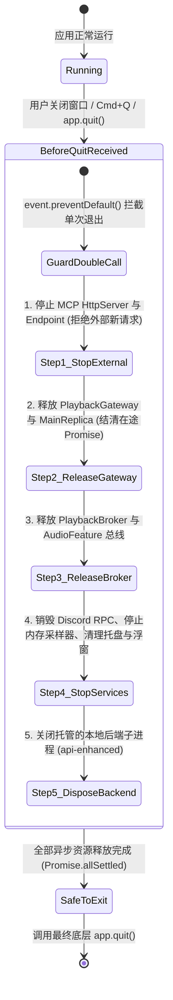

# Scopify Desktop 架构全景与子系统设计规范

> 本文档是 Scopify 桌面端（Electron Host）及跨端播放平台的**核心架构全景指南**。
> 摒弃冗余叙述，直接以 **UML 类图、组件拓扑图、时序图与状态机** 为主线，深度拆解系统分层、核心接口契约、跨进程通信以及数据流转机制。

---

## 1. 全局分层与进程边界拓扑

Scopify 采用单向契约依赖模型：**Web 渲染进程**负责界面与播放领域编排，**Electron 主进程**承载原生能力、系统集成与安全存储，双方通过无依赖纯 TypeScript 契约包 `@scopify/desktop-contract` 进行强类型对齐。

---

## 2. 平台宿主抹平：`WebRuntime` 适配器设计

为了让 Web 页面与组件在浏览器端和 Electron 桌面端无需编写侵入性 `if (isElectron)` 分支，设计了统一的宿主缝隙（Seam）：

---

## 3. 播放平台全景：`@scopify/playback-core` 与双引擎体系

播放子系统将**业务逻辑（队列与切歌规则）**、**音源获取（网易云协议与缓存）**与**发声硬件（HTML Audio / 原生 Rust）**彻底解耦。

### 3.1 核心类与接口 UML 契约

### 3.2 切歌与真实发声端到端时序（含 Revision 纪元淘汰机制）

在快速切歌时，异步网络请求容易发生后发先至。系统通过递增的 `revision` 纪元号保证状态绝对一致：

---

## 4. 跨窗口状态同步与主进程可信控制：Broker 与 Gateway

Electron 桌面中存在多个窗口（主窗口、歌词悬浮窗、壁纸控制窗、托盘菜单），必须保证**同一时刻只有一个主控发声源（Authority）**，其余窗口均为**只读副本（Replica）**。

### 4.1 Gateway 异步真回执等待时序

外部（如 MCP 或托盘）通过 `PlaybackGateway` 发送命令时，绝不提前虚假返回成功，必须拿到渲染端执行回执：

---

## 5. 本地安全 MCP 架构与防护模型

桌面端通过标准 Streamable HTTP 协议提供本地 MCP 控制能力，使外部 AI 客户端（Claude Desktop、Cursor 等）可以受控管理播放。

### 5.1 MCP 内部构件与安全防线

### 5.2 MCP 9 项工具与权限矩阵

| 工具名 | 权限门禁 | 幂等性 | 说明 |
| :--- | :--- | :--- | :--- |
| `get_playback_status` | `playback.read` | 是 (只读) | 获取当前播放阶段（playing/paused）、进度毫秒、总时长、音量 |
| `get_now_playing` | `playback.read` | 是 (只读) | 获取当前曲目精简快照（仅保留 id、title、artistNames 与安全封面） |
| `play` | `playback.control` | 否 (写操作) | 恢复播放，穿透至前端并等待音频就绪回执 |
| `pause` | `playback.control` | 否 (写操作) | 暂停播放，穿透至前端并等待确认挂起回执 |
| `toggle_playback` | `playback.control` | 否 (写操作) | 播放/暂停状态翻转 |
| `next_track` | `playback.control` | 否 (写操作) | 切至下一首，等待真实切歌与首帧加载回执 |
| `previous_track` | `playback.control` | 否 (写操作) | 切至上一首 |
| `seek` | `playback.control` | 是 (入参幂等) | 跳转到指定毫秒进度（`positionMs: number`） |
| `set_volume` | `playback.control` | 是 (入参幂等) | 调整播放音量（`volume: 0..100`） |

---

## 6. 生命周期、优雅停机与内存治理

### 6.1 优雅停机时序状态机 (`core/shutdown.ts`)

应用退出时，各个子模块之间存在严格的依赖拓扑：**必须先关闭对外暴露的外部入口（MCP HTTP），再释放中枢 Gateway 与 Broker，最后注销窗口与后端进程**，杜绝退出时出现崩溃或内存访问冲突。

### 6.2 内存防劣化治理机制 (`processMemory.ts`)

为了严格遵守 SPlayer-Next 倡导的内存纪律（Memory Discipline），桌面端引入常态化进程工作集监控：
- **启动与就绪基线**：主窗口渲染完成时立即触发首个采样快照。
- **低频定期采样**：通过 `app.getAppMetrics()` 提取每个子进程（Main、Renderer、GPU、Utility、各浮窗）的物理工作集（Working Set Size MB）。
- **进程名关联**：根据 OS ProcessId 将子进程与业务窗体（`desktop-lyric`、`desktop-playback-controller` 等）精确关联，记录到 Core 日志中，为长期防内存泄漏对比提供科学数据支撑。
