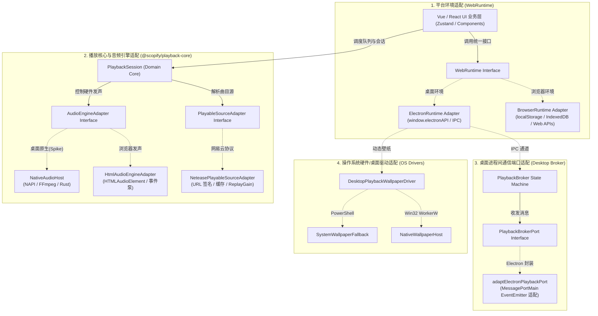
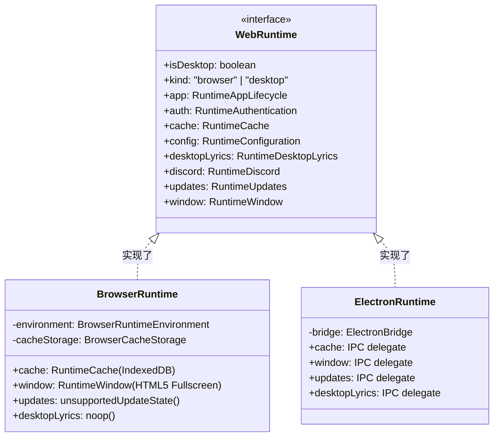
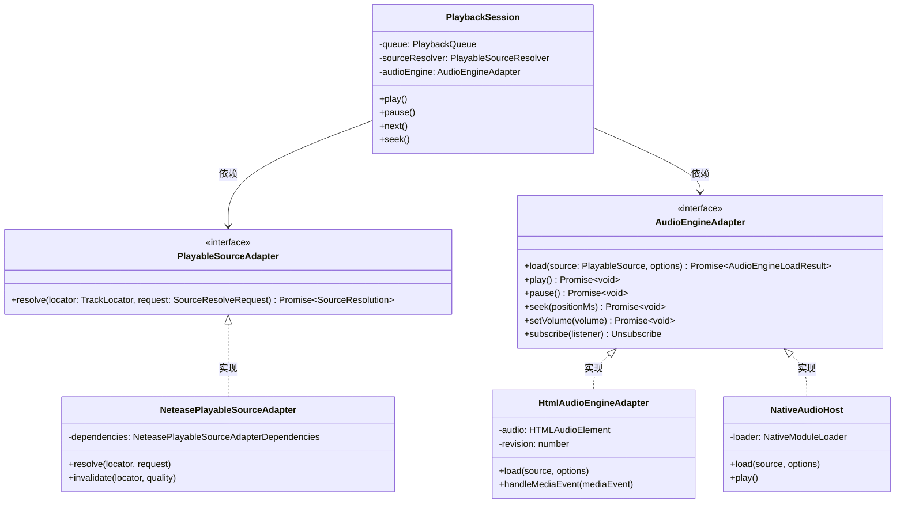
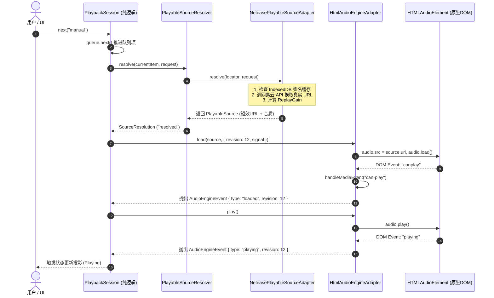
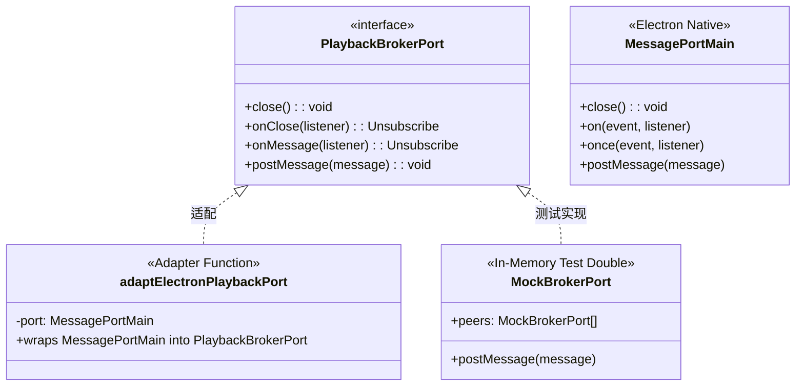
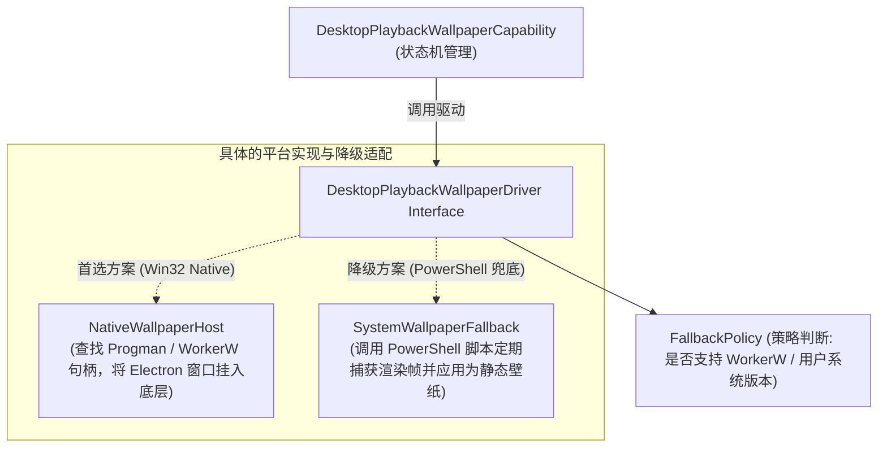

# Scopify 适配器（Adapter）架构设计与链路全景报告

> 本报告专门剖析 Scopify 代码库中**非 MCP 部分**的 Adapter 架构设计，解析各个子系统如何通过“受控接口（Interface）+ 专用适配器（Adapter）+ 隔离缝隙（Seam）”实现跨平台（Web 浏览器 / Electron 桌面）及跨环境解耦。

---

## 一、 为什么整个系统有这么多 Adapter？

Scopify 的整体代码被设计为**一次编写、多端运行（Web 浏览器 + Electron 桌面应用）**。为了保证业务逻辑（如歌单、播放状态、Zustand Store、UI 组件）不被具体运行环境污染，团队在关键边界处设立了清晰的“接口缝隙（Seams）”。

非 MCP 的 Adapter 链路主要分布在以下 **4 个核心领域**：



---

## 二、 领域一：平台环境宿主适配器 (`WebRuntime`)

### 1. 解决的问题
前端组件需要调用存储（Cache）、全屏切换、窗口最小化、Discord 状态发布、自动更新检测等功能。但在纯 Web 浏览器里，很多桌面功能（如系统托盘、动态壁纸）是无法运行的；而存储在 Web 里是 `IndexedDB`，在 Electron 桌面里则是主进程的本地文件和 IPC。

### 2. 类图与接口结构



### 3. 运行时的组装点（Composition Root）

在 [`repo/frontend/apps/web/lib/runtime/index.ts`](file:///d:/Github/Scopify/repo/frontend/apps/web/lib/runtime/index.ts) 中：
```ts
export function createRuntimeForWindow(rendererWindow: Pick<Window, "electronAPI"> | undefined) {
  // 如果窗口注入了 preload 的 electronAPI，则使用 ElectronRuntime
  if (rendererWindow?.electronAPI) return createElectronRuntime(rendererWindow.electronAPI);
  // 否则降级为纯浏览器 BrowserRuntime
  return createBrowserRuntime();
}

export const runtime = createRuntimeForWindow(typeof window === "undefined" ? undefined : window);
```
**设计收益**：业务组件只需 `import { runtime } from "@/lib/runtime"`，完全不需要写 `if (isElectron) { ... } else { ... }`，所有差异都在 Adapter 层被抹平或安全降级。

---

## 三、 领域二：播放核心与音频引擎适配器 (`@scopify/playback-core`)

这是系统中设计最精妙的深模块（Deep Module）。它把播放领域的职责彻底拆开为两层 Adapter：
1. **源解析适配器 (`PlayableSourceAdapter`)**：负责把抽象的歌曲定位器（`TrackLocator`）解析成可播放的 URL 或本地路径。
2. **音频发声引擎适配器 (`AudioEngineAdapter`)**：负责控制底层的真实发声硬件，完全不知道网易云、Cookie 或队列逻辑。

### 1. 类图与核心契约



### 2. 播放启动的时序流（Sequence Diagram）

当用户点击下一首或切歌时，整个链路的数据流动如下：



### 3. 为什么要有 `revision`（版本纪元标记）？
在快速连击“下一首”时，网络请求可能后发先至。`HtmlAudioEngineAdapter` 每次 `load()` 都会带上递增的 `revision`。如果 DOM 慢悠悠触发了上一首歌的 `canplay` 或 `error`，Adapter 会比较 `event.revision === this.currentRevision`，凡是过期的事件全部静默丢弃，彻底杜绝了切歌串音或状态倒退的问题。

---

## 四、 领域三：桌面进程间 Broker 端口适配器 (`PlaybackBrokerPort`)

在桌面模式下，播放器的主窗口是真实的 **Authority（音频主控）**，而系统托盘（Tray）、桌面歌词（Desktop Lyric）、控制浮窗等辅助窗口都是只读的 **Replica（副本）**。

### 1. 为什么需要端口适配器？
Electron 原生的 `MessagePortMain` 是一个典型的 Node EventEmitter 结构（包含 `.on('message', ...)`, `.postMessage(...)`）。
如果让 `PlaybackBroker` 直接操作 Electron 的 `MessagePortMain`，会导致：
1. 无法进行干净的自动化单元测试（跑测试必须启动真实的 Electron 主进程）。
2. 通信协议与 Electron 强耦合。

因此，代码在 [`electron/main/capabilities/playbackBroker/port.ts`](file:///d:/Github/Scopify/repo/frontend/apps/desktop/electron/main/capabilities/playbackBroker/port.ts) 定义了一个仅有 4 个方法的纯接口：

```ts
export interface PlaybackBrokerPort {
  close(): void;
  onClose(listener: () => void): () => void;
  onMessage(listener: PlaybackBrokerPortMessageListener): () => void;
  postMessage(message: unknown): void;
}
```

并在 [`electronPort.ts`](file:///d:/Github/Scopify/repo/frontend/apps/desktop/electron/main/capabilities/playbackBroker/electronPort.ts) 中实现适配器：



**测试优势**：在 `tests/playbackBroker.test.ts` 中，测试代码无需 Electron 运行时，直接用内存里的 Fake Port 就能测试 164 项关于消息乱序、重放、去重和超时的复杂逻辑。

---

## 五、 领域四：桌面系统级驱动适配器 (`DesktopPlaybackWallpaperDriver`)

桌面端支持将当前播放的歌曲动画投射为 Windows 桌面壁纸。因为不同 Windows 版本的底层机制差异很大，这里采用的是典型的 **驱动/策略模式（Driver Pattern）适配器**。



在 [`electronDriver.ts`](file:///d:/Github/Scopify/repo/frontend/apps/desktop/electron/main/capabilities/desktopPlaybackWallpaper/electronDriver.ts) 中，适配器会根据 `fallbackPolicy` 自动判断：如果原生 WorkerW 注入失败或系统不支持，无缝降级到 PowerShell 静态壁纸兜底实现，对上层状态机完全透明。

---

## 六、 总结：架构设计的全景价值

通过梳理这四组核心适配器链路，可以看出 Scopify 现有非 MCP 架构的核心原则：

| 适配器分类 | 隔离的边界（Seam） | 核心价值 |
| :--- | :--- | :--- |
| **`WebRuntime`** | UI 业务层 ↔ 运行环境宿主 | 一套前端代码，在 Chrome 标签页与 Electron 桌面内自动自适应，无条件分支侵入。 |
| **`PlayableSourceAdapter`** | 播放队列 ↔ 音频源协议 | 隔离网易云特有的 URL 签名与 ReplayGain，未来扩展本地歌曲或第三方音源无需改动播放核心。 |
| **`AudioEngineAdapter`** | 播放逻辑 ↔ 物理发声硬件 | 将复杂的 HTML5 Audio 事件和异步时序收敛在单一模块，上层只处理干净的 `loaded`、`playing` 状态。 |
| **`PlaybackBrokerPort`** | 协议状态机 ↔ Electron IPC 通信 | 将 Electron 事件循环与核心通信逻辑解耦，使得复杂的多窗口同步算法可被纯内存单测全面覆盖。 |
| **`WallpaperDriver`** | 视觉表现 ↔ Windows 系统底层 | 原生 Win32 挂载与脚本降级双保险，隔离操作系统底层的不稳定性。 |
